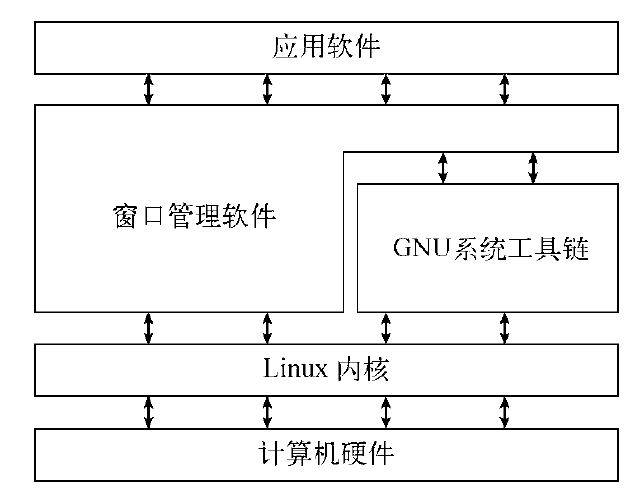

## GNU/Linux

完整的Linux的系统需要以下4个关键部件，将Linux系统的各个不同部分汇集起来组成一个易于安装的包，就形成了Linux发行版。

- **Linux内核**

  系统的核心，控制着内存、程序和硬件之间的交互（必要时分配硬件，并根据需要执行软件）。

  主要功能：

  - 系统内存管理：管理可用物理内存，创建和管理虚拟内存。
  - 软件程序管理：进程管理（运行中的程序叫进程）。
  - 硬件设备管理：将硬件设备当成特殊的文件，即字符型/块/网络设备文件。
  - 文件系统管理：采用虚拟文件系统（Virtual File System，VFS）作为和每个文件系统交互的接口，支持通过不同类型的文件系统从硬盘中读写数据。

- **GNU工具**

  - coreutils：核心GNU工具，主要包含处理文件、操作文本和管理进程的工具。
  - shell：交互式工具，为用户提供启动程序、管理文件系统中的文件以及运行在Linux系统上的进程的途径。

- **图形化桌面环境**

  X Window，KDE（K Desktop Environment），GNOME，Unity等。

- **应用软件**

