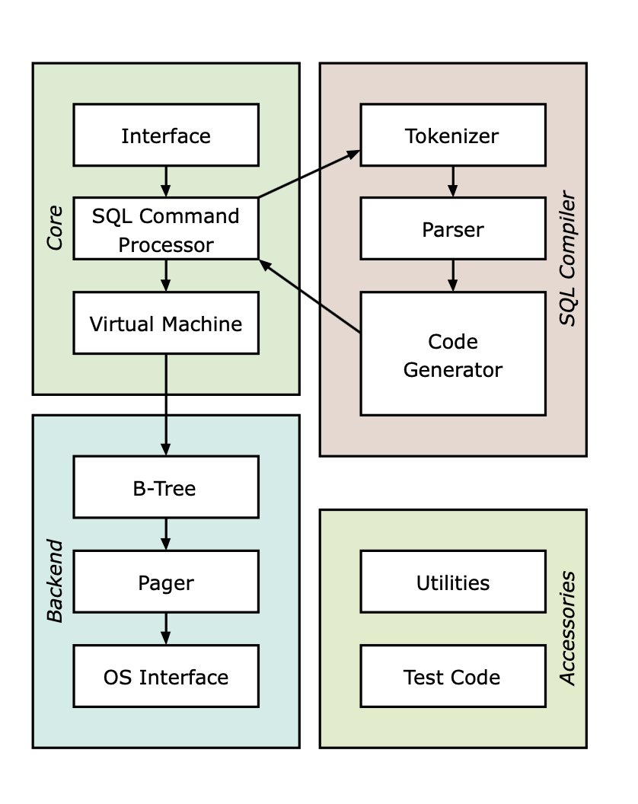

## SQLite


### 1. SQLite 基础

**SQLite** 是一种C语言库，它实现了一个 [小型](https://www.sqlite.org/footprint.html)， [快速](https://www.sqlite.org/fasterthanfs.html)， [自包含](https://www.sqlite.org/selfcontained.html)， [高可靠性](https://www.sqlite.org/hirely.html)， [功能齐全](https://www.sqlite.org/fullsql.html)的 SQL数据库引擎。

最新版本的 macOS 预装了 SQLite，在命令行使用`sqlite3`命令可以验证。在出现的 SQLite 命令提示符 **sqlite>** 下，你就可以使用各种 SQLite 命令了。也就是说，所有的**点命令**只在 SQLite 提示符中可用。

在使用 SQLite 命令前，我们先了解一下 [SQLite的架构](https://www.sqlite.org/arch.html)。



链接 https://www.sqlite.org/arch.html


#### 1.1 命令

应确保 **sqlite>** 提示符与**点命令**之间不含空格。 使用**.help**可以得到 SQLite 点命令列表。

```shell
sqlite>.help
sqlite>.show
sqlite>.quit
```

使用 **.show** 命令，来查看 SQLite 命令提示符的默认设置。

```shell
sqlite>.show
        echo: off
         eqp: off
     explain: auto
     headers: off
        mode: list
   nullvalue: ""
      output: stdout
colseparator: "|"
rowseparator: "\n"
       stats: off
       width:
    filename: :memory:
sqlite>
```

**格式化输出**设置：

```shell
sqlite>.header on
sqlite>.mode list
sqlite>.timer on
sqlite>
```

**sqlite_master** （主表）中保存数据库表的关键信息。

```shell
sqlite>.schema sqlite_master
```

上述操作产生的结果如下：

```shell
CREATE TABLE sqlite_master (
  type text,
  name text,
  tbl_name text,
  rootpage integer,
  sql text
);
```


#### 1.2 语法

- **大小写**

  不区分大小写，也有一些命令大小写敏感，如 GLOB 和 glob 在 SQLite 的语句中就有不同的含义。

- **注释**

  使用 `--` 或使用 `/**/`（C风格的注释）

- **数据类型**

  **存储类**：NULL，INTEGER，REAL，TEXT，BLOB。

  **INTEGER**： 代表带符号整数类型，根据值的大小存储在 1、2、3、4、6 或 8 字节中。布尔值被存储为整数 0（false）和 1（true）。

  **REAL** ：代表浮点值类型，存储为 8 字节的 IEEE 浮点数字。

  **TEXT **：代表文本字符串，使用数据库编码（UTF-8、UTF-16BE 或 UTF-16LE）存储。

  **BLOB**：blob 数据，完全根据它的输入存储。

  **日期和时间**：SQLite 把日期和时间存储为 TEXT、REAL 或 INTEGER 值。

  TEXT：格式为 "YYYY-MM-DD HH:MM:SS.SSS" 的日期。
  REAL：从公元前 4714 年 11 月 24 日格林尼治时间的正午开始算起的天数。
  INTEGER：从 1970-01-01 00:00:00 UTC 算起的秒数。

- **Affinity 类型**

  TEXT、NUMERIC、INTEGER、REAL、NONE。

  

#### 运算符

运算符是一个保留字或字符，用于指定 SQLite 语句中的条件，并在语句中连接多个条件。运算符主要用于 SQLite 语句的 WHERE 子句中执行操作，如算术、比较、逻辑和位运算。WHERE 子句是用来设置 SELECT 语句的条件语句。

- 算术运算符

  `+ - * /  %`

- 比较运算符

  `= != <> > >= !> < <= !<`

- 逻辑运算符

  `AND，NOT，OR，BETWEEN，EXISTS，IN，NOT IN，LIKE，GLOB，IS NULL，IS，IS NOT，||，UNIQUE`

  使用连接运算符 **AND** 和 **OR** 编译多个条件，可以缩小在 SQLite 语句中所选的数据。

  使用 **LIKE** 运算符匹配通配符指定模式的文本值，百分号 （`%`）和下划线 （`_`）是 LIKE 运算符一起使用的两个通配符。百分号（%）代表零个、一个或多个数字或字符。下划线（_）代表一个单一的数字或字符。这些符号可以被组合使用。

  

  

- 位运算符

  `& | ~ << >>`等作用于位，并逐位执行操作


#### 表达式

表达式是一个或多个值、运算符和计算值的SQL函数的组合。

- 布尔表达式：在匹配单个值的基础上获取数据
- 数值表达式：执行查询中的任何数学运算（avg()、sum()、count()等是内置的函数）
- 日期表达式：返回当前系统日期和时间值


### 2. 创建、附加和分离数据库

```shell
$sqlite3 myTestDB.db
sqlite> ATTACH DATABASE 'myTestDB.db' as 'mytest';
sqlite> DETACH DATABASE 'mytest';
```

#### 创建数据库

使用 **sqlite3** 命令创建数据库，使用SQLite 的 **.databases** 命令显示数据库列表，使用 SQLite **.dump** 点命令将数据库的完整内容转储到一个 ASCII 文本文件中，也可恢复。

```shell
$sqlite3 myTestDB.db
$sqlite> .databases
sqlite>.quit
$sqlite3 myTestDB.db .dump > myTestDB.sql
$sqlite3 myTestDB.db < myTestDB.sql
```

#### 附加数据库

SQLite 使用 **ATTACH DATABASE** 语句选择一个特定的数据库，使用该命令后，所有的 SQLite 语句将在附加的数据库下执行。语法是`ATTACH DATABASE file_name AS database_name;`。

```shell
sqlite> ATTACH DATABASE 'myTestDB.db' as 'mytest';
sqlite>.database
```

myTestDB.db 是文件名，MYTEST 是数据库名。

数据库名称 **main** 是被保留用于主数据库， **temp** 则被保留用于存储临时表及其他临时数据对象。这两个数据库名称可用于每个数据库连接，且不应该被用于附加（database main / TEMP is already in use）。


#### 分离数据库

SQLite使用 **DETACH DTABASE** 语句把命名数据库从一个数据库连接分离出来，语法为 `DETACH DATABASE 'Alias-Name';`

```shell
sqlite> DETACH DATABASE 'mytest';
```

当同一个数据库文件已经被附加上多个别名，DETACH 命令将只断开给定名称的连接。

无法分离 **main** 或 **temp** 数据库。

执行分离操作后，在内存中的数据库或临时数据库会被摧毁，内容被丢弃。


### 3. 创建和删除表

```shell
CREATE TABLE database_name.table_name(
   column1 datatype  PRIMARY KEY(one or more columns)	NOT NULL,
   column2 datatype,
   column3 datatype,
   .....
   columnN datatype,
);

DROP TABLE database_name.table_name;
```

- 使用 **CREATE TABLE** 语句创建表

- 使用 **.tables** 命令可以列出附加数据库中的所有表

- 使用 **.schema** 命令可以得到表的完整信息

- 写上了 **NOT NULL** 的约束则表示在表中创建记录时这些字段不能为 NULL。

- 使用 **DROP TABLE**语句删除表（删除表定义及其所有相关数据、索引、触发器、约束和该表的权限规范）


### 4. SQLite 语句详解

可以任何关键字（如 SELECT、INSERT、UPDATE、DELETE、ALTER、DROP 等）开始，以分号（;）结束。

#### INSERT INTO 语句

使用 INSERT INTO 语句「向数据库的某个表中添加新的数据行」。

```shell
INSERT INTO table_name( column1, column2,....columnN)
VALUES ( value1, value2,....valueN);

INSERT INTO TABLE_NAME VALUES (value1,value2,value3,...valueN);
```

你还可以将 INSERT INTO 与 SELECT 语句和 WHERE 子句结合，使用一个表来填充另一个表。

```shell
INSERT INTO first_table_name [(column1, column2, ... columnN)] 
SELECT column1, column2, ...columnN 
FROM second_table_name
[WHERE condition];
```


#### SELECT 语句

使用 **SELECT** 语句「从 SQLite 数据库表中获取数据，以结果表（结果集）的形式返回数据」。

```shell
SELECT column1, column2....columnN FROM   table_name;
SELECT * FROM table_name;

SELECT tbl_name FROM sqlite_master WHERE type = 'table';
SELECT sql FROM sqlite_master WHERE type = 'table' AND tbl_name = 'COMPANY';
```

使用通配符`*`可以获取所有可用的字段。

使用带有 **sqlite_master** 表的 SELECT 语句来列出所有在数据库中创建的表，还可以列出关于 COMPANY 表的完整信息。

可以在SELECT 语句中使用 **DISTINCT 关键字**，目的是「消除所有重复的记录，并只获取唯一一次记录」。

```sqlite
SELECT DISTINCT column1, column2,.....columnN 
FROM table_name
WHERE [condition]
```


#### UPDATE 语句

使用 **UPDATE** 查询「修改表中已有的记录」。可以使用带有 WHERE 子句的 UPDATE 查询来更新选定行，否则所有的行都会被更新。

```shell
UPDATE table_name
SET column1 = value1, column2 = value2....columnN=valueN
WHERE [CONDITION];
```


#### DELETE 语句

使用**DELETE** 查询「删除表中已有的记录」。可以使用带有 WHERE 子句的 DELETE 查询来删除选定行，否则所有的记录都会被删除。

```shell
DELETE FROM table_name
WHERE  {CONDITION};
```


#### 子句

 **WHERE 子句**

使用 **WHERE** 子句「指定从一个表或多个表中获取数据的条件」，也就是说可以使用 WHERE 子句来过滤记录，只获取需要的记录。

```shell
SELECT column1, column2....columnN
FROM   table_name
WHERE  CONDITION;
```

WHERE 子句可以用在 SELECT 、UPDATE、DELETE 等语句中。在 WHERE 子句中，你可以使用[比较或逻辑运算符](https://www.sqlite.net.cn/sqlite/sqlite-operators.html)指定条件（如 >、<、=、LIKE、NOT等）。你可以使用 AND/OR 子句来组合条件。

```shell
SELECT * FROM COMPANY WHERE AGE >= 25 AND SALARY >= 65000;
SELECT * FROM COMPANY WHERE AGE >= 25 OR SALARY >= 65000;
SELECT * FROM COMPANY WHERE AGE IS NOT NULL;
SELECT * FROM COMPANY WHERE NAME LIKE 'Ki%';
SELECT * FROM COMPANY WHERE NAME GLOB 'Ki*';
SELECT * FROM COMPANY WHERE AGE IN ( 25, 27 );
SELECT * FROM COMPANY WHERE AGE NOT IN ( 25, 27 );
SELECT * FROM COMPANY WHERE AGE BETWEEN 25 AND 27;
```

**AND/OR 子句**

```shell
SELECT column1, column2....columnN
FROM   table_name
WHERE  CONDITION-1 {AND|OR} CONDITION-2;
```

**Like 子句**


```shell
SELECT column1, column2....columnN
FROM   table_name
WHERE  column_name LIKE { PATTERN };
```

**GLOB 子句**

```shell
SELECT column1, column2....columnN
FROM   table_name
WHERE  column_name GLOB { PATTERN };
```

**IN 子句**

```shell
SELECT column1, column2....columnN
FROM   table_name
WHERE  column_name IN (val-1, val-2,...val-N);
```

**NOT IN 子句**

```shell
SELECT column1, column2....columnN
FROM   table_name
WHERE  column_name NOT IN (val-1, val-2,...val-N);
```

**BETWEEN 子句**

```shell
SELECT column1, column2....columnN
FROM   table_name
WHERE  column_name BETWEEN val-1 AND val-2;
```

**COUNT 子句**

```shell
SELECT COUNT(column_name)
FROM   table_name
WHERE  CONDITION;
```

**DISTINCT 子句**

```shell
SELECT DISTINCT column1, column2....columnN
FROM   table_name;
```

**EXISTS 子句**

```shell
SELECT column1, column2....columnN
FROM   table_name
WHERE  column_name EXISTS (SELECT * FROM   table_name );
```

**GROUP BY 子句**

```shell
SELECT SUM(column_name)
FROM   table_name
WHERE  CONDITION
GROUP BY column_name;
```

**HAVING 子句**

```shell
SELECT SUM(column_name)
FROM   table_name
WHERE  CONDITION
GROUP BY column_name
HAVING (arithematic function condition);
```

**ORDER BY 子句**

```shell
SELECT column1, column2....columnN
FROM   table_name
WHERE  CONDITION
ORDER BY column_name {ASC|DESC};
```


#### ANALYZE 语句

```shell
ANALYZE;
or
ANALYZE database_name;
or
ANALYZE database_name.table_name;
```

#### ALTER TABLE 语句

```shell
ALTER TABLE table_name ADD COLUMN column_def...;
```

#### ALTER TABLE 语句（Rename）

```shell
ALTER TABLE table_name RENAME TO new_table_name;
```

#### ATTACH DATABASE 语句

```shell
ATTACH DATABASE 'DatabaseName' As 'Alias-Name';
```

#### BEGIN TRANSACTION 语句

```shell
BEGIN;
or
BEGIN EXCLUSIVE TRANSACTION;
```

#### COMMIT 语句

```shell
COMMIT;
```

#### CREATE INDEX 语句

```shell
CREATE INDEX index_name
ON table_name ( column_name COLLATE NOCASE );
```

#### CREATE UNIQUE INDEX 语句

```shell
CREATE UNIQUE INDEX index_name
ON table_name ( column1, column2,...columnN);
```

#### CREATE TABLE 语句

```shell
CREATE TABLE table_name(
   column1 datatype,
   column2 datatype,
   column3 datatype,
   .....
   columnN datatype,
   PRIMARY KEY( one or more columns )
);
```

#### CREATE TRIGGER 语句

```shell
CREATE TRIGGER database_name.trigger_name 
BEFORE INSERT ON table_name FOR EACH ROW
BEGIN 
   stmt1; 
   stmt2;
   ....
END;
```

#### CREATE VIEW 语句

```shell
CREATE VIEW database_name.view_name  AS
SELECT statement....;
```

#### CREATE VIRTUAL TABLE 语句

```shell
CREATE VIRTUAL TABLE database_name.table_name USING weblog( access.log );
or
CREATE VIRTUAL TABLE database_name.table_name USING fts3( );
```

#### COMMIT TRANSACTION 语句

```shell
COMMIT;
```

#### DETACH DATABASE 语句

```shell
DETACH DATABASE 'Alias-Name';
```

#### DROP 语句

```shell
DROP INDEX database_name.index_name;
DROP TABLE database_name.table_name;
DROP VIEW view_name;
DROP TRIGGER trigger_name;
```

#### EXPLAIN 语句

```shell
EXPLAIN INSERT statement...;
or 
EXPLAIN QUERY PLAN SELECT statement...;
```

#### PRAGMA 语句

```shell
PRAGMA pragma_name;

For example:

PRAGMA page_size;
PRAGMA cache_size = 1024;
PRAGMA table_info(table_name);
```

#### RELEASE SAVEPOINT 语句

```shell
RELEASE savepoint_name;
```

#### REINDEX 语句

```shell
REINDEX collation_name;
REINDEX database_name.index_name;
REINDEX database_name.table_name;

#### ROLLBACK 语句

​```shell
ROLLBACK;
or
ROLLBACK TO SAVEPOINT savepoint_name;
```

#### SAVEPOINT 语句

```shell
SAVEPOINT savepoint_name;
```

#### VACUUM 语句

```shell
VACUUM;
```


### 5. 完整实例

```shell
$sqlite3 myTestDB.db

sqlite> CREATE TABLE COMPANY(
   ID INT PRIMARY KEY     NOT NULL,
   NAME           TEXT    NOT NULL,
   AGE            INT     NOT NULL,
   ADDRESS        CHAR(50),
   SALARY         REAL
);

INSERT INTO COMPANY (ID,NAME,AGE,ADDRESS,SALARY)
VALUES (1, 'Paul', 32, 'California', 20000.00 );
INSERT INTO COMPANY VALUES (2, 'James', 24, 'Houston', 10000.00 );

sqlite>.header on
sqlite>.mode column
sqlite>.width 10, 20, 10
sqlite> SELECT * FROM COMPANY;
sqlite> SELECT ID, NAME, SALARY FROM COMPANY;
sqlite> SELECT * FROM COMPANY WHERE AGE >= 25 AND SALARY >= 65000;
```


**Links**

[1] <https://www.sqlite.net.cn>

[2] <https://sqlite.org/index.html>

