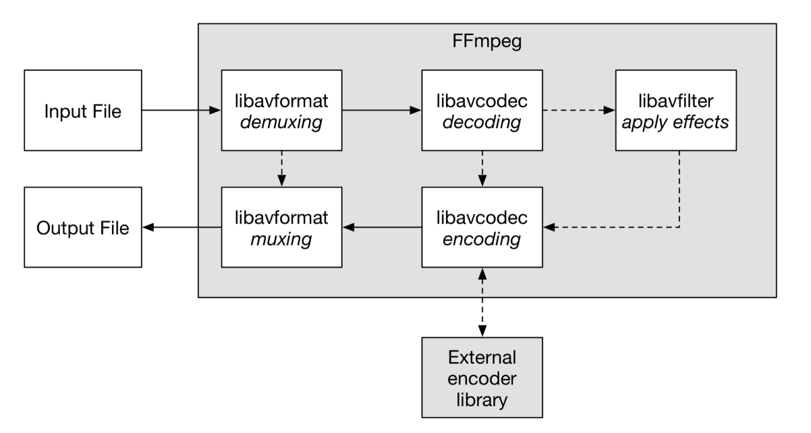

## FFmpeg

怎么使用命名行更改视频文件的格式呢？使用类似下面这样的命令即可。

```bash
ffmpeg -i dino.mov -vcodec libx264 -preset fast -crf 23 -y -acodec copy dino.mp4
```

这里就要说到 FFmpeg 了。

FFmpeg 包含：命令行工具(ffmpeg、 ffprobe、ffplay)和库（libavformat、 libavcodec、libavfilter …）。

- libavformat：读写容器格式(AVI, MKV, MP4, …)
- libavcodec：读写编码格式(H.264, H.265, VP9, …)
- libavfilter ：多种音视频滤镜



### 1. 安装FFmpeg

```bash
# 使用 Homebrew 安装 FFmpeg
$ brew --version
$ brew install ffmpeg
$ ffmpeg

# 查看 FFmpeg 支持的容器
$ ffmpeg -formats	

# 查看 FFmpeg 支持的编码格式
$ ffmpeg -codecs

# 查看 FFmpeg 已安装的编码器
$ ffmpeg -encoders
```

- **容器（container）**

  视频文件是一个包含视频、音频和字幕的容器，如MP4、MKV、WebM、AVI。

- **编码格式（CODEC）**

  经过编码的视频和音频才能保存成文件。不同编码格式有不同的压缩率，从而导致文件大小和清晰度的差异。编码后会损失一些细节，以换取压缩后较小的文件体积。常见的编码格式如下：

  - 视频编码格式（有版权，可免费使用）：H262、H264、H265。
  - 视频编码格式（无版权）：VP8、VP9、AV1。
  - 常用音频编码格式：MP3、AAC。

- **编码器（encoders）**

  实现某种编码格式的库文件。只有安装了某种格式的编码器，才能实现该格式视频/音频的编码和解码。

  视频编码器：libx264，NVENC，libx265，libvpx，libaom。

  音频编码器：libfdk-aac，aac。

### 2. FFmpeg 的使用格式

```bash
$ ffmpeg {1} {2} -i {3} {4} {5}

# 参数多时建议写成多行
$ ffmpeg \
[全局参数] \
[输入文件参数] \
-i [输入文件] \
[输出文件参数] \
[输出文件]
```

#### 常用命令行参数

- `-c`指定编码器

- `-c copy`直接复制，不经过重新编码（较快）

- `-c:v `/ `-c:a`指定视频编码器 / 音频编码器

- `-i`指定输入文件

- `-an`、`-vn`去除音频流、视频流

- `-preset`指定输出的视频质量，会影响文件的生成速度。该参数的可用值有: ultrafast、superfast、veryfast、faster、fast、medium、slow、slower、veryslow。

- `-y`不经过确认，输出时直接覆盖同名文件。

  

### 3. FFmpeg使用举例

- 查看文件信息

  ```bash
  # 查看视频文件的元信息（编码格式、比特率）
  $ ffmpeg -i input.mp4
  
  # 只显示元信息，隐藏冗余信息
  $ ffmpeg -i input.mp4 -hide_banner
  ```

- 转换编码格式或容器格式

  ```bash
  # transcoding（转成 H.264 编码）
  $ ffmpeg -i [input.file] -c:v libx264 output.mp4
  
  # transcoding（转成 H.265 编码）
  $ ffmpeg -i [input.file] -c:v libx265 output.mp4
  
  # transmuxing（mp4 转 webm）
  $ ffmpeg -i input.mp4 -c copy output.webm
  ```

- 调整码率

  改变编码的比特率，一般用来将视频文件的体积变小。

  ```bash
  # transrating
  $ ffmpeg \
  -i input.mp4 \
  -minrate 964K -maxrate 3856K -bufsize 2000K \
  output.mp4
  ```

- 改变视频分辨率

  示例将分辨率从 1080p 转为 480p 。scale值必须是偶数，-1表示保持长宽比。

  ```bash
  # transsizing
  $ ffmpeg \
  -i input.mp4 \
  -vf scale=480:-1 \
  output.mp4
  ```

- 从视频里提取音频

  ```bash
  # demuxing
  $ ffmpeg \
  -i input.aac -i input.mp4 \
  output.mp4
  ```

- 截图
  -vframes 1指定只截取一帧，-q:v 2表示输出的图片质量，一般是1到5之间（1 为质量最高）。

  ```bash
  # 从指定时间开始，连续对1秒钟的视频进行截图
  $ ffmpeg \
  -y \
  -i input.mp4 \
  -ss 00:01:24 -t 00:00:01 \
  output_%3d.jpg
  
  # 指定只截取一帧,截一张图
  $ ffmpeg \
  -ss 01:23:45 \
  -i input \
  -vframes 1 -q:v 2 \
  output.jpg
  ```

- 裁剪（cutting）

  截取原始视频里面的一个片段，输出为一个新视频。可以指定开始时间（start）和持续时间（duration），也可以指定结束时间（end）。-c copy表示不改变音频和视频的编码格式，直接拷贝。

  ```bash
  $ ffmpeg -ss [start] -i [input] -t [duration] -c copy [output]
  $ ffmpeg -ss [start] -i [input] -to [end] -c copy [output]
  ```

- 为音频添加封面

  将音频文件，转为带封面的视频文件。

  ```bash
  $ ffmpeg \
  -loop 1 \
  -i cover.jpg -i input.mp3 \
  -c:v libx264 -c:a aac -b:a 192k -shortest \
  output.mp4
  ```

  `-loop 1`参数表示图片无限循环,`-shortest`参数：表示音频文件结束，输出视频就结束。

  

**参考**

[FFmpeg 视频处理入门教程 — 阮一峰][1]

**文档协议**

自由转载-非商用-非衍生-保持署名（创意共享3.0许可证）


