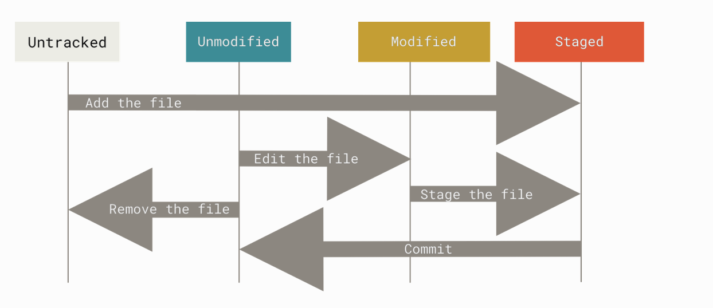

## Git


### 1. 概述


> Do not forget the `git --help` command. 


2005，在不能再免费使用 BitKeeper的情况下，为了继续维护Linux 内核，Linux 开源社区（特别是Linus Torvalds）开发了自己的版本系统。他们对新的系统制订了若干目标：速度快、简单设计、对非线性开发模式的强力支持（允许成千上万个并行开发的分支）、完全分布式、有能力高效管理类似 Linux内核一样的超大规模项目（速度和数据量）。

下面，让我们深入了解 Git 的相关概念和使用方法。


#### 1.1 版本控制

**版本控制（version control）**是一种「记录一个或若干文件内容变化，以便将来查阅特定版本的修订情况」的系统。有以下几种类型的版本控制系统：

- **本地**版本控制系统（本地VCS）：最初的版本控制系统。
- **集中化**的版本控制系统（CVCS）：实现**项目共享**，简化管理员的权限管理和维护负担；对中央服务器的单点故障很敏感。如果中央服务器宕机或中心数据所在磁盘损坏，可能会导致严重的问题。
- **分布式**版本控制系统（Distributed Version Control System， DVCS）：解决了CVCS 对中央服务器的单点故障敏感的问题，成为了主流的版本控制系统。由于本地的开发环境中就有仓库，所以开发者不必连接远程仓库就可以进行开发。分布式的重要思想就是**多个仓库并存**。Git 就是一种分布式版本控制系统。

如果你使用的是装有 macOS 的电脑，那么只要安装了 Xcode Command Line Tools 就可以使用 Git 了。 

在终端（Terminal）里运行如下命令，可以查看安装的 Git 版本。如果没有安装，它会提示你安装。你可以到 [Git 官网](https://git-scm.com)下载相应平台的软件包进行安装。

```bash
$ git --version
# git version 2.23.0
```

你也可以使用 SourceTree、Github Desktop 等 GUI 客户端，但是 GUI 软件只实现了 Git 所有功能的一个子集。如果想要执行所有命令，只能使用命令行模式。

你可以使用下面的命令获取帮助。

```bash
$ git help <verb>
$ git <verb> --help
$ man git-<verb>
```


#### 1.2 Git的基本思想和特点

- **Git将数据视作快照流**

  Git 直接记录快照，即把数据当做小型文件系统的一系列快照。这是 Git 与大多数基于差异（delta-based）版本控制工具不同的地方。

  在 Git 中，每当你提交更新或保存项目状态时，它基本上就会对当时的全部文件创建一个快照并保存这个快照的索引。如果没有修改，Git 只保留一个指向之前存储的文件的链接。你可以把 Git 看成一个小型的文件系统。

- **Git 中的大部分操作都是本地执行，只需要访问本地文件和资源**

  这提高了Git 操作的效率，也使得你在离线或没有 VPN 的时候，也可以进行大部分操作。

- **Git 保证完整性**

  所有的数据在存储前，Git 都会「使用 SHA-1 散列计算校验和」，然后以校验和来引用。这个功能建构在 Git 底层，保证了只有在 Git 不知情时，才能更改文件或目录的内容。

  散列值（哈希值）是一个字符串，由 40 个 十六进制字符（0-9 和 a-f）组成。SHA-1哈希基于 Git 中文件的内容或目录结构计算出来。另外，Git 数据库中保存的信息都是以文件内容的哈希值来索引的。

  ```bash
  24b9da6552252987aa493b52f8696cd6d3b00373
  ```

- **Git 一般只添加数据**

  当你执行 Git 操作时，基本上就是往 Git 数据库中添加数据。你很难让 Git 执行任何不可逆操作，或者让它以任何方式清除数据。

  

### 1.3 Git 的重要概念


- **文件的三种状态**

  

  - **已修改（modified）**

    修改了文件但未放入暂存区或 Git 仓库目录

    You have changed the file but have not committed it to your database yet

  - **已暂存（staged）**

    对一个已修改文件的当前版本做了标记，使之包含在下次提交的快照中。可以跳过暂存直接提交。

    You have marked a modified file in its current version to go into your next commit snapshot.

  - **已提交（committed）**

    数据已安全保存在本地数据库（Git 仓库目录），也就是Git 目录中保存了特定版本的文件。

    The data is safely stored in your local database.
    
    

  **已跟踪**表示Git 已经知道的文件。已经被纳入版本控制，上一次快照中有相关记录。状态可能是未修改、已修改或已放入暂存区。**未跟踪表示除已跟踪文件外的其他所有文件。上次快照和暂存区均无相关记录。

  

- **Repository**

  - **工作区（Working Copy）**

    对项目的某个版本独立提取出来的内容。

  - **暂存区（Index）**

    一个文件，保存了下次将要提交的文件列表信息，一般在 Git 仓库目录中。

  - **本地仓库 （Local Repository）**

    存放在本机的仓库。本地仓库就是Git 仓库目录，用来保存项目的元数据和对象数据库，是 Git 中最重要的部分，从其它计算机克隆仓库时，复制的就是这里的数据。

  - **远程仓库（Remote Repository）**

    存放在 GitHub 等云端的仓库。

- **Branch**

  对开发者提交的 Commits 进行分类，开发者可以根据实际需求创建额外分支。

  

#### 1.4 基本的 Git 工作流

- **在工作区中修改文件**

  You **modify** files in your working tree.

- **将想要下次提交的更改选择性地暂存，将更改的部分添加到暂存区**

  You selectively stage just those changes you want to be part of your next commit, which **adds** only those changes to the staging area.

- **提交更新，找到暂存区的文件，将快照永久性存储到 Git 目录**

  You do a **commit**, which takes the files as they are in the staging area and stores that snapshot permanently to your Git directory.


#### 1.5 Git 基本操作的含义

-  **Commit**

  用于将修改的文件记录（**提交**）至本地 Repository 中。

- **Push**

   将已经提交到本地仓库的内容更新（**推送**）至远程仓库。

- **Clone**

  将远程仓库中的内容完整地下载（**克隆**）到本机存储，通常仅在第一次下载时使用。

- **Fetch**

  **查看**远程的内容更新。

- **Pull**

  **取回**，将本地文件与远程内容同步。

- **Checkout**

  手动切换分支

- **Merge**

   合并

   

### 2. 配置

每台计算机上只需要配置一次，程序升级时会保留配置信息。以后也可以通过一些命令来修改这些配置信息。

Git 使用自带的工具 `git config` 来帮助设置控制 Git 外观和行为的配置变量。这些变量存储在三个不同的位置，每一个级别会覆盖上一级别的配置。

- `/etc/gitconfig` 文件

  包含系统上每个用户及他们仓库的通用配置。

- `~/.gitconfig` 或 `~/.config/git/config` 文件

  只针对当前用户。传递`--global` 选项让 Git 读写此文件，可以使其对系统上所有的仓库生效。

- `.git/config`

  当前使用仓库的 Git 目录中的 config 文件。相当于使用`--local` 选项。

```bash
# 查看所有的配置及所在文件
$ git config --list --show-origin 

# 检查配置信息
$ git config --list

# 读取通用配置（/etc/gitconfig 文件）
$ git config --system

# 检查 Git 的某一项配置
$ git config user.name

# 查询 Git 中该变量的 原始值
$ git config --show-origin user.name

# 用户信息设置
$ git config --global user.name "Firstname Lastname"
$ git config --global user.email "your_email@example.com"

# 文本编辑器设置
$ git config --global core.editor 'vim'

# 命令别名设置/取消设置（也可在终端里直接修改）
$ git config --global alias.s status
$ git config --global unset alias.s

$ git config --global color.ui auto
$ git config --global color.diff auto
$ git config --global color.branch auto

$ git config --global init.defaultBranch main
```


### 3. Git 的基础用法

#### 创建（Create）

```shell
# Initializing a Repository in an Existing Directory
$ cd /Users/user/my_project
$ git init

# Cloning an Existing Repository
$ git clone https://github.com/libgit2/libgit2 mylibgit

# Tracking New Files
$ git add file_name
```

当你想新建一个目录并对其使用版本控制时，使用以下命令：

```bash
$ mkdir git-learning
$ cd git-learning
$ git init
$ ls -al
```

你也可以克隆现有仓库。如果需要自定义本地仓库的名字，请指定新目录名（如 learnGit）。Git 支持多种数据传输协议，如https://、git://或 SSH 传输协议。


#### 查看（Browse）

```shell
$ git status
$ git log
$ git log --graph
$ git diff
$ git branch
$ git show
```

你可以使用 `git status` 查看文件状态，使用 -s选项能够缩短状态命令的输出。

```bash
# 查看文件状态
$ git status

# 缩短状态命令的输出
$ git status -s
$ git status --short

# 查看忽略文件
$ cat .gitignore
```

使用-s或--short选项得到的输出中，不同标记的含义是，??  表示新添加的未跟踪文件  ，A  表示新添加到暂存区的文件  ，M  表示修改过的文件。

你可以使用 `git log` 查看提交历史。

```sh
# 查看提交历史
$ git log

# 显示每次提交所引入的差异(最近 3 次)
$ git log -p -3

# 查看每次提交的简略统计信息
$ git log --stat

# 格式化展示提交历史(一行展示)
$ git log --pretty=oneline
```


为文件创建快照：使用 git add，执行后文件处于暂存状态。

```sh
# 在learnGit项目下创建一个新的README文件（未跟踪）
$ echo learnGit > README

# 跟踪新文件
$ git add README

# 为改动创建快照
$ git add .
```


查看已暂存和未暂存的修改：比较工作目录中当前文件和暂存区域快照之间的差异。

```sh
# 查看修改后未暂存的变化
$ git diff

# 查看已暂存的将要添加到下次提交里的内容(已暂存文件与最后一次提交的文件差异)
# 下面两条命令等价
$ git diff --staged
$ git diff --cached
```


#### 更新（Update）

```shell
$ git pull
$ git merge
$ git fetch
$ git am
```


#### 分支（Branch）

```shell
$ git checkout -b
$ git checkout -b feature-A
$ git checkout main
$ git checkout -
```

- `origin`    : 	default upstream repository

- `HEAD`		: 	current branch

- `HEAD^`	  : 	parent of current branch

- `HEAD~4`	 :	great-great grandparent of current branch

  

#### 提交和发布（Commit and Publish）

```shell
# 提交更新
$ git commit

# -m：将提交信息与命令放在同一行
$ git commit -m  "Story 182: Fix benchmarks for speed”

# 跳过使用暂存区域
$ git commit -a
$ git commit --amend

$ git rebase -i
$ git push	
```


#### 其他

使用stash缓存代码修改 WIP（Working In Process）

```bash
$ git stash
```

使用 `git rm` 命令将文件从已跟踪清单（暂存区）移除，然后提交。

使用 `git mv`移动或重命名文件。

```sh
$ git mv file_from file_to
```

Revert

```shell
$ git reset
$ git checkout
$ git revert
```


### 4. Git 命令集锦

```shell
# 1 - Start a working area
$ git init			# Create an empty Git repository or reinitialize an existing one
$ git clone			# Clone a repository into a new directory

# Work on the current change
$ git add			# Add file contents to the index
$ git mv    		# Move or rename a file, a directory, or a symlink
$ git restore   	# Restore working tree files
$ git rm      		# Remove files from the working tree and from the index

# 2 - Examine the history and state

$ git bisect    	# Use binary search to find the commit that introduced a bug
$ git diff			# Show changes between commits, commit and working tree, etc
$ git grep      	# Print lines matching a pattern
$ git log     		# Show commit logs
$ git show      	# Show various types of objects
$ git status		# Show the working tree status

# 3 - Grow, mark and tweak your common history
$ git branch		# List, create, or delete branches
$ git commit		# Record changes to the repository
$ git merge			# Join two or more development histories together
$ git rebase    	# Reapply commits on top of another base tip
$ git reset     	# Reset current HEAD to the specified state
$ git switch   		# Switch branches
$ git tag     		 # Create, list, delete or verify a tag object signed with GPG

# 4 - Collaborate
$ git fetch     # Download objects and refs from another repository
$ git pull 		# Fetch from and integrate with another repository or a local branch
$ git push		# Update remote refs along with associated objects
```


**Reference**

[1] <https://git-scm.com/book/en/v2>

