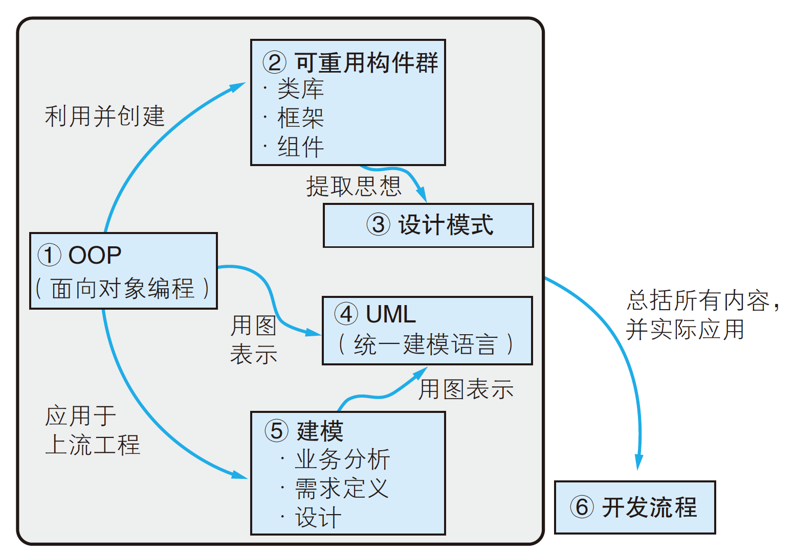
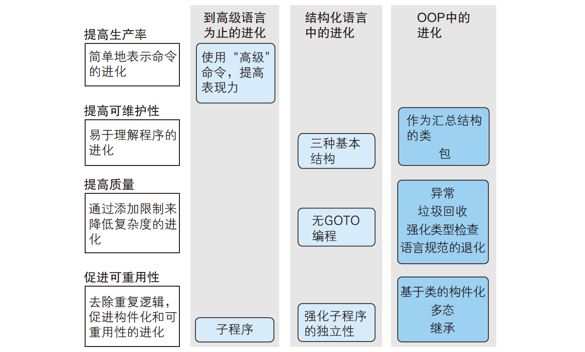
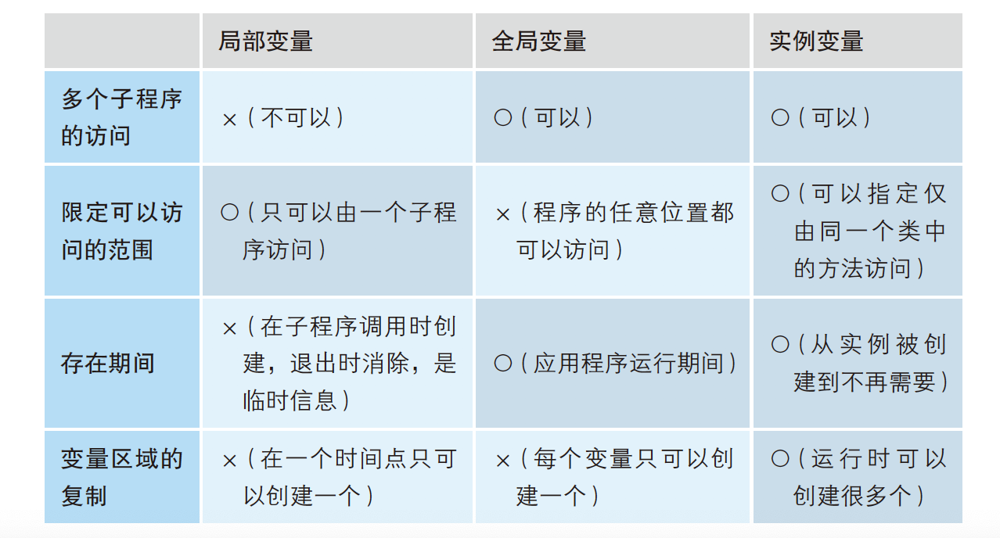
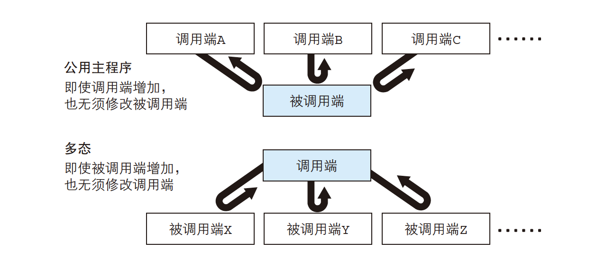
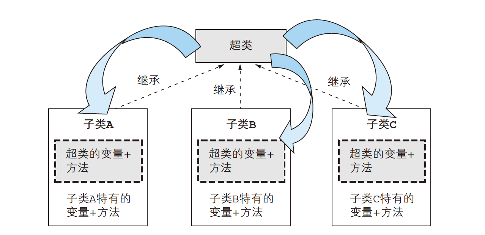
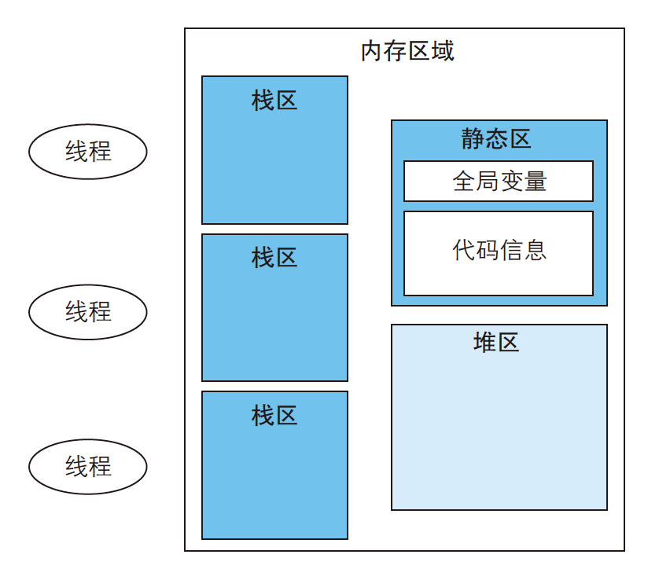
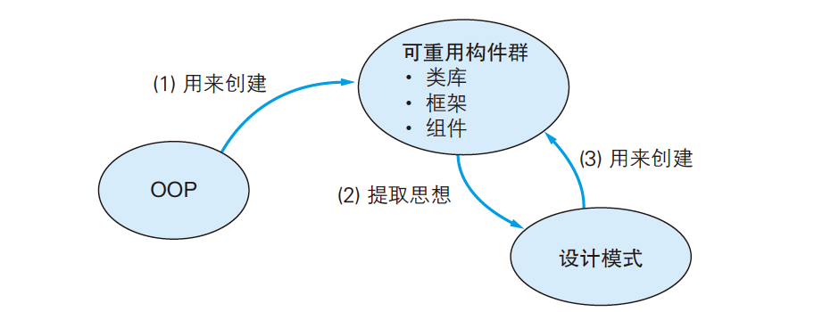
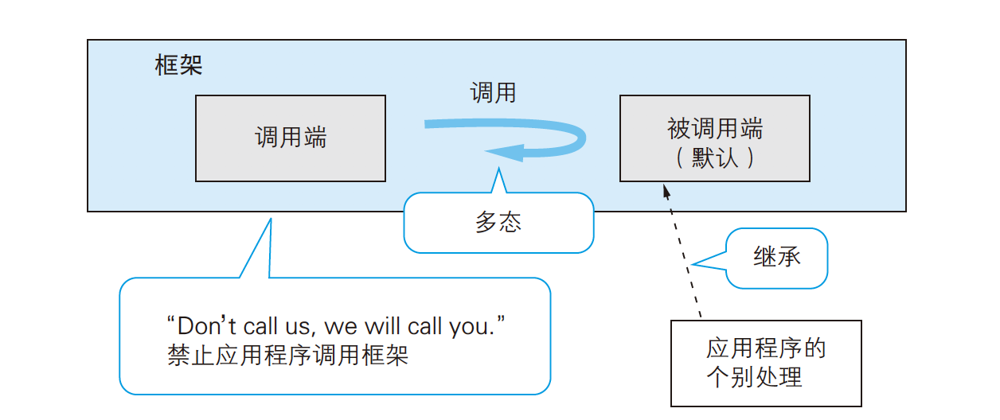
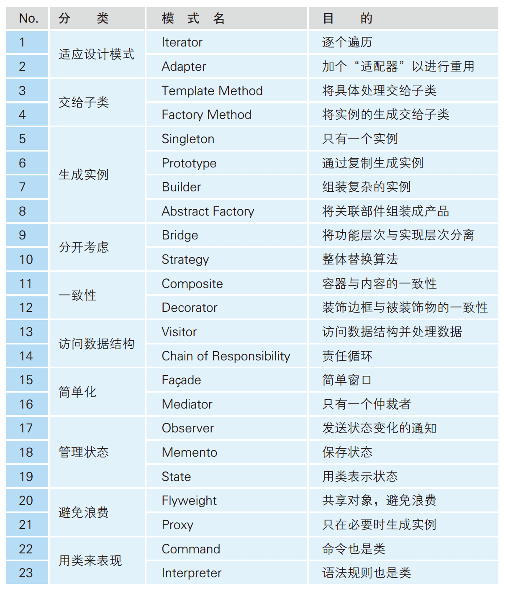
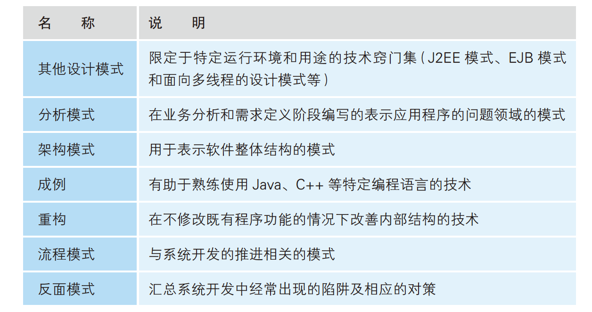

# 面向对象编程技术



- 面向对象技术
  - 面向对象技术是软件开发的综合技术（1，12）
  - 面向对象语言的结构和现实世界不能等同（2）
  - 编程语言进化史（3）
  - OOP 的基本结构：类、多态和继承（4）
  - 理解内存结构（5）
  - OOP 带来的软件重用（类库、框架、组件）和思想重用（设计模式）（6）
- 面向对象包括编程技术和归纳整理法
  - 统一建模语言 UML（7、8、9）
  
  - 面向对象设计的思想和技术窍门（10）
  
  - 软件开发流程（11）
  
    

## 1. 编程语言进化史

在OOP出现之前，那些已经存在的编程技术能够实现什么呢？又有着哪些限制呢？在详细学习 OOP 以前，我们首先回顾编程语言的发展历史。



程序员最初使用**机器语言**编写程序。计算机只可以解释用二进制数编写的机器语言，并且计算机对机器语言不进行任何检查，只是飞快地执行。

由于使用机器语言编程很低效，所以人类发明了**汇编语言**。汇编语言语言是编程语言的第一步，它将无含义的机器语言用人类容易理解的符号表示出来。使用汇编语言编写好的程序，需要使用汇编程序转换为机器语言之后才能够被计算机执行。

计算机的进化史，就是不断利用现有工具创造出新的工具的历史。最早的高级语言的编译器是使用汇编语言编写的，而最早的汇编语言的编译器是用机器语言编写的。

后来人们发明了**高级语言**，使用更贴近人类的表达形式来编写程序。发明于 1957 年的FORTRAN是第一种高级语言，FORTRAN使用算式编写程序。程序员使用高级语言编程后，都得到了提高。 在从机器语言到汇编语言，再到高级语言的进化过程中，使用贴近人类的形式编写程序的目的已经达到了。人们总是希望提高编程语言的表现能力，即用更贴近人类的方法简单地表示希望让计算机执行的作业，FORTRAN等高级语言已经能够做到了。虽然高级语言的出现使程序员的编程效率和质量都得到了提升，但是由于计算机的普及和快速发展，NATO在20 世纪60 年代后半期提出了所谓的**软件危机（software crisis）**。软件危机是指人类的供给能力满足不了日益增大的软件开发需求的状况。NATO 在1968年的一次国际会议中声明，20 世纪末，即使全人类都成为程序员，也无法满足日益增大的软件需求。

为了应对软件危机，语言进化的方向就转变成了**提高可维护性**。无 GOTO 编程以及提高子程序独立性的结构都是为了便于既有程序的理解和修改。随着程序寿命的延长，可维护性就编程了一个必须要考虑的功能要求。

首先，Dijkstra提出了简单易懂的**结构化编程**，又叫无 GOTO 编程。结构化编程的基本思想是，不使用GOTO 语句（无条件跳转），提倡采用简单的基本结构（顺序、分支和循环结构）进行编程，以便编写出能够正确运行的程序。结构化语言的出现是极大的进步。

另外，为了应对软件危机，还要提高子程序的独立性。子程序结构被用于将在程序中的多个位置出现的相同命令汇总到一处，以减小程序的大小，提高编程的效率。但这样还不够，为了强化程序的可维护性，还应该**提高子程序（过程或函数）的独立性**。如何提高子程序的独立性呢？提高子程序独立性的方法就是**减少在调用端（主程序）和子程序之间的共享信息（全局变量）。**如果子程序之间使用全局变量交换信息，那我们很难知道哪一个子程序在何时修改或引用了变量。对于包含很多子程序的应用程序而言，修改全局变量会带来很多问题。减少全局变量对提高程序整体的可维护性而言非常重要。

为了避免全局变量导致的问题，人们设计出了**局部变量**和**按值传递**（call by value）两种结构完成子程序间的信息交换。局部变量是指只可以在子程序中使用的变量，在进入子程序时被创建，在退出子程序时消失。按值传递是指通过参数向子程序传递信息时，不直接使用调用端引用的变量，而是复制值以进行传递。局部变量和按值传递可以使全局变量的使用控制在最小限度，较少子程序之间共同访问的变量，从而提高子程序的独立性。

C语言是经典的结构化编程语言。C语言可以使用if 语句、while 语句和for 语句等命令编写明确的控制结构，也提供了局部变量和按值传递功能。并且还具备位运算和指针等功能。位运算是之前汇编语言才可以执行的运算，而指针用于动态分配内存，以便高效实用内存区域。C 语言虽然提供了GOTO 语句，但是仅仅是为了跳出嵌套循环结构等特殊情况而准备的。C语言还有一个重要的特征，即编程所需的全部功能并非通过语言规范提供，而是有函数库提供。这样，即使不改进语言编译器，也可以添加语言规范层的功能。C++、Objective-C、Java等面向对象的编程语言都是 C语言的直系子孙。

结构化编程避免了滥用 GOTO 语句造成的面条式代码问题，也通过公用子程序解决了可重用的问题。但是，结构化编程仍然无法解决全局变量问题和可重用性差的问题。

结构化语言使用局部变量和按值传递结构以减少全局变量的使用。但是局部变量是临时变量，在子程序调用结束时就会消失。因此在子程序运行结束后依然需要保持的信息就只能被存放着子程序外面，即保存为全局变量。而全局变量可以被程序的任何位置使用，所以当因某种情况而需要修改全局变量时，为了查明影响范围，就必须调查所有的逻辑。（注：C语言中通过添加 static 修饰符来限制可以访问全局变量的范围）

另外，结构化语言通过子程序实现的可重用性规模较小，因此需要提高可重用的规模。但在结构化语言中，作为公共构件创建的只是子程序。能够打破这一限制的，正是面向对象编程（OOP）技术。OOP 起源于 1967 年的 Simula67，Smalltalk 和 C++出现后，通过 GUI的开发，OOP 的灵活性和**可重用性**得到了验证。

OOP 是怎么解决结构化语言无法解决的两个问题呢？答案是，OOP 引入了类、多态和继承。类、多态和继承是「去除程序的冗余逻辑，进行整理」的结构，也叫做面向对象的三大元素。打个比方，如果要保持房间整洁，平时就要多加注意，此外还需要使用清理不必要物品（去除冗余）的吸尘器和规整必要物品（整理）的收纳架。

- 类结构将紧密关联的子程序（函数）和全局变量汇总，创建大粒度的软件构件。这样就可以将之前分散的子程序和变量加以整理。
- 多态和继承能够整合之前公用子程序无法很好处理的重复代码，彻底消除了源代码的冗余。


## 2.面向对象OOP与冗余和整理

> 面向对象的基本思想是，重点关注各个构件，提高构件的独立性，将构件组合起来，实现系统整体的功能。通过提高构件的独立性，当发生修改时，能够使影响范围最小，在其他系统中也可以重用。——《面向对象是怎样工作的》

| 基本结构 | 说明                           | 目的     | 记法                                     |
| -------- | ------------------------------ | -------- | ---------------------------------------- |
| 类       | 汇总子程序和变量，创建软件构件 | 整理     | 汇总、隐藏和从一个类创建很多个实例的结构 |
| 多态     | 实现方法调用端的公用化         | 去除冗余 | 创建公用主程序的结构                     |
| 继承     | 实现重复的类的定义的公用化     | 去除冗余 | 将类的共同部分汇总到另外一个类中的结构   |

**面向对象编程（OOP）**作为一种「**去除程序冗余，进行整理**」的编程技术，是以在它之前出现的编程技术为基础，并针对之前的技术缺点进行了改进。使用 OOP 的目的是编写出高质量、易于维护和可重用性好的程序。类、多态和继承这三种基本结构是提高软件可维护性和可重用性的有效技术。OOP 使用类结构汇总子程序和变量，并使用多态和继承结构实现以前子程序无法实现的逻辑的公用化。在使用 OOP 进行编程时，我们需要思考的是：

- 怎么做才能使程序更容易维护和重用？
- 考虑使用顺序、分支和循环等基本结构和公用子程序是否能够实现？
- 使用类、多态、继承等 OOP 的结构来实现会不会更好？


面向对象（Object Oriented）的含义是「以对象为中心」，目的是「驱动逻辑电路组成的计算机」。计算机擅长的是做记忆工作和程序固定的工作，相比人类的大脑能够处理的数据量更大。所以，面向对象技术是为了提高软件的可维护性和可重用性，从而开发「大规模软件的可重用构建群」成为可能，而非完全模拟现实世界。此处讨论的面向对象限于编程领域，我们把面向对象是用来轻松地进行软件开发的综合技术，其核心是编程技术（OOP、框架和设计模式）。

**类（封装）**、**多态**和**继承**是面向对象编程（Object Oriented Programming）的基本结构。在 OOP 中，类、多态和继承被明确定义为提高软件的可维护性和可重用性的结构。类通过「汇总变量和子程序」创建独立性高的构件，实例则能在运行时将实例变量在堆区展开，确保类的逻辑。多态和继承用于消除重复代码，创建通用性强的构件。

### 2.1 类：汇总、信息隐藏、从一个类创建很多个实例

类（class）指类型，是面向对象的最基本的结构，与之对应的实例（instance，也叫对象）指具体的物。类和实例的关系相当于集合和元素的关系，类是用来创建实例的结构，实例固定属于唯一的一个类。我们都是先创建类，然后再创建实例的。在面向对象中，我们通过定义类来编写程序。当程序运行时，从定义的类创建实例，它们之间互相作用，从而实现软件的功能。我们需要事先为所有的行动都准备好方法，并通过消息传递来调用方法，这样事物才会开始运作。

类的功能是汇总、隐藏和“创建很多个”：

- **汇总**：类能够将紧密联系的（多个）子程序和（多个）全局变量汇总到一个类中，既减少了整体构件的数量，也使得方法（子程序）的命名和查找更轻松。OOP 中将由类汇总的子程序称为**方法**，将全局变量称为**实例变量（属性或字段）**。这就是汇总和整理操作的价值，将此思想进一步延伸，可以得到用于整理大规模软件的包（package）功能，包将多个类进行分组，可以解决类名冲突问题。
- **隐藏**：OOP 具有将实例变量的访问范围仅限定在类中的功能，即隐藏只在类内部使用的变量和子程序。隐藏无法从类外部使用的变量和方法，就缩小了修改的影响范围。除了「隐藏变量和方法」之外，OOP 中还具备「显式公开类和方法」的功能。类的隐藏功能能对其他类隐藏类中定义的变量和方法（子程序），所有我们在写程序时就可以不使用全局变量了。
- 从一个类**创建很多个**实例：一旦定义了类，在运行时就可以由此创建很多个实例。实例是指类定义的实例变量所持有的内存区域。另外，定义了多个类就可以在运行时创建多个实例，即能够确保多个内存区域。这是 OOP 特有的功能。


用C 语言也可以实现前面介绍的汇总和隐藏功能。C 语言中会将源程序分割为多个文件，如果将变量和子程序指定为static，那么

其他文件就无法访问了。

**实例变量**融合了「局部变量能够将影响范围局部化」的特点以及「全局变量存在时间长」的优点，因此**可以将实例变量理解为存在时间长的局部变量或者限定访问范围的全局变量。**另外，实例变量和全局变量一样，在程序中并不是唯一存在的，通过创建实例，能够根据需要创建相应的变量区域。



### 2.2 多态：实现调用端公用化

多态（polymorphism）是统一调用子程序端的逻辑的结构，即创建公用主程序的结构，这方便了消息发送者。多态的关键在于，即使替换被调用端的类（相当于子程序），也不会影响调用端的类（相当于主程序）。多态让相似的类发送消息的方法通用，发送消息时不用关心对方具体是哪一个类的实例。多态虽然只是实现了程序调用端的公用化，但其重要性不亚于类。框架和类库等大型可重用构件群正是因为多态的存在才成为可能。

多态中需要将对象类的方法调用方式（被调用的方法的参数和返回值形式）全部统一，即让被调用的类“看起来都一样”。



实现多态的内存结构。

多态具体的实现方法有很多种，典型的是**方法表（虚函数表）**。

首先在各个类中准备一个方法表。该方法表中依次存储着各个类定义的方法在内存中展开的位置，即方法的指针。方法的指针就是指 C/C++中的函数指针。

### 2.3 继承：去除类的重复定义



继承（inheritance）是将类定义的共同部分（共同的方法和实例变量）汇总到另外一个类中，并去除重复代码的结构。我们将想要共同使用的方法和实例变量定义在公用类中，并声明想要使用的类继承该公用类，这样就可以直接使用公用类中定义的内容。在OOP 中，该公用类称为超类（父类），利用超类的类称为子类。在OOP 的继承中，父类的所有性质都会被继承。

继承是系统地整理相似事物的类的共同点和不同点的结构。继承相当于全集与子集的关系，在面向对象中，全集被称为超类，子集被称为子类。我们可以在超类中定义全集共同的性质，在子类中定义子类特有的性质。

另外，声明继承也就是声明使用多态。因此，在声明继承的子类中，为了统一方法调用方式，继承的方法的参数和返回值类型必须与超类一致

根据继承的信息类型的不同，内存配置也不同。从超类继承的方法和实例变量的内存配置是完全不同的。

子类中可以直接使用超类中定义的方法。继承的方法虽然存储在方法表中，但实际的代码信息使用的却是超类的内容。

通过继承，实例变量的定义也被复制到了子类中，但实际的值却会根据实例的不同而有所不同。因此，堆区中创建的子类的所有实例都会复制并持有超类中定义的实例变量。这样一来，所有的实例都会被分配变量区域。


#### 类型和类型检查

在程序中定义存储值的变量时，我们需要**给变量指定类型**。这样做，首先是为了**告诉编译器内存区域的大小**。声明变量的类型后，编译器就可以计算出在内存中保持该变量所需的内存空间。另外，给变量指定类型也是为了**防止程序发生错误**。

**在 OOP 中可以将类作为类型使用，可以将变量的类型、方法的参数类型或者方法的返回值类型指定为类。**对于类型指定为类的变量、参数和返回值，如果要存储该类（及其子类）之外的实例，在编译和运行程序时会发生错误。假设已经定义了一个 FileManager 类。

````java
FileManager manager;										// 将变量的类型指定为类

int getSomething(FileManager manager) { /* 省略逻辑处理 */ }	// 将方法的参数类型指定为类

FileManager getDefalutManager() { /* 省略逻辑处理 */ }		// 将方法的返回值类型指定为类
````

机器语言和汇编语言几乎不存在进行类型检查的结构。高级语言和结构化语言中则导入了一些结构，用于检查编程语言自带的数据类型和结构体的使用方法。而OOP 通过将汇总变量和方法的类定义为类型，从而将类型检查作为一种程序规则强制要求。因此，编译器和运行环境会匹配类型来检查逻辑，从而使得编程更轻松。类型检查的结构会根据编程语言的种类的不同分为两种：

- 强类型检查：程序编译时检查错误。
- 弱类型检查：程序运行时检查错误。


## 3.OOP 程序的运行机制

### 3.1 一般的程序运行环境

使用OOP 编写的程序的特征在于内存使用方式，但如果大家在编写程序时完全不了解内部运行机制，那么编写的程序可能就会占用过多内存，从而影响机器资源。因此，我们有必要理解内存的使用方法。

#### 程序的运行机制

| 程序运行方式 | 说明                                                         | 优缺点                                     | 备注                         |
| ------------ | ------------------------------------------------------------ | ------------------------------------------ | ---------------------------- |
| 编译器方式   | 将程序中编写的命令（通过编译器）转换为计算机能够理解的机器语言之后再运行 | 运行效率高；运行前花时间                   |                              |
| 解释器方式   | 将源代码中编写的程序命令边解释边运行                         | 立即运行，兼容性好；运行速度慢             |                              |
| 中间代码方式 | 首先使用编译器将源代码转换为不依赖于特定机器语言的中，间代码，然后使用专门的解释器来解释中间代码并运行。 | 同一个程序可以在不同的运行环境中高效地运行 | 使用虚拟机解释、运行中间代码 |

注：许多编程语言都既支持编译器方式，又支持解释器方式。

OOP 提供的类、多态和继承等结构使大规模重用（创建类库和框架等可重用构件群）成为可能，而使用了编程语言层面的虚拟机后，大范围的重用（能在各种平台上使用创建的软件构件）也成为了可能。

#### 线程

线程指程序的运行单位。进程表示的单位比线程大，一个进程可以包含多个线程。能够同时运行多个线程的环境称为多线程环境。使用多线程可以减少等待时间，提高整体的处理效率。通过并发处理多个线程，可以高效利用CPU 资源。

#### 内存使用方式



程序的内存区域分为静态区、堆区和栈区三部分。

| 类型   | 用法                                                 | 存储信息                               | 分配单位                     |
| ------ | ---------------------------------------------------- | -------------------------------------- | ---------------------------- |
| 静态区 | 在应用程序开始运行时分配                             | 全局变量、运行代码                     | 为整个应用程序分配一个       |
| 堆区   | 开始时分配一定的区域，之后会根据需要再为应用程序分配 | 任意（取决于应用程序）                 | 为一个系统或应用程序分配一个 |
| 栈区   | 后入先出方式                                         | 调用的子程序的参数、局部变量和返回位置 | 为每个线程分配一个           |

### 3.2 OOP 的特征在于内存的用法

#### 每个类只加载一个类信息

当使用OOP 编写的程序运行时，会从类创建实例进行动作。而实际上，当程序运行时，在创建实例之前，需要将对应的类信息加载到内存中。类信息中最重要的是方法中编写的代码信息，代码信息时类固有的信息，每个类只加载一个方法中编写的代码信息。加载类信息的时间点：

- 预先整体加载所有类信息（C++）
- 在需要时依次将类信息加载到内存中（Java）

#### 在堆区创建实例，在变量中存储实例的指针

每次创建实例都会使用堆区。**OOP 中的内存使用方法的最大特征就是实例的创建方法。使用OOP 编写的程序会大量使用有限的堆区来运行。**在执行创建实例的命令时，程序会在堆区分配所需大小的内存，用于存储该类的实例变量。这时，为了实现指定实例来调用方法的结构，还需要将实例和方法区（即静态区）中的类信息对应起来。

 在变量中存储实例的指针。存储实例的变量中存储「实例的指针（表示内存区域位置的信息）」，而非实例本身。当将存储实例的变量赋给其他变量时，只是复制指针，堆区中的实例本身并不会发生变化。因为复制的都只是存储实例的指针，实例本身一直都只有一个，并不会改变。复制存储实例的变量时要多加注意。


#### OOP 运行机制中的垃圾回收

**垃圾回收器**会自动删除**堆区**中「**脱离网络关系的实例**」（从根部无法到达的实例，即孤立的实例）。

使用OOP 编写的应用程序，都是通过从类创建实例并对该实例启动方法来运行，并且实例还可以引用其他实例（具体结构是在变量中存储实例的指针）。在使用OOP 编写的应用程序中会创建很多实例，它们互相引用，整体构成一个网络。作为一般的程序结构，正在运行的方法的参数和局部变量存储在栈区中。在OOP 中，参数和局部变量还可以指定实例。在这种情况下，栈区中存储的是堆区中的实例的指针。方法区也可以引用堆区的实例。栈区和方法区中存储着应用程序处理所需的信息，因此这里引用的实例不会成为垃圾回收的对象。栈区和方法区是网络的根部。

注意：栈区和方法区不要一直引用不再需要的实例。（在万一程序因为内存不足而异常结束的情况下，这是修改应用程序的一个要点）


## 4.重用


使用OOP 技术是为了提高软件的可维护性和可重用性，我们可以利用OOP 具有的类、多态和继承等结构，实现实际的大规模重用。重用有两个方面：

- **软件重用**：准备通用性高的软件构件群进行重用。使用 OOP 开发通常都是使用已经存在的可重用构件群，如源代码或运行形式的模块。这些可重用构件群称为**类库**、**框架**和**组件**等。

- **思想重用**：对软件开发或维护时频繁出现的技术窍门和手法进行命名，实现模式化（**设计模式**）

  

可重用构件群和设计模式的发展历程：



- 利用OOP 创建可重用构件群
- 提取可重用构件群中共同的设计思想，形成设计模式
- 为了创建可重用构件群，会利用设计模式



在好莱坞，电影制作者对演员说“Don’t call us, we will call you”，这就是好莱坞原则。所有的控制流程都由框架决定，应用程序的处理则使用多态，按需调用。基本的使用方法就是，继承框架提供的默认类（或者接口），并编写一些方法。







## 附录 Java 中的OOP

#### 类具有汇总、隐藏和从一个类创建很多个实例的功能。

````java
//1类的汇总和隐藏功能
public class TextFileReader extends TextReader {
    //存储正在访问的文件编号的变量，private 将 fileNO 隐藏（只有类内部的方法才能访问）
   	private int fileNO;	
    
    // 构造函数（创建实例时调用的方法）
    //（通过参数接收路径名）
    public TextFileReader(String pathName) { /*处理逻辑*/ } //在创建实例时指定文件的路径名
    
    //打开文件
    public void open()(String pathName) { /*处理逻辑*/ } 
    
    //关闭文件
    public void close(){ /*处理逻辑*/ }	
    
    //从文件读取一个字符
    public char read(){ /*处理逻辑*/ }
}

// 2.从一个类“创建很多个”实例
TextFileReader reader1 = new TextFileReader();	//从TextFileReader 类创建第一个实例
TextFileReader reader2 = new TextFileReader();	//从TextFileReader 类创建第二个实例

reader1.open("C:\\a.txt");		//打开第一个文件
reader2.open("C:\\b.txt");		//打开第二个文件

char ch;						//声明读取字符的变量
ch = reader1.read();			//从第一个文件读取一个字符（指定实例，调用方法）
ch = reader2.read();			//从第二个文件读取一个字符
ch = reader2.read();			//从第一个文件读取一个字符

reader1.close();				//关闭第一个文件
reader2.close();				//关闭第二个文件
````

#### 使用多态实现调用端的公共化

- 创建TextReader类，使公用主程序端无须关注文本文件和网络（TextReader 也可以不是类，使用仅声明方法规格的接口来实现。）

- 创建一个读取文本文件的TextFileReader类，继承自TextReader类。
- 创建一个读取通过网络发送的字符串的类NetworkReader，继承自TextReader类。

````java
public class TextReader {
    //打开
    public void open() {}
    //关闭 
    public void close(){}
    //读取一个字符
    public char read(){}
}

public class TextFileReader extends TextReader {
    //存储正在访问的文件编号的变量
   	private int fileNO;	
    
    // 构造函数（创建实例时调用的方法）
    //（通过参数接收路径名）
    public TextFileReader(String pathName) { /*处理逻辑*/ } //在创建实例时指定文件的路径名
    
    //打开文件
    public void open()(String pathName) { /*处理逻辑*/ } 
    
    //关闭文件
    public void close(){ /*处理逻辑*/ }	
    
    //从文件读取一个字符
    public char read(){ /*处理逻辑*/ }
}


public class NetworkReader extends TextReader {
    //	打开网络
    public void open(){ /*省略处理逻辑*/ }
    
    // 关闭网络
    public void close(){ /*省略处理逻辑*/ }
    
    // 从网络读取一个字符
    public char read(){ /*省略处理逻辑*/ }
}

//	使用多态（确保扩展性）
int getCount(TextReader reader){
    int charCount = 0;
    while(true) {
        char = reader.read();	//	使用多态来读取字符
        //	省略满足结束条件时跳出循环的逻辑
        charCount++;
    }
    return charCount;
}
````

使用多态时，被调用的方法的参数和返回值的形式必须统一。

我们在TextFileReader 和NetworkReader 中声明它们遵循由TextReader 确定的方法调用方式。 extends TextReader 是继承（后述）的声明，意思是遵循超类TextReader 中定义的方法调用方式。通过使用多态结构，无论是从文件还是网络输入的字符，我们都可以轻松地编写出计算字符个数的程序

#### 继承

````java
public class SubClass extends SuperClass {
	//
}
````

