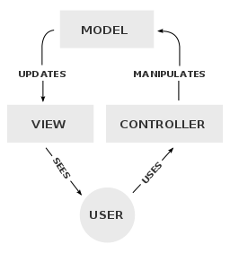
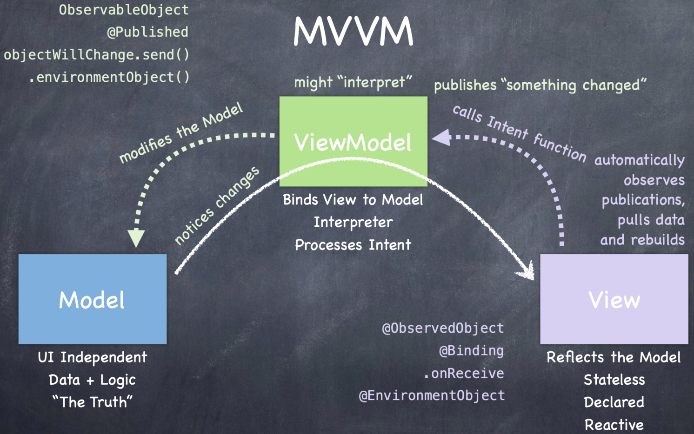
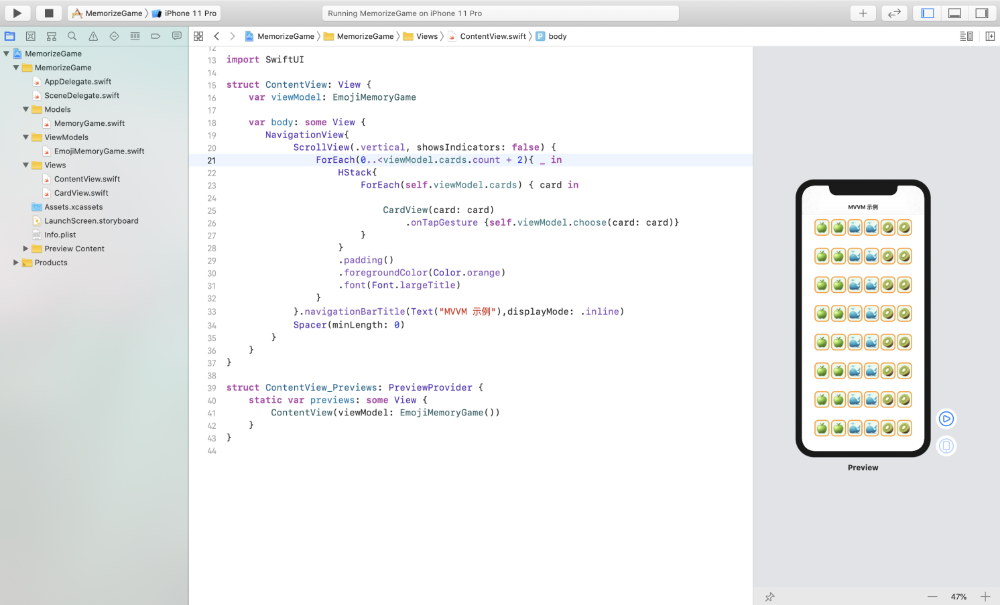

## 1. 什么是设计模式

软件设计模式，是指在软件设计中给定上下文中对常见问题的通用可重用解决方案。它不是可以直接转换为源代码或机器代码的最终设计，而是关于如何解决可以在许多不同情况下使用的问题的描述或模板。设计模式是形式化的最佳实践，开发者可以在设计应用程序或系统时用来解决常见问题。

可以把设计模式看成介于编程范式和具体算法之间的一种计算机编程的结构化方法。

面向对象的设计模式通常显示类或对象之间的关系和交互，而无需指定最终的应用程序类或对象。暗示可变状态的模式可能不适合函数式编程语言，某些模式可能在内置支持解决其试图解决的问题的语言中变得不必要，而面向对象的模式不一定适用于非对象面向语言。

## 2. 什么是 MVC

在 iOS 开发中，MVC（Model-View-Controller，模型-视图-控制器模式）是 UIKit 使用的设计模式。

图片来源：https://commons.wikimedia.org/wiki/File:MVC-Process.svg（RegisFrey / Public domain）

Model 是 MVC 的核心，是应用程序的动态数据结构，独立于UI，负责管理应用程序的数据，逻辑和规则，从Controller 接收用户输入。

View 以特定格式表示 Model，可以是信息的任何表示形式，例如图表或表格。 可以使用同一信息的多种视图，例如用于管理的条形图和用于会计的表格视图。

Controller 负责 Model 和 View 之间的交互。Controller 接收用户输入，可选地对其进行验证，然后将输入传递给 Model。这里Controller 的任务，包含转换模型数据。

但是，使用 Controller 转换模型数据并不合适。于是就有了 MVVM。

## 3. 主角 MVVM

MVVM 是 Model-View-ViewModel （模型-视图-视图模型）的缩写，源自MVC，也是一种组织代码的架构设计模式。MVVM 的思想是“数据与视图分离”，与响应式 UI 协同工作。SwiftUI（Apple 最新推出的声明式 UI 框架）必须遵守 MVVM 才能正常工作。

图片来源：https://commons.wikimedia.org/wiki/File:MVVMPattern.png（Ugaya40 / [CC BY-SA 3.0](https://creativecommons.org/licenses/by-sa/3.0)）

MVVM 的主要优点如下：

- UI 组件与业务逻辑分离
- 业务逻辑与后端逻辑（数据模型）分离，即与数据库操作分离
- 一般不必担心生命周期事件（如旋转屏幕）

MVVM 会维护应用生命周期的状态，APP 的状态会将与用户离开时的状态保持一致，所以你基本上不用操心生命周期事件（如旋转屏幕）。使用 MVVM 组织代码也增强了代码的易读性。

为了达到数据和视图分离的目的，MVVM 将对象（objects）分成了三类：Model、View、ViewModel。

那么，它们如何分工？又是怎么协作的勒？都在下面这张图里。

图片来源：斯坦福 CS193p课程截图

Model 独立于 UI，而聚焦于数据和逻辑部分。View 是受 Model 驱动的，Model 和 View 之间有数据流动，具有无状态（Stateless）、声明式（Declared）、响应式（Reactive）的特点。View 作为 Model 的具体反映，负责向用户渲染视图。而 ViewModel 则充当模型和视图之间的桥梁，将 View 与Model 绑定 。

相较于 MVC，MVVM 的重点在于ViewModel（视图模型）。ViewModel 是一个值转换器，表示视图模型负责以易于管理和显示对象的方式公开（转换）来自模型的数据对象。在这方面，ViewModel 比 View 更具模型性，可以处理大多数视图显示逻辑。ViewModel 可以实现中介模式，围绕视图支持的一组用例来组织对后端逻辑的访问。

三者的协作过程如下：

- **Model -> ViewModel -> View**
  
  当 Model 发生变化时，Model 会通知 ViewModel 有变化发生。ViewModel 可能会根据变化做出相应的反应，比如告知 View 「数据模型里有东西发生了改变」。View 会自动观察 ViewModel 发布的「公告」，获取数据并重建视图。

- **View -> ViewModel -> Model**
  当View 发生变化时，View 会调用 Intent 函数，接着 ViewModel 处理 Intent，并对 Model 进行相应的修改。

## 4. MVVM 项目实践

### 代码组织

查看源码请前往 GitHub 仓库 ：[CS193p-SwiftUI-Spring-2020](https://github.com/italkso/CS193p-SwiftUI-Spring-2020)

注：本例 Copy 自斯坦福 [CS193p](https://cs193p.sites.stanford.edu) 课程 Lecture2：MVVM and the Swift Type System。CS193p系列课程是由斯坦福大学 Paul Hegarty 教授讲授的 iOS 开发课程，学习可直接访问[https://cs193p.sites.stanford.edu](https://cs193p.sites.stanford.edu)。入门建议对照课程手敲。

## 参考资料

[1] [https://cs193p.sites.stanford.edu/sites/g/files/sbiybj16636/files/media/file/l2.pdf](https://cs193p.sites.stanford.edu/sites/g/files/sbiybj16636/files/media/file/l2.pdf)

[2] [MVC](https://en.wikipedia.org/wiki/Model%E2%80%93view%E2%80%93controller)

[3] [MVVM](https://en.wikipedia.org/wiki/Model%E2%80%93view%E2%80%93viewmodel)
