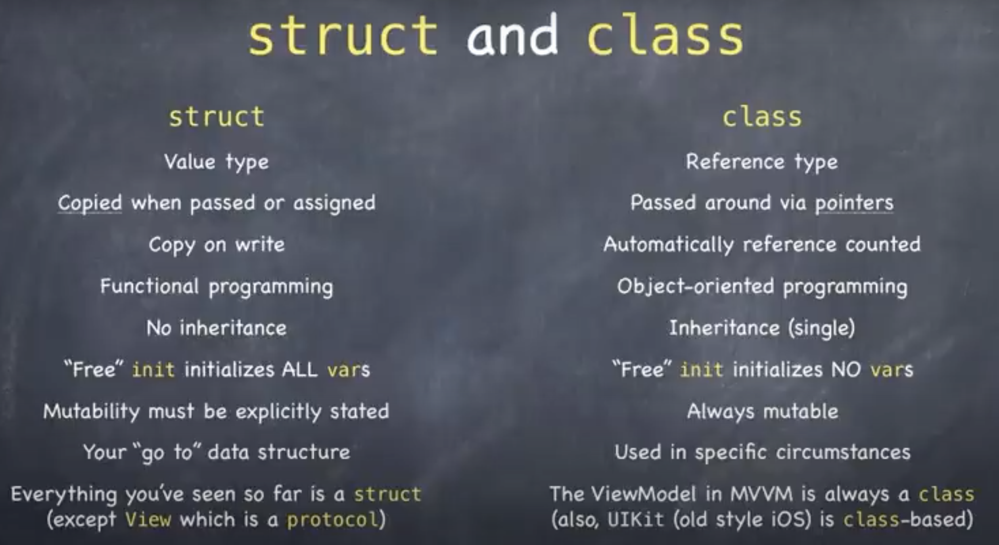

##  结构体和类的异同



来源：斯坦福大学CS193p 课程


### 1. 结构体和类在语法上的相似之处

结构体和类都可以定义属性、常量、函数和构造器。

- 定义存储属性（存储在内存中）

```Swift
var isFavorate: Bool
```

- 定义计算属性（某段代码的计算结果）

```Swift
var body: some View {
		Text("Hello, Swift")
}
```

- 定义常量（定义后值不发生改变）

```Swift
let defaultColor = Color.orange
...
CardView().foregroundColor(defaultColor)
```

- 定义函数

```Swift
func multiply(operand: Int, by: Int) -> Int {
     return operand * by
 }
 multiply(operand: 5, by: 6)
func multiply(_ operand: Int, by otherOperand: Int) -> Int { return operand * otherOperand
 }
 multiply(5, by: 6)
```

- 定义构造器（创建结构体或类时定义的特殊函数，用于初始化）

```swift
struct MemoryGame {
  init(numberOfPairsOfCards: Int) {
  // create a game with that many pairs of cards
  }
}
```


#### 2. 结构体和类的不同之处

| 结构体                    | 类                                                           |
| ------------------------- | ------------------------------------------------------------ |
| 值类型                    | 引用类型                                                     |
| 在传递或赋值时会**复制**  | 通过**指针**引用值                                           |
| 写时赋值（Copy on write） | class  使用 ARC（自动引用计数）                              |
| 函数式编程的概念          | OOP（面向对象编程）的概念                                    |
| 无继承                    | 可继承的（单继承），这是结构体和类最重要的区别               |
| “自由”初始化所有变量      | class  不会“自由”初始化变量                                  |
| 是否可修改必须显示声明    | 总是可以修改                                                 |
| 与数据结构关系紧密        | 用在具体场景中                                               |
| SwiftUI 更多使用 struct   | MVVM 中的 ViewModel 总是   class 类型，UIKit 也是基于 class 的UI框架 |


**Reference**

[1] <https://cs193p.sites.stanford.edu/sites/g/files/sbiybj16636/files/media/file/l2.pdf>

