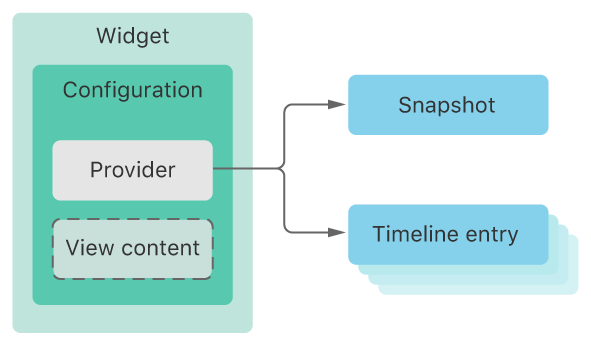

## 1. Widget 的用途

Widget（桌面小组件） 主要用于「**展示信息**」，仅提供轻量互动，记住不要把复杂逻辑放入 Widget。



知识要点：

- Widget 主要位于设备负一屏，也可被添加在桌面的任意位置。
- Widget 有 small / medium / large三种尺寸，分别占据 4、8、16 个应用图标格。
- 你可以通过「向 App 添加 widget extension 」的方式实现一个小组件。
- 使用 timeline provider 配置 Widget， timeline provider 会告诉 WidgetKit 合适刷新 Widget 的内容。
- 你可以使用 SwiftUI 视图展示 Widget 的内容。
- 向 Widget 添加 SiriKit intent 定义可以提供使用户能够自定义 Widget。


## 2. 制作桌面小组件

#### 2.1 新增一个 Target

> File - New -Target - iOS - Application Extension - Widget Extension - Product Name

小组件在开发期间的名称不能与项目名重复，假设命名为 `StariosWidget`。Target 新建完成后，Xcode 会新建几份模版文件： `StariosWidget.intentdefinitions` (为小组件提供更复杂的自定义功能)和 `StariosWidget.swift` ( 包含五个重要的 struct）。

```swift
import WidgetKit
import SwiftUI
import Intents

struct Provider: IntentTimelineProvider {...}

struct SimpleEntry: TimelineEntry {...}

struct StariosWidgetEntryView : View {...}

//	@main 指小组件应用的接入点
@main						
struct StariosWidget: Widget {...}

struct StariosWidget_Previews: PreviewProvider {...}
```

**Provider**

负责由小组件向操作系统提供信息。Provider 遵循 IntentTimelineProvider 协议，开发者需要提供 **placeholder、getSnapshot 和 getTimeline**等三个必备函数的实现。

```swift
struct Provider: IntentTimelineProvider {
    func placeholder(in context: Context) -> SimpleEntry {
        SimpleEntry(date: Date(), configuration: ConfigurationIntent())
    }//无网络连接或数据未能及时加载时，小组件接收到的默认信息

    func getSnapshot(for configuration: ConfigurationIntent, in context: Context, completion: @escaping (SimpleEntry) -> ()) {
        let entry = SimpleEntry(date: Date(), configuration: configuration)
        completion(entry)
    }//显示的真实信息

    func getTimeline(for configuration: ConfigurationIntent, in context: Context, completion: @escaping (Timeline<Entry>) -> ()) {
        var entries: [SimpleEntry] = []

        // Generate a timeline consisting of five entries an hour apart, starting from the current date.
        let currentDate = Date()
        for hourOffset in 0 ..< 5 {
            let entryDate = Calendar.current.date(byAdding: .hour, value: hourOffset, to: currentDate)!
            let entry = SimpleEntry(date: entryDate, configuration: configuration)
            entries.append(entry)
        }

        let timeline = Timeline(entries: entries, policy: .atEnd)
        completion(timeline)
    }//操作系统向小组件索要的时间轴
}
```

**SimpleEntry**

**SimpleEntry** 遵循 **TimelineEntry** 协议，**时间轴** （Timeline）是小组件中一个重要的概念 ，系统需要知道小组件想显示什么内容，而且需要根据组件的时间轴排期。

```swift
struct SimpleEntry: TimelineEntry {
    let date: Date
    let configuration: ConfigurationIntent
}
```

**StariosWidgetEntryView**

标准的 SwiftUI 视图。

```swift
struct StatiosWidgetEntryView : View {
    var entry: Provider.Entry

    var body: some View {
        Text(entry.date, style: .time)
    }
}
```

**StariosWidget**

```swift
struct StariosWidget: Widget {
    let kind: String = "StariosWidget"

    var body: some WidgetConfiguration {
        IntentConfiguration(kind: kind, intent: ConfigurationIntent.self, provider: Provider()) { entry in
            StatiosWidgetEntryView(entry: entry)
        }
        .configurationDisplayName("My Widget")
        .description("This is an example widget.")
    }
}
```

**StariosWidget_Previews**

提供小组件的 Canvas 预览窗口，`.previewContext(WidgetPreviewContext(family: .systemSmall))` 表示使用小尺寸的小组件预览。

```swift
struct StariosWidget_Previews: PreviewProvider {
    static var previews: some View {
        StariosWidgetEntryView(entry: SimpleEntry(date: Date(), configuration: ConfigurationIntent()))
            .previewContext(WidgetPreviewContext(family: .systemSmall))
    }
}
```


**WidgetKit** 是一个纯 SwiftUI 视图的框架，自身已经内置了一些常用功能。

- 自动暗色模式：前提是使用类似 `.color(.primary)` 的写法或者使用系统提供的标准色。

- 小组件推荐轮转：使用 **On-Device Intelligence** 将用户叠加的多个小组件轮转推荐。


**Reference**

[1] <https://developer.apple.com/documentation/widgetkit/>

