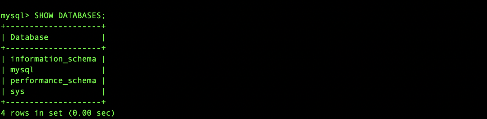

## 1.关系型数据库

### 关系模型

数据库按照数据结构来组织、存储和管理数据。

数据库一共有三种模型：层次、网状或关系模型（主流）。

关系模型，即若干个存储数据的二维表。关系数据库的表和表之间需要建立“一对多”，“多对一”和“一对一”的关系，这样才能够按照应用程序的逻辑来组织和存储数据。

**记录（Record）**：表的每一行，记录是一个逻辑意义上的数据。

**字段（Column）**：表的每一列，同一个表的每一行记录都拥有相同的若干字段。

关系数据库支持的标准数据类型包括数值、字符串、时间等，根据业务规则选择合适的数据类型。

其中使用最广泛的两种：`BIGINT`能满足整数存储的需求，`VARCHAR(N)`能满足字符串存储的需求。

### 主键和外键

在关系数据库中，关系是通过主键 和外键来维护。

通过主键字段唯一区分出不同的记录，保证任意两条记录不重复。主键是用来唯一定位记录的，修改了主键，会造成一系列的影响。因此记录一旦插入到表中，主键最好不要再修改。选取主键的一个基本原则是：不使用任何业务相关的字段作为主键。作为主键最好是完全业务无关的字段，一般把这个字段命名为`id`。常见的可作为`id`字段的类型有：

| 类型             | 说明                                                         |
| ---------------- | ------------------------------------------------------------ |
| 自增整数类型     | 数据库会在插入数据时自动为每一条记录分配一个自增整数（能满足大部分应用需求）。 |
| 全局唯一GUID类型 | 使用一种全局唯一的字符串作为主键，类似`8f55d96b-8acc-4636-8cb8-76bf8abc2f57`。GUID算法通过网卡MAC地址、时间戳和随机数保证任意计算机在任意时间生成的字符串都是不同的。 |


### 主流关系数据库

1. 商用数据库（[Oracle](https://www.oracle.com/)，[SQL Server](https://www.microsoft.com/sql-server/)，[DB2](https://www.ibm.com/db2/)）

2. 开源数据库（[MySQL](https://www.mysql.com/)，[PostgreSQL](https://www.postgresql.org/))

3. 桌面数据库（微软[Access](https://products.office.com/access)，适合桌面应用程序）

4. 嵌入式数据库（[Sqlite](https://sqlite.org/)，适合手机应用和桌面程序）

   

## 2. SQL 简介

SQL（Structure Query Language，结构化查询语言）是用于在数据库中存储、处理和检索数据的标准语言。使用SQL可以做：

- 查询，检索数据，插入/更新/删除记录
- 创建新的数据库、新表、存储过程、视图
- 对表、过程和视图设置权限

SQL语言定义了以下几种操作数据库的能力：

- **DDL（Data Definition Language）**：允许用户定义数据，即创建表、删除表、修改表结构等操作。通常，DDL由数据库管理员执行。

- **DML（Data Manipulation Language）**：DML为用户提供添加、删除、更新数据的能力。

- **DQL（Data Query Language）**：DQL允许用户查询数据。

  

在网站中使用 SQL的必要条件：RDBMS（Relational Database Management System）、服务端脚本语言PHP 等、SQL、HTML/CSS。

SQL 语法：SQL语言关键字不区分大小写！


【常见SQL命令】

| 命令              | 说明                   |
| ----------------- | ---------------------- |
| `SELECT`          | 从数据库中提取数据     |
| `UPDATE`          | 更新数据库中的数据     |
| `DELETE`          | 从数据库中删除数据     |
| `INSERT INTO`     | 将新数据插入数据库     |
| `CREATE DATABASE` | 创建一个新的数据库     |
| `ALTER DATABASE`  | 修改数据库             |
| `CREATE TABLE`    | 创建一个新表           |
| `ALTER TABLE`     | 修改表格               |
| `DROP TABLE`      | 删除表                 |
| `CREATE INDEX`    | 创建索引（搜索关键字） |
| `DROP INDEX`      | 删除索引               |


## 3. 安装 MySQL Community Server

[下载](https://dev.mysql.com/downloads/mysql/)并安装 MySQL Community Server 后，把 mysql 安装目录映射到/usr/local/bin目录下：

```bash
$ cd /usr/local/bin

$ ln -fs /usr/local/mysql-8.0.20-macos10.15-x86_64/bin/mysql mysql
```

登录 MySQL（会要求输入密码）：

```bash
$ mysql -u root -p
Enter password:
#密码不会显示，正确输入即可
```

登录成功后，提示符会变成`mysql>` ，说明已经成功连接到Mysql服务器上，你可以执行 SQL 命令`SHOW DATABASES;`查看。

```bash
$ mysql> SHOW DATABASES;
```



````bash
$ mysql -u root mysql 			#输入 \s 获取更多关于服务器的信息，\q 或 quit 退出控制台
$ mysqladmin -u root version 	#查看正在运行的服务器的状态
$ mysqladmin variables  		#检查正在运行的服务器中的所有配置选项（datadir 和 have_innodb 等）
````
