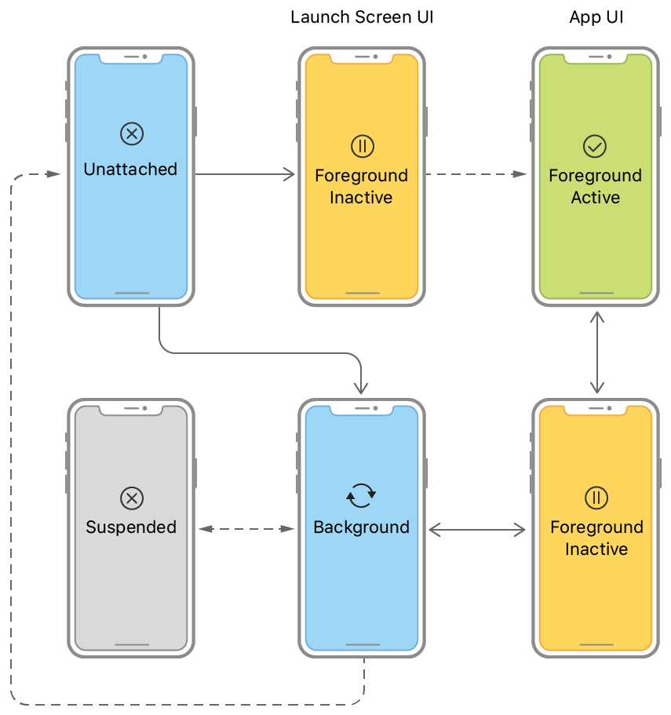

## 应用生命周期

> The current state of your app determines what it can and cannot do at any time. For example, a foreground app has the user’s attention, so it has priority over system resources, including the CPU. By contrast, a background app must do as little work as possible, and preferably nothing, because it is offscreen. As your app changes from state to state, you must adjust its behavior accordingly. 
>
> [Managing Your App's Life Cycle](https://developer.apple.com/documentation/uikit/app_and_environment/managing_your_app_s_life_cycle) - Apple Developer



### 五种状态

**[应用的生命周期 （App Life Cycle）](https://developer.apple.com/documentation/uikit/app_and_environment/managing_your_app_s_life_cycle)**是指应用程序在设备上运行时的不同**状态**。当用户对应用进行不同的操作时，应用会在用户进行不同操作时在这些状态中进行**切换**。

- **Unattached**

  应用完全没有被运行，也不在内存中。所以此时应用不会消耗内存，也不会运行代码。比如，关机重启后、上划并彻底退出应用后、新安装应用未打开等都属于**未读取 （Unattached）**状态。

- **Foreground Inactive**

  **前台不活跃（ Foreground Inactive）**是短暂的过渡状态，启动应用以及前后台之间的切换都要经历。当应用界面已经显示在屏幕上，但还不会对用户操作作出反馈时就处于这种状态。进入前台活跃状态时，要读取数据，准备 UI。而退出前台活跃状态时，应该存储数据，暂停当前正在运行的内容，减少资源消耗。

- **Foreground active**

  **前台活跃（Foreground active）**是应用最常见的状态，当应用界面展示在手机屏幕上运行，用户可以对其执行任何操作。

- **Background** 

  **后台 （Background ）**状态表示应用仍在内存中，可以继续运行代码，并随时准备被再次使用。

- **Suspended** 

  **挂起 （Suspended）**  状态表示，虽然应用仍然在内存中，但是应用不能再运行任何代码。当应用在后台长时间没有被使用，就会进入挂起状态。如果其它应用需要使用更多的内存，处于挂起状态的应用随时会被系统从内存中移除。


### 项目实践

```swift
import SiwftUI

@main
struct ForCreatorLifeCycleApp: App {
    @environment(\.scenePhase) private var scenePhase
    
    var body: some Scene {
        WindowGroup {
            ContentView()
        }
        .onChange(of: scenePhase) { newPhase in 
        	switch newPhase {
                case .active:
                	print("Foreground Active")
                case .inactive:
                	print("Foreground Inactive")
                case .background:
                	print("Background")
                @unknown default:
                	print("Error")
            }            
        }
    }
}
```

