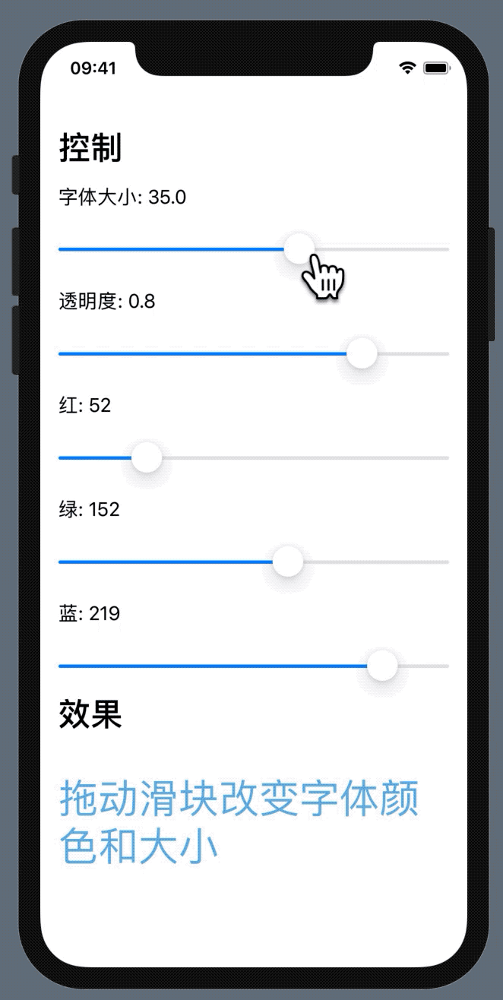

# 如何改变字体颜色和大小

通过 Slider 结合@State 属性 改变字体的颜色和大小，效果如下：



代码如下：

```Swift
import SwiftUI

struct ChangeFontSizeAndColor: View {
    
    @State private var size: Double = 40
   
    
    //rgba(52, 152, 219,0.8)
    @State private var opacity:Double = 0.8
    @State private var red: Double = 52
    @State private var green: Double = 152
    @State private var blue: Double = 219
    
    
    var body: some View {
        VStack(alignment:.leading){
            Text("Control")
                .font(.title)
                .bold()
                .padding(.vertical)
            VStack(alignment: .leading, spacing: 20){
                Text(String(format: "Font Size: \(size)", "%.0f"))
                Slider(value: $size, in: 10...50, step:1)
                
                Text(String(format: "Opacity: \(opacity)", "%.0f"))
                Slider(value: $opacity, in: 0...1,step: 0.1)
                
                Text("Red: \(Int(red))")
                Slider(value: $red, in: 0...255,step: 1.0)
                
                Text("Green: \(Int(green))")
                Slider(value: $green, in: 0...255,step: 1.0)
                
                Text("Blue: \(Int(blue))")
                Slider(value: $blue, in: 0...255,step: 1.0)
            }
            Text("Result")
                .font(.title)
                .bold()
            Spacer()
            VStack{
                Text("Drug the Slider to change the color & size of these Text")
                   .font(.system(size: CGFloat(size)))
                   .foregroundColor(Color(red:red/255, green:green/255, blue:blue/255).opacity(opacity))
           }
            Spacer()
        }.padding()
    }
}

struct SwiftUIView_Previews: PreviewProvider {
    static var previews: some View {
        ChangeFontSizeAndColor()
    }
}
```

