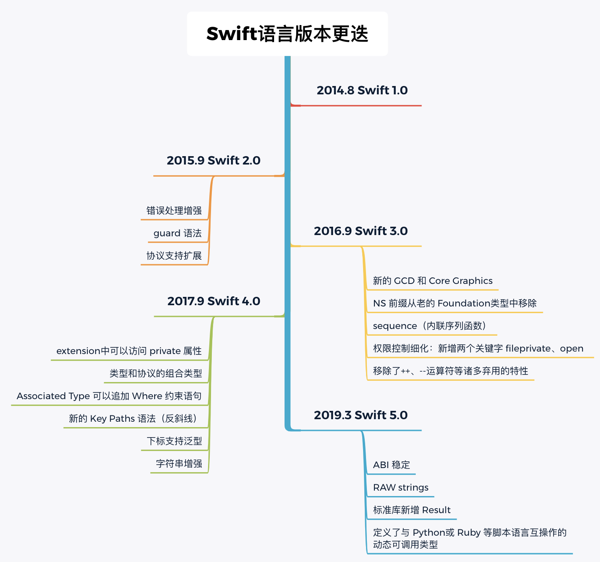

# Swift 编程


## 1.Swift 简介


### Swift 的现代编程特性

- 变量使用前先初始化

- 检查数组索引是否越界，检查整数溢出

- 使用可选类型（Optional）显式处理 nil 值

- 自动内存管理（ARC）

- 允许从未知错误中恢复

  

### Swift 的版本更迭




### Swift的特点

- **编程范式**

  Swift 支持「面向协议编程」、「函数式编程」、「面向对象编程」。Objective-C 仅支持面向对象编程。

- **类型安全**

  Swift 是类型安全的，而 Objective-C 是非类型安全的。

- **值类型增强**

  struct、enum、tuple、基本数据类型（用 struct 实现）都是值类型，值类型具有不变性，独立性、可交换性等特点。而 Objective-C 中的 NSNumber、NSString 、集合类对象都是指针类型。

- **枚举增强**

  Swift 中的枚举可以使用整型、浮点型、字符串型，可以拥有属性和方法，支持泛型、协议和扩展等。而 Objective-C中的枚举仅仅是一个标记值。

- **泛型支持**

  Swift 支持泛型和泛型的类型约束，而 Objective-C 对泛型约束的支持仅仅停留在编译器警告阶段。

- **协议和扩展**

  Swift 对协议的支持很丰富，可配合扩展、泛型、关联类型实现面向协议编程，还可用于值类型。而 Objective-C 的协议缺乏强约束。

- **函数和闭包是 first class**

  Swift 中的函数和闭包一等公民，你可以直接定义函数类型变量，可以将函数和闭包作为其他函数参数传递，也可以把函数和闭包作为函数的返回值返回。而 Objective-C 中的函数时二等公民，为了模拟 swift 中类似的效果，需要selector 封装或者使用 block。


## 2. 语法要点


此处总结了使用 Swift 编写代码的一些要点，如果需要更详细的说明，后文相关章节会有展开。


使用 Xcode、 Playground、swiftc 或 REPL 都可以编译和运行 Swift 代码。

使用 Xcode 的 Playground 文件练习 Swift 语法时，请记得在Xcode 的 Playground文件中使用**`import Foundation`**导入 Swift 语言及核心功能框架。长按并选择底部的「**Automatically Run**」，Playground 就会在在用户每次新增代码后，自动运行并给出代码执行结果。


### 注释和打印

单行注释用`//`，多行注释用`/* */`。`print()`函数默认添加了换行`\n`，如果不想要换行，使用 `print()`给 terminator 赋值一个期望的分隔符。

```swift
public func print(_ items: Any..., separator: String = " ", terminator: String = "\n")
```


### 代码规范

包括大小写、空行、命名、标点符号等。

- 代码换行时使用键盘 Return 按钮。

- 花括号中代码前需空格时，使用 Tab 键按钮。

- Swift 语言自带的关键字、自定义函数、常量名和变量名均遵循驼峰命名法。

- 使用英文标点符号。

  

### 常量和变量

#### let 和 var

- 使用**`let`**声明常量，初始化后无法修改内容；使用 **`var`** 声明变量 ，初始化后可以随意修改内容。
- 使用赋值号 **`=`**  将其右侧的内容赋给左侧的变量，assign 即是赋值，第一次赋值叫做**初始化**（Initialize）。
- 常 / 变量仅能在其作用域（Scope）内被使用，作用域一般是该变量的声明所处的花括号中。

#### 命名规则（见名知义）

- 一般使用「驼峰命名法」

- 常量名和变量名可以包含大部分字符（包含 Unicode字符）
- 常量名或变量名必须唯一
- 存储值时必须保证值的类型与常量或变量的类型相匹配。

#### 命名禁忌

- 不能含有空格、数学符号、箭头、专用的 Unicode标量值、线条或框形图字符等
- 不能以数字开头
- 应当避免使用 Swift 的关键字作为常量名或变量名


### 运算符

一元（unary）运算符只需要一个操作数，前缀（`-a`、`!b`）、后缀（可选类型的`？`和`！`）均可。 二元（binary）运算符需要两个数，中缀（ `3 + 4` ）。条件运算符(`?: `)是唯一的三元（ternary）运算符。

- **算术**

  `+ - * / %`，默认情况下Swift 的算术运算符不允许值溢出，以避免存储越界时出现意外结果。

  Swift 中的**整数除法**所得结果是直接**向下取整**，一元加减即是正负号。

  `a % b`是**取余**（ remainder）运算符。在 Swift 中，对负数使用运算符`%`是求余数而不是模。`a % b`与 `a % -b`结果相同。

- **赋值**

  使用 `=` 初始化或给变量重新赋值，使用`+= -= *= /=`等一次性完成运算并赋值，即复合赋值。

  为了避免开发者误将赋值运算符用作恒等运算符（==），赋值本身不返回值。

-  **逻辑**

   `&& || !`，常用在条件判断语句中，注意`&&`和`||`左结合。

- **比较**

  `== != > >= < <=`，返回一个布尔（Bool）值，是条件判断语句中常用的运算符。

- **区间**

  `a…b` 、 `a..<b`、 `a…` 或 `…b`，常与循环语句搭配使用。`a..<b`在数组等从 0 开始的数据结构中特别有用。

- **三元条件运算符**

  `x ? a : b`，平衡代码的简洁性和易读性，不提倡过度使用。

- **Optional 相关**

  `?` - 定义可选类型

  `!` - 强制解包

  `??` - 合并空值`a ?? b`为可选类型提供默认值，即有值时将`a`解包，没有值时返回预先指定的默认值`b`。

- **Type casting**

  `is   ` 是类型检查运算符。

  `as?`  向下类型转换的条件形式(the conditional form of downcast )，不确定是否会成功时用。

  `as!` 向下类型转换的强制形式(the forced form of downcast )，确定总会成功时用。

  

- `=== `和`!==`

  判断运算符两边的指针是否相同，即判定两个 instance 是不是同一个。

- **圆括号（Parentheses**）

  在不需要圆括号时使用圆括号，可以提高复杂表达式的可读性。

  ```swift
  // 门禁访问示例
  if (enteredDoorCode && passedRetinaScan) || hasDoorKey || knowsOverridePassword {
      print("Welcome!")
  } else {
      print("ACCESS DENIED")
  }
  // 打印 "Welcome!"
  ```


###  控制流

- **条件判断（Condition）**

  `if else`、`else if`、`?:`、 `switch`、`default`

- **循环（Loop）**

  `for-in`：可用于集合类型及区间

   `while`：`while condition {}`，优先判断是否满足条件

  `repeat-while`： `repeat {} while condition`，运行完第一遍代码后才进行条件判断
  
  

### 类型

因为存储空间总是有限的，计算机所作的计算也只是近似计算，所有需要类型这个概念。

按照存储性质类型划分，可以分为值类型与引用类型。基本类型是指编程语言直接提供的类型，而enum、class、struct等是自定义类型。

Swift 是**强类型**语言 （strongly typed language），要么直接完成初始化，Swift 会根据内容推断常量或变量的类型，即**类型推断**（Type Inference）；要么明确明确标出常量或变量的类型，即**类型注解**（Type Annotations）。按下 Option 键并点击任意常/变量，Xcode 就会显示其类型。

使用`String(42)`将 `Int 42` 转换为 `String`呢，就叫做**类型转换**（Type Casting）。

你还可以适度使用`typealias`关键字给基础类型或者更复杂的类型起一个**类型别名**，比如`typealias name = String`。

#### 常用的类型

- **基本类型**

  最基本的数据类型，`Int`、`Double`、`Bool`、`String`，值类型。

  字符串插值`\()`，字符串拼接`+`。

- **集合类型**

  处理批量数据，数组`[]`, 字典`[:]`, Set`[Set]`，值类型。

- **元组**

  将多个值作为一个单一的复合值返回，`()`。

- **函数和闭包**

  `func`, `{}`，提供功能， 引用类型。

- **可选类型**

  显示处理空值（实际属于枚举类型），`Optional?`，值类型。

- **结构 struct** 

  创建自定义类型，值类型。

- **枚举 enum**

  存储有限类别的事务，允许创建新类型，关键字`enum…case`，值类型。

- **类 class**

  创建自定义类型，引用类型。

#### 值类型和引用类型

硬盘容量大，可以永久存储（ Permanent Storage）信息。而内存空间有限，仅被用来临时存放（Temporary Storage）正在运行的应用。

Int、Double、Bool、Enum、Struct、Array、Dictionary等都是**值类型**（Value Type），它们直接将信息存储在内存的存储单元中，这些类型的常量或变量所指代的就是内存中的信息本身。

Class是属于**引用类型**（Reference Type），引用类型的变量存储的是内存中值所对应的内存地址，即**指针**（Pointer）。

#### 集合类型

- **Array**

  **语法**

  `[Type]`，`[[Type]]`，逻辑上的多维数组在内存中仍表现为一维数组。

  数组 Array 适合存储大量不确定的数据。

  **属性**

  `count`，`min`，`isEmpty`，`contains(_:)`

  **方法**

  增 - `append(_:)`或`+=`，`insert(_:at:)`

  删 - `remove(at:)`，`removeLast()`，`removeAll()`，`removeSubrange(2...5)`

  查 - `arrayName[index]`，`randomElement()`，`firstIndex(of:)`

  改 - `arrayName[index] = newValue`，`sort()`，`shuffle()`原位修改，`map()`使用尾随闭包语法返回新数组，`filter()`使用尾随闭包语法返回符合筛选条件的新数组。

- **Dictionary**

  **语法**

  `[key:value]`，可以将字典与数组混合使用，把字典作为数组的元素。

  **属性**

  `count`，`isEmpty`，`contains(where:)`

  **方法**

  增 - `dictionaryName[key] = value`

  删 - `dictionaryName[key] = nil`

  改 - `dictionaryName[key] = newValue`

  查 - `dictionaryName[key]`

  

- **Set**

  略。

#### 元组

Tuple

#### 可选类型

- **可选类型（Optional）是一个枚举类型  （enum）**

  `Optional.none` 表示 `nil`，`Optional.some`表示包裹值。

- **声明和强制解包**

  在现有类型后方加 `?`可以声明一个可选变量，使用`！`强制解包（Force Unwrap）

- **可选绑定**

  可选绑定（Optional Binding）是指先判断，有值就赋给常量或变量。

  `if let`语法：所创建的常量仅能在花括号 {} 内被使用。

  `guard let`语法：所创建的常量可以在 `guard let` 自身的花括号外使用。

- **可选链**

  使用可选链（Optional Chaining） 为可选类型增加默认值 ，语法为 `??`。

#### 结构、枚举、类、扩展和协议

- 使用 **结构（struct）**自定义新类型
- 使用 **枚举（enum）** 自定义新类型，将有限种类的数据归类

- 使用 **类（class）** 自定义新类型，将数据通过层级关系归类

- 使用 **扩展 （extension）**向现有的任意类型添加新内容

- 使用 **协议（protocol）**

  

### 权限控制 Access Control

`open`、`fileprivate`、`internal`、`private`、`public`。


## 3. 函数和闭包


函数和闭包都是引用类型，当你把一个函数或闭包赋给一个常量或变量时，实际上是在引用函数和闭包。


### 函数（Function）

函数是 first-class 类型，可以将函数类型作为参数传递和返回值返回。

```swift
// Define a function
func functionName(argumentLabel parameter: ParameterType) -> ReturnType {
    //	Implementation
    return ReturnType()
}

// Call a function
functionName(argumentLabel: actualValue)	
```

- **完整的函数定义**

  包括关键字 `func`，函数名，参数列表`()`，返回值和实现函数功能的代码。

- **parameter是外来数据**

  函数可以使用 parameter 引入外来数据来执行其自身功能。parameter List 为空则表明函数不需要任何外来数据。

- **argument 是使用函数时的具体数值**

  通过函数名和参数列表可以**调用**函数。这时，应明确给出该函数中每一个参数的具体数值 。

- **标签及默认值**

  使用 **Argument Label** 是为了提高函数调用时参数的可读性。标签名(如 `to`)不一定要与参数名(如 `name`)相同，在调用时也可以使用`_`省略标签名。

- **返回值**

  Return Value 指函数所返回的结果，Return Type是指返回值的类型。当代码中仅包含一个可以返回的数值时，可以省略 **return** 关键字。

- **函数重载**

  Function Overload 指函数名相同，但其它方面不同的函数。

- **最佳实践**

  应将待解决的问题**划分**成多个小函数，而不是把所有功能放入一个函数。

  根据函数使用情况来回推函数定义，先思考函数的功能，然后考虑要处理的参数以及是否需要返回值。

示例：

```swift
func greeting() {
    print("Hello")
}

func greeting(to name:String) {
    print("Hello,\(name)")
}

greeting()
greeting(to: "Jobs")
```


### 闭包（Closure）

- **Closure Expression**

  闭包省略了函数名，并将花括号前移，同时增加了 `in` 语法。通常将闭包作为函数的参数使用。

```swift
//	Closure Expression
{(parameters) -> ReturnType in
	statements
}

let chars = ["a", "e", "i", "o", "u"]

var reversedChars = chars.sorted(by: { (s1: String, s2: String) -> Bool in
    return s1 > s2
})

reversedChars = chars.sorted(by:{s1, s2 in return s1 > s2})

reversedChars = chars.sorted(by:{s1, s2 in s1 > s2})

reversedChars = chars.sorted(by:{ $0 > $1})

reversedChars = chars.sorted(by:>)
```

- **Trailing Closures**

```swift
let chars = ["a", "e", "i", "o", "u"]

var reversedChars = chars.sorted { (s1: String, s2: String) -> Bool in
    return s1 > s2
}

reversedChars = chars.sorted {s1, s2 in return s1 > s2}

reversedChars = chars.sorted {s1, s2 in s1 > s2}

reversedChars = chars.sorted { $0 > $1}
```


## 4. 结构、类和 OOP


### 面向对象编程OOP


 面向对象编程（Object-oriented programming，OOP)就是「**整理归类**」，即将待用物品归类，并根据类别赋予不同的功能和属性。OOP 的实质是**间接（indirection）**技术。

**抽象（Abstraction）**、**封装 （Encapsulation）**、**继承 （Inheritance）**、**多态 （Polymorphism）**是OOP 的四个重要属性。

Swift 中，类 class 与结构 struct 都用来创建自定义类型，都具有「属性、初始化器、方法」。关键字不同只是两者在语法上的区别。有兴趣可以参考 CS193P 课程中关于结构和类的比较。

struct 和 class 的核心差异是：

- struct 是值类型，而 class 是引用类型

  在存储逻辑上的差异。

- struct 只支持一个层级，class 支持创建多个层级的父子关系

  class 支持继承。

- struct 自带默认的初始化器，而 class 必须写明初始化器 

  如果你不提供初始化器，编译会报错，错误信息类似`Class 'MyClass' has no initializers`。

对于 Apple 官方框架来说，适用于反复使用的框架一般定义为 class，以减少重复占用过多内存。而不需要继承、不适合反复使用的实体常被定义为 struct。Apple 官方文档建议，当创建新的自定义类别时，首先定义为 struct。只有你需要用到 class 继承的特性，或者是作为引用类型的特性时，再将关键字更换为 class。


### 结构

**struct** 用来定义新的类型，是 Swift 语言的核心组成部分。一个常见的 struct 可能包含**属性**、**初始化器**和**方法**。用属性来处理数值、用方法来书写功能。Swift 中的[Int](https://developer.apple.com/documentation/swift/int)、 [Double](https://developer.apple.com/documentation/swift/double)、[Array](https://developer.apple.com/documentation/swift/array)、[Dictionary](https://developer.apple.com/documentation/swift/dictionary) 等数据类型实际上都是struct 。

```swift
struct StructName {
    
	// Instance or Type Property, Stored or Computed Property, Lazy Property
    var property: Int
    
    //	Default Initializer, Custome Initializer
    init(property: Int) {
        self.property = property
    }
    
    //	Instance or Type Method, Mutating Method
    func someMethod() {
    	//
    }
}
```

参考示例：

`lazy` 表示把赋值操作 `currentHealth = maxHealth` **延迟**到 `currentHealth` 真正需要被使用时。

```swift

//  MARK: - Structure
struct Player {
    //  MARK: - Property
    static var allPlayers: [Player] = []    // Type Property
    var name: String
    var livesRemaining = 5 {//Property Observer
        willSet {
            print("Warning: \(livesRemaining) Lives")
        }
        didSet {
            if livesRemaining != 0 {
                print("I'm Back!")
            } else {
                print("Game Over.")
            }
        }
    }// Property Observer
    let maxHealth = 100
    lazy var currentHealth = maxHealth
    var isPlayerOutOfLives: Bool {
        get {
            livesRemaining == 0 ? true : false
        }
        set {
            if newValue {
                livesRemaining = 0
            }
        }
    }// Computed Property
    
    //  MARK: - Initializer
    init(name: String) {
        self.name = name
    }// Default initializer with a default value
    
    init(name: String, livesRemaining: Int, currentHealth: Int) {
        self.name = name
        self.livesRemaining = livesRemaining
        self.currentHealth = currentHealth
    }// Default initializer without a default value
    
    init(name:String, livesRemaining: Int) {
        self.name = "VIP" + name
        self.livesRemaining = livesRemaining
        currentHealth = 10000
    }// Customer initializer
    
    //  MARK: - Method
    func welcomePlayer() {
        print("Current Player: \(name)")
    }
    
    mutating func damaged(by health: Int) {
        currentHealth -= health
        
        if currentHealth <= 0 && livesRemaining > 0 {
            livesRemaining -= 1
            currentHealth = maxHealth
        }
        
        if livesRemaining == 0 {
            print("Game Over")
        }
    }
    
    mutating func stateReport() {
        print("Current Health\(currentHealth),\(livesRemaining)Lives Left")
    }
    
    static func recentAddedPlayer() -> Player {
        allPlayers[allPlayers.count - 1]
    }// Type Method
}

var playerX = Player(name: "X")
var playerY = Player(name: "Y", livesRemaining: 10, currentHealth: 100)
Player.allPlayers.append(contentsOf: [playerX, playerY])
print("Player Added Recently: \(Player.recentAddedPlayer().name)")
playerX.stateReport()
playerX.isPlayerOutOfLives = true

playerX.damaged(by: 50)
playerX.stateReport()

playerX.damaged(by: 30)
playerX.stateReport()
```

- **值类型和引用类型**

  结构（struct）和枚举(enum)是**值类型**，而类(class)、函数和闭包是**引用类型**。

- **创建 Instance**

  使用语法「**`名称(属性的值)`**」创建结构、枚举和类的 **Instance** 。

- **点语法**

  使用**点语法**调用 Instance 的属性及方法。

-  **Type Property/Method**

  添加关键词 **static** 的属性及方法分别叫做**类型属性**（Type Property）和**类型方法**（Type Method），代表其内容与结构相关。

  当需要将结构作为一个独特的类型来提供数据时，就要用到**类型属性**。

  定义类型属性：`static var allPlayers: [Player] = []`。

  调用类型属性：`结构名.类型属性`，如`Player.allPlayers.append(contentsOf: [playerWang, playerZhou])`。

  类型方法。

-  **Instance Property/Method**

  **未**添加关键词 **static** 的属性及方法分别叫做Instance Property和Instance Method，代表其内容仅能用于 instance 中，如调用Instance 方法`playerWang.stateReport()`。

```swift
//    Definition of Structure
struct Resolution {
    var width = 0
    var height = 0
    
    func printInfo(){
        print("Width:\(width),Height:\(height)")
    }
}

//  Create an instance and initialize members of structure Resolution
let someResolution = Resolution(width: 640, height: 480)

print("\(someResolution.height)")
someResolution.printInfo()
```


#### 属性

- **属性**

  在结构和类中定义的常量或变量叫做**属性**（Property）。

- **lazy**

  使用关键词可以告知编译器先忽略 lazy 关键词后的赋值语句。

- **属性观察器**

  属性观察器（Property Observer）负责监视属性的变化，并在属性的值发生变化时作出反馈。触发时机：

  `willSet` ：检测到该属性将要发生变化，新的值为 `newValue`。

  `didSet` ：已将新的值赋给该属性，被更改的值为 `oldValue`。

- **计算属性**

  计算属性 （Computed Property）是指本身不存储任何数值，通过计算现有属性获得结果的属性。关键词为 `get` 和 `set`。


#### 方法

- **方法**

  定义在结构、枚举和类中的函数叫做**方法**（Method） 。

- **mutating**

  当方法需要更改属性的值时，需要在方法的关键词 func 前加上关键词 **mutating**。


#### 初始化器

初始化器（Initializers）是特殊的方法，用于给 struct 创建 instance ，使用初始化器是为了确保 Instance 中的所有属性都被赋值。Swift 允许开发者自定义初始化器。

通常使初始化器的参数与结构的属性**同名**，可以使用 **self** 关键词区分，关键词 self 等同于**当前的instance**。

一般Swift 会自动提供两个初始化器的版本，一种将默认值考虑进去，只需开发者提供剩余参数即可，如 `init(name: String)`；另一种不考虑默认值，要求提供所有参数，如 `init(name: String, livesRemaining: Int, currentHealth: Int)`。


### 类

使用**类（Class）**可以实现上述 OOP 的四个属性。

#### 继承

> A class ( subclass ) can *inherit* methods, properties, and other characteristics from another class  ( superclass ). 

```swift
class SomeBaseClass {
    // Definition of base class 
}

class SomeSubclass: SomeSuperclass {
    // Definition of subclass
}
```

- 继承使用冒号语法，即**`SubClass: SuperClass`**。
- 如果向子类添加的内容已在父类中存在，使用关键字 **override **，表示以子类覆盖后的内容为准。
- 使用关键字 **super** 可以直接调用父类实体，如**`super.init()`**。你也可以在子类中完整地写出对初始化器中所有变量的赋值，但这样比较麻烦。

#### 多态

- **处理多种子类**是OOP 中多态的体现


## 5. 可选类型和枚举

```swift
//	 Enumerations
enum CompassPoint {
    case north, south, east, west
    mutating func turnNorth() {
        self = .north
    }
}
var currentDirection = CompassPoint.west
let rememberedDirection = currentDirection
currentDirection.turnNorth()

print("The current direction is \(currentDirection)")
print("The remembered direction is \(rememberedDirection)")
```

数组（ Array） 适合存储大量不确定的数据，枚举（Emuration） 适合存储有限类别的事务，使用枚举可以创建一个新类型。枚举的关键词是 `enum...case`。使用枚举的方式是「`枚举名称.枚举中的种类`」。

可选类型(Optional)实际上就是一个包含两个状态的枚举，`Optional.some`存储数值，`Optional.none`存储空值。你可以给 policyNote 赋值 nil，或直接根据其枚举的属性给它赋值为 Optional.none，其结果完全一致，如下图所示。。

除了单独使用外，你也可以将枚举与 switch 语句搭配使用，用于对枚举中不同类型的事务做区别处理。


## 6. 协议

### 协议

> A ***protocol*** defines a blueprint of methods, properties, and  other requirements that suit a particular task or piece of  functionality. The protocol can then be *adopted* by a class, structure, or enumeration to provide an actual implementation of those requirements. 

```swift
protocol MyProtocol {
    var name: String { get }
    
    init(name:String)
}

struct FirstStruct: MyProtocol {
    var name: String
    init(name:String) {
        self.name = name
    }// You can omit these codes in structure because of its default initializer
}

struct SecondStruct {
    var name: String
}

extension SecondStruct: MyProtocol {
    //	Some Code
}

class ClassName: SuperClass, MyProtocol {
    // Defination of Class
    // Implementation of ProtocolName
}
```

协议是规则，遵守协议的结构、类或枚举需要实现协议规定的功能。遵守协议可以写在 结构、类或枚举中，也可以用扩展来写。

[面向协议编程（Protocol Oriented Programming，POP）](https://developer.apple.com/videos/play/wwdc2015/408/)是为了代码复用，即整理项目中的 struct、class、enum等代码，提取逻辑层面的内容后将这些能够复用的部分写出协议。因此，protocol 中的属性、方法及初始化器都有其特殊之处。

- protocol 中的**属性**关键词 `var`，只读`{ get }`表示属性的值允许被 instance 读取， 可读可写`{ get set }属性的值可以被实体 instance 读取或变更。

- protocol 中的**初始化器**及**方法**不包含具体实现。

  

### 常见的协议类型

Equatable 协议和 Comparable 协议用于比较、Hashable 协议和 Identifiable 协议用于识别、Codable 协议用于存取。

- **Equatable**

  [Equatable 协议](https://developer.apple.com/documentation/swift/equatable) 用于判断两个「自定义类型」的Instance 的值是否相等(comparasion for value equality)。所有基础类型（ String、Double、Int、Array 等）都默认遵守 Equatable 协议。

  当自定义类型中不只基础类型时，需要写上类方法 `static func == (Self, Self) -> Bool` ，因为这是实现Equatable 协议要求必须（`Required`）提供的。

- **Comparable**

  [Comparable 协议](https://developer.apple.com/documentation/swift/comparable) 用于判断先后问题，遵守了该协议的类型可以使用关系运算符进行比较。

- **Hashable**

  **哈希 （Hash）** 是指将现有的数据结构通过一定的运算转化为一个随机的、不可重复的、独特的值，这个值就叫哈希值，是一个整数。Swift 提供了哈希值运算，开发者通过添加`: Hashable`只需要遵守 [Hashable 协议](https://developer.apple.com/documentation/swift/hashable/)即可。Hashable 协议继承自 Equatable 协议。

  结构 struct 的所有**存储属性**（stored properties）和枚举 enum 的所有**关联值（**associated values）都必须遵守 Hashable 协议。

- **Identifiable**

  [Identifiable 协议](https://developer.apple.com/documentation/swift/identifiable/) 要求遵守该协议的必须添加一个名为 id 的属性，该属性必须包含一个可哈希的数值，名为 id。Swift 提供的 `UUID()`函数可以用来生成唯一的 ID ，用法是`var id = UUID()`。

  Identifiable 协议还是许多 SwiftUI 视图背后的前置数据条件，SwiftUI 会根据这个独特的 id 来判断视图的复用。

- **Codable**

  [Codable 协议](https://developer.apple.com/documentation/swift/codable/) 的声明如下，Codable 是 Encodable 和 Decodable 协议的类型别名，遵守Codable 协议的数据支持存取。**编码** （Encode）就是将内存中临时存储的信息转化成硬盘里永久存储的信息，**解码**（ Decode）则是将硬盘里的信息读入内存。

  ```swift
  typealias Codable = Decodable & Encodable
  ```

  

## 7. 扩展

> *Extensions* add new functionality to an existing class, structure, enumeration, or protocol type.

```swift
//	Extension Syntax
extension SomeType {
    // New functionality
}

//	Extend an existing type to make it adopt one or more protocols
extension SomeType: SomeProtocol, AnotherProtocol {
    // Implementation of protocol requirements
}

//	Computed Properties
extension Double {
    var km: Double { return self * 1_000.0 }
    var m: Double { return self }
    var cm: Double { return self / 100.0 }
    var mm: Double { return self / 1_000.0 }
    var ft: Double { return self / 3.28084 }
}
```

使用扩展（Extension）可以扩展现有类型（struct，class ，enum，protocol）的内容，扩展支持计算属性、初始化器及方法。


## 8. CPU、多线程与 GCD

````Swift
// iOS 异步编程中常用(创建必须张贴所有UI代码的队列)
DispatchQueue.main.async {
	// 主队列
}

// 创建具有某种优先级的非 UI 队列
DispatchQueue.global(qos:.background).async {
    // 执行复杂任务
}
````

**GCD (Grand Central Dispatch，中央调度系统)**是对Grand Central Terminal的引用，作用是通过将工作提交由系统管理的调度队列，在多核硬件上同时执行代码。

一般GCD 会让所有代码在按其编写的先后**顺序 （Serial）** 运行。默认情况下代码都会被 GCD 放在**主队列 （main）**运行。

但如果所有业务都放在主队列，某些复杂业务可能会阻塞主队列。为此，GCD通过 **队列 FIFO** 和**线程池**，实现了任务的**并发（Concurrent）**执行。

 Swift 中默认提供的并发队列叫做**全局队列 （Global）**，全局队列使用参数 **QOS**（Quality of Service）考虑任务的优先级。

按优先级从高到底分别是：

- **`.userInteractive`** 

  快速执行此操作，决定UI。将 QOS 设置为 UI 级时GCD 会将任务分配到高性能核心上尽快完成。

- **`.userInitiated`** 

  用户发起的任务，现在就做

- **`.utility`** 

  需要发生，但非用户请求

- **`.background`** 

  后台任务，如清理等维护任务

线程池的管理由操作系统完成。GCD的工作方式是允许可并行运行的程序中的特定任务排队等待执行，并根据处理资源的可用性，安排它们在任何可用处理器内核上执行。线程（Threads）、队列（Queues）、闭包（Cloures）、主队列（Main Queue）：系统使用单个线程来处理主队列中的所有代码块。 因此，它也可以用于同步。后台队列（Background Queues）。

GCD 的两个基本任务是：

- 访问队列
- 将代码块放入队列


### 多线程

将一个闭包加入队列有 2 种基本的方式，最常用的是`.async`，它将在“稍后执行这个闭包”。在 UI 代码中不会调用.sync，因为它会阻塞 UI。但是，你可以在后台队列中调用它。

```Swift
// 将闭包加入队列的 2 种基本方式
let queue = DispatchQueue.main  // or DispatchQueue.global(qos:)
queue.async {/*在队列上执行的代码*/}
queue.sync {/*在队列上执行的代码*/}
```

嵌套（Nesting）：下面异步执行的代码似乎是同步的，但实际上不是。

```Swift
DispatchQueue(global: .userInitiated).async {
  // 执行可能会花费较长时间的任务
  // 不在主队列，所以不会阻塞 UI
  // 一旦完成了这一长期的工作，就可能需要更改UI
  // 但我们无法在此处执行UI，因为此代码是在主队列之外执行的
  // 所以，将需要的UI代码放入一个闭包中
  DispatchQueue.main.async {
    // 主队列，UI 代码可以执行
  }
}
```

异步 API：在 iOS 异步编程中常常使用 `DispatchQueue.main.async { }` ，而`Dispatch.global(qos:)`用得少，原因是大量异步 iOS API 运行在更高层次。大量 iOS 函数会在全局队列中自动完成他们的工作。比如 URLSession（从一个 URL 读取数据并返回）。

#### 数据结构和函数

`Dispatch`（调度）框架声明了几种数据类型和函数来创建和操作它们：

- **队列和任务**
  - `DispatchQueue`（调度队列）：一个对象，用于在应用程序的主线程或后台线程上串行或并发地管理任务的执行。
  - `DispatchWorkItem` （调度工作项）：  以某种方式封装想要执行的工作，从而可以附加  completion 句柄或执行依赖项。
  - `DispatchGroup` （调度组）： 将一组任务作为一个单元监视。
  - `DispatchQoS`：任务的服务质量或执行优先级。
- **系统事件监视**
  - `DispatchSource`  ：一个对象，用于协调处理特定的低级系统事件，例如文件系统事件，计时器和UNIX信号。
  -   `DispatchIO`  ：一个对象，使用基于流或随机访问的语义管理文件描述符上的操作。
  -   `DispatchData` ： 一个对象，用于管理基于内存的数据缓冲区，并将其公开为连续的内存块。
  -  `DispatchDataIterator`  ：调度数据对象内容上的逐字节迭代器。
- **任务同步**
  - `DispatchSemaphore`  ：一个对象，使用「计数信号量」控制对跨多个执行上下文的资源的访问。
- **Time Constructs**
  - `DispatchTime`：相对于默认时钟的时间点，纳秒精度。
  - `DispatchWallTime`：根据 wall clock 的绝对时间点，以微秒为单位。
  - `DispatchTimeInterval`：枚举，单位为秒，毫秒，微秒或纳秒。
  - `DispatchTImeoutResult`：表示调度操作是否在指定时间之前完成的结果值。
  - `dispatch_time_t`：时间的抽象表示。
  - `DISPATCH_WALLTIME_NOW: UInt`：当前时间。
- **Dispatch 对象**
  - `DispatchObject`  ：大多数 dispatch 类型的基类。
  -   `DispatchPredicate`  ：枚举，在给定执行上下文中进行评估的逻辑条件。
  -   `func dispatchPrecondition(condition: () -> DispatchPredicate)`  ：检查进一步执行所需的调度条件。


