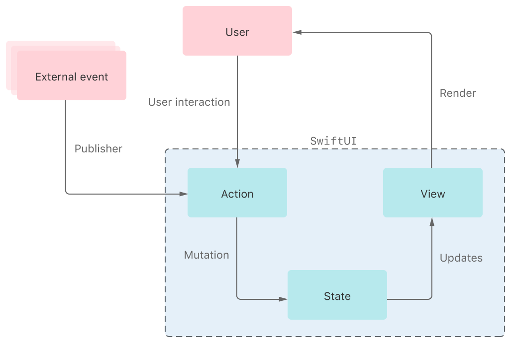
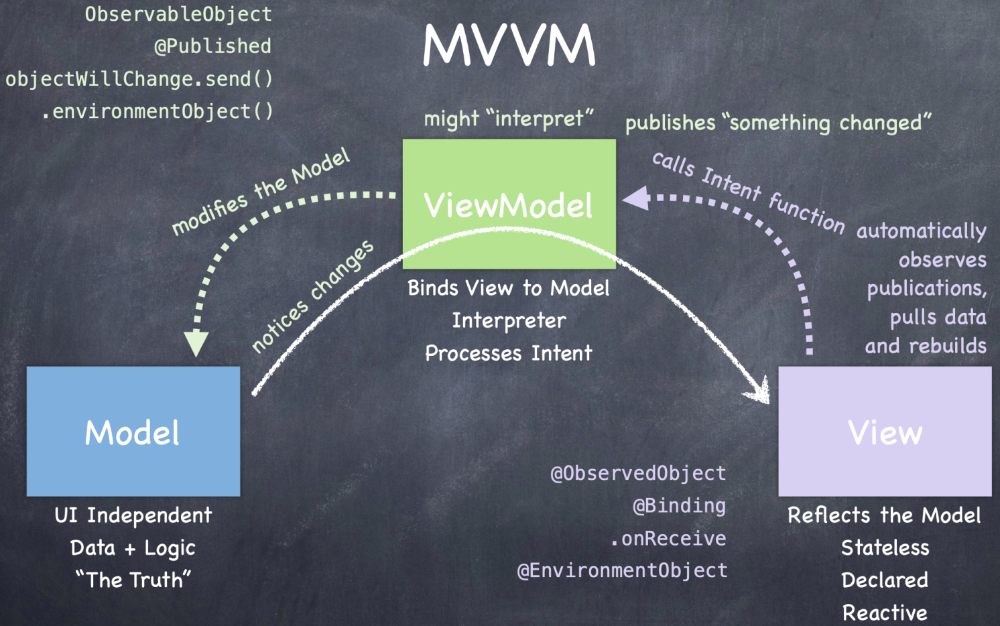

## SwiftUI

### 1. 核心概念

**View** 视图和 **Modifier **修改器是描述性 UI 编程框架 **SwiftUI** 的核心 。

代码`Text("Hello World") .font(.headline)`表示被字体修改器 `.font(.headline)` 修改的 `Text View` 。

```swift
import SwiftUI

struct SwiftUIView: View {
    var body: some View {
        Text("Hello World")
            .font(.headline)
            .foregroundColor(.white)
            .padding()
            .background(Color.primary)
            .cornerRadius(8.0)
    }
}
```

**View**

可见的界面元素，比如按钮、文字、滑条、图片、列表、应用底部按钮等。界面元素的位置关系（ZStack、VStack、HStack）也属于 View 的范畴。

**Modifier**

修改视图的显示及运作方式，比如字体大小和种类、圆角、动画触控反馈、阴影、边际、背景等界面细节。

**界面功能**

由 Swift 配合及框架实现，比如复制到剪贴板，播放歌曲、点击按钮后触发付款流程等。 


### 2. SwiftUI 应用程序的组成

- Apps 应用层面：`struct ReaderAPP ：{ }`，负责告知「代码归属同一个应用」

- Scenes 场景层面： `var body: some Scene { }`，负责处理「应用多开」

- Views 视图层面：`struct ContentView: view { }`，应用程序中将「呈现的视图」

  注：`@main` 负责告知操作系统此处为应用的进入点。

  

### 3. UI 与交互层面

#### 常用视图

```swift
// 文本视图

@state var username = ""
@state var password = ""
@State var textInput = ""

var body: some View {
    Text("Hello, World!")
	Label("显示文字", systemImage: "SF Symbol 图标名称")
	TextField("占位文字", text: $username)
    SecureField("占位文字", text: $password)
}
```

#### 视图运作原理

在 SwiftUI 中，由每个视图自行索要大小。当视图中内容大小明确时，视图根据自身需求索要空间。当视图本身内容大小不明确时，该视图会索要全部剩余空间。

操作系统会告知应用其**视图可用总空间的大小 （Proposed Size）**，该大小会层层传递给子级视图，子级视图会根据自身需求，用两种方式**索要大小 （Claimed Size）。**

SwiftUI 会将被索要的大小从总空间中剔除，并将剩余空间继续传给其它子级视图。在视图大小的传递过程中，SwiftUI 的作用是尽量协调并尊重每个视图索要的区域。空间不够时，则 SwiftUI 会在自身可控范围内适当压缩间距大小。如果空间还不够，则会协调视图相互妥协。


#### 视图内布局

- 使用指定大小的框架修改器`.frame()`直接告知系统视图需要的大小。

- 使用`.fixedSize()`锁定尺寸。

- 使用`.padding()`边缘留白。

-  使用`.ignoresSafeArea(.keyboard)` 和`.edgesIgnoringSafeArea(.all)`忽略安全区，其中`.all`可以替成`.leading`， `.trailing`， `.top`，` .bottom` ，`.vertical` ，`.horizontal`。

- 使用 `.hidden()`隐藏现有视图但保留视图位置。

- 使用`.redacted()`将尚未加载完成的数据自动转化为占位符。

  

#### 自定义修改器

```swift
import SwiftUI

struct SignInView: View {
    @State var username = ""
    @State var password = ""
    
    var body: some View {
        VStack {
            TextField("Username", text: $username) .inputFieldStyle()          
            SecureField("Password", text: $password).inputFieldStyle()
        }
    }
}

//  Create custom modifier - Step1
struct InputFieldModifirer: ViewModifier {
    func body(content: Content) -> some View {
        content
            .font(.body)
            .foregroundColor(.primary)
            .textFieldStyle(RoundedBorderTextFieldStyle())
            .font(.headline)
            .frame(width: UIScreen.main.bounds.width / 1.1)
            .padding()
            .shadow(color: .secondary, radius: 5, x: 1, y: 5)
    }
}

// Create custom modifier - Step2
extension View {
    func inputFieldStyle() -> some View {
        self.modifier(InputFieldModifirer())
    }
}
```


### 4. 状态和数据流动（State & Data Flow）

> SwiftUI provides tools, like state variables and bindings, for connecting your app’s data to the user interface. These tools help you maintain a single source of truth for every piece of data in your app.



Image from [Apple Developer](https://docs-assets.developer.apple.com/published/4fee13b0ffd4854249fa6d4740449865/6075/SwiftUI-SaDF-Overview@2x.png)

**数据流动**（Data Flow） 指应用程序中数据的传递方式。

- 通过将值类型包装为[`State`](https://developer.apple.com/documentation/swiftui/state) 属性来在单个视图内管理UI状态的变化。
- 使用[`ObservedObject`](https://developer.apple.com) 属性包装器连接遵循[`ObservableObject`](https://developer.apple.com/documentation/Combine/ObservableObject)协议的外部引用模型数据。
- 使用[`EnvironmentObject`](https://developer.apple.com/documentation/swiftui/environmentobject)属性包装器访问存储在环境中的可观察对象(observable object)。
- 使用[`StateObject`](https://developer.apple.com/documentation/swiftui/stateobject)直接在视图中实例化可观察对象。
- 使用[`Binding`](https://developer.apple.com/documentation/swiftui/binding)属性包装器共享对唯一真值（ a source of truth）的引用，例如状态或可观察对象。
- 通过将值存储在[`Environment`](https://developer.apple.com/documentation/swiftui/environment)中，在整个应用程序中分配值。
- 使用[`PreferenceKey`](https://developer.apple.com/documentation/swiftui/preferencekey)从子视图向上通过视图层次结构传递数据。
- 使用[`FetchRequest`](https://developer.apple.com/documentation/swiftui/fetchrequest)管理与Core Data一起存储的持久性数据。

-  `ObservableObject` 协议
- `@State`
- `@Binding`
- `@Environment`
-  `@Published`
- `@StateObject`
- `@ObservedObject`
-  `@EnvironmentObject` 

「接收用户输入的数据」、「改变数据状态来更新界面、「渲染新内容」等由 SwiftUI 负责，开发者只需要使用由符号 **@** 表示的**属性包装器**（Property Wrapper）说明想要执行的操作。

@State、@Binding 和@Environment 是与数据流动有关的几个常见属性包装器。它们主要负责不同视图间的信息传递，视图与数据之间的沟通。


- **@State 状态**

  @State 的作用是将对应的变量全权交给 SwiftUI 进行内存和状态管理。即负责数据变化的状态，适用于在**当前视图**结构中可能会被修改的，需要驱动界面变化的变量。

  ```swift
  import SwiftUI
  
  struct TestView: View {
      
      @State private var isVisible = false
      
      var body: some View {
          
          ZStack {
              
              Toggle("Visible", isOn: $isVisible)
                  .font(.system(size: 20, weight: .bold, design: .rounded))
                  .padding()
                  .clipShape(Rectangle())
                  .background(Color.orange)
              
              if isVisible {
                  Text("Hello, World").font(.headline)
              }
          }
      }
  }
  ```

  

- **@Binding 绑定** 

  在子视图中使用属性包装器 @Binding，能够将父级视图结构中的信息传递到子级视图结构中，即将子视图中的信息与父视图结构的信息做捆绑，传递变化。无论出现多少个绑定，只存在唯一的真值。当修改绑定时，实际修改的是原有值。使用`$变量名`可以将绑定传递下去。

  

  ```swift
  import SwiftUI
  
  struct MySuperView: View {
      
      @State var userInput = ""
      
      var body: some View {
          VStack {
              MySubView(userInput: $userInput)
              AnotherSubView(userInput: $userInput)
          }
      }
  }
  
  struct MySubView: View {
      //	Add a binding variable in subview
      @Binding var userInput: String
      
      var body: some View {
          TextField("Enter your name",text: $userInput)
              .textFieldStyle(RoundedBorderTextFieldStyle())
              .padding()
              .background(Color.red)
              
      }
  }
  
  struct AnotherSubView: View {
      @Binding var userInput: String
      
      var body: some View {
          TextField("Enter your name",text: $userInput)
              .textFieldStyle(RoundedBorderTextFieldStyle())
              .padding()
              .background(Color.blue)
      }
  }
  ```

  **唯一真值原则（Single Source of Truth**）是数据流动中的重要思想。无论用户处在应用程序的哪一个视图结构中，其信息存储应且仅应该被存储一次。为了保障子视图结构中用户输入的信息与父视图结构中所包含的信息处于同一个源头，即符合「唯一真值原则」，子视图中信息应与父级视图绑定。

  

- **@Environment 环境**  

  属性包装器 `@Environment` 负责监听系统信息，环境中包含许多种由系统提供的信息，每个不同类别的信息叫做**环境值**（[EnvironmentValues](https://developer.apple.com/documentation/swiftui/environmentvalues)），比如 [`pixelLength`](https://developer.apple.com/documentation/swiftui/environmentvalues/pixellength),  [`scenePhase`](https://developer.apple.com/documentation/swiftui/environmentvalues/scenephase) 或者  [`locale`](https://developer.apple.com/documentation/swiftui/environmentvalues/locale)。

  ```swift
  //	Environment
  @Environment(\.locale) var locale: Locale
  @Environment(\.colorScheme) var colorScheme: ColorScheme
  
  // colorScheme
  if colorScheme == .dark { // Checks the wrapped value.
      DarkContent()
  } else {
      LightContent()
  }
  
  //	 Set or override some values using the environment(_:_:) view modifier 
  MyView().environment(\.lineLimit, 2)
  ```

  

  ### 5. 应用中的数据状态监测

  

- **Combine** 

  响应式框架 `Combine` 是 `SwiftUI` 中数据流动背后的驱动器，其中视图与数据的关系，「**视图是数据状态改变的结果 Views are a Function of State**」。

- **ObservableObject & @Published**

  **可观察对象**（`ObservableObject` ）是一个协议，该协议要求所有遵守该协议的类必须包含**发布器** （`@Published`）这个属性包装器。使用`@Published` 的目的是「标注哪些数据被改变时需要被发送」。当数据发生改变时，发布器会会自动将最新数据推送至所有订阅的视图中。

- **@ObservedObject**

  ````swift
  //	订阅可观察对象
  @ObservedObject var data: Data
  
  //	直接在视图中初始化并交由 SwiftUI 管理存储
  @StateObject var data = Data()	
  
  //	在最高层级的视图中把数据装到沙包里(丢沙包式)
  .environmentObject(data)
  //	跨视图使用（任意子视图中的写法 —— 接沙包）
  @EnvironmentObject var data: Data
  ````

  `@ObservedObject` 是放置在视图文件中，用于「订阅可观察对象」的属性包装器。 `@StateObject` 和 `@EnvironmentObject ` 是`@ObservedObject` 的两个变种。

  ```swift
  import SwiftUI
  
  class Data: ObservableObject {
      @Published var title = "Pride and Prejudice"
      @Published var author = "Jane Austen"
      @Published var content = "A single man in possession of a good fortune must be in want of a wife..."
  }//Data.swift - Provide data source for Apps
  ```

  

  ```swift
  import SwiftUI
  
  struct MyView: View {
  //    @ObservedObject var data: Data
      @StateObject var data = Data()
      
      var body: some View {
          FirstSubView().environmentObject(data)
      }
  }
  
  struct FirstSubView: View {
      var body: some View {
          SecondSubView()
      }
  }
  
  struct SecondSubView: View {
      @EnvironmentObject var data: Data
      
      var body: some View {
          VStack(alignment: .leading, spacing: 20) {
              Text(data.title)
                  .font(.headline)
                  .foregroundColor(.red)
              Text(data.author)
                  .font(.subheadline)
                  .foregroundColor(.secondary)
              Text(data.content)
                  .font(.body)
                  .padding(.vertical)
          }.padding()
      }
  }//	Use data from Data.swift
  ```

  

  ### 6. 数据存储

  数据存储 （Data Persistence）表示本地或者云端存储。

  

  ### 7. UIFeedbackGenerator

  [反馈生成器](https://developer.apple.com/documentation/uikit/uifeedbackgenerator) `UIFeedbackGenerator` 包含三个变种，分别是 `UINotificationFeedbackGenerator`，`UIImpactFeedbackGenerator` 和 `UISelectionFeedbackGenerator` 用于生成基础的震动反馈。
  
  

***Reference***

[1] <https://developer.apple.com/documentation/swiftui/state-and-data-flow>

