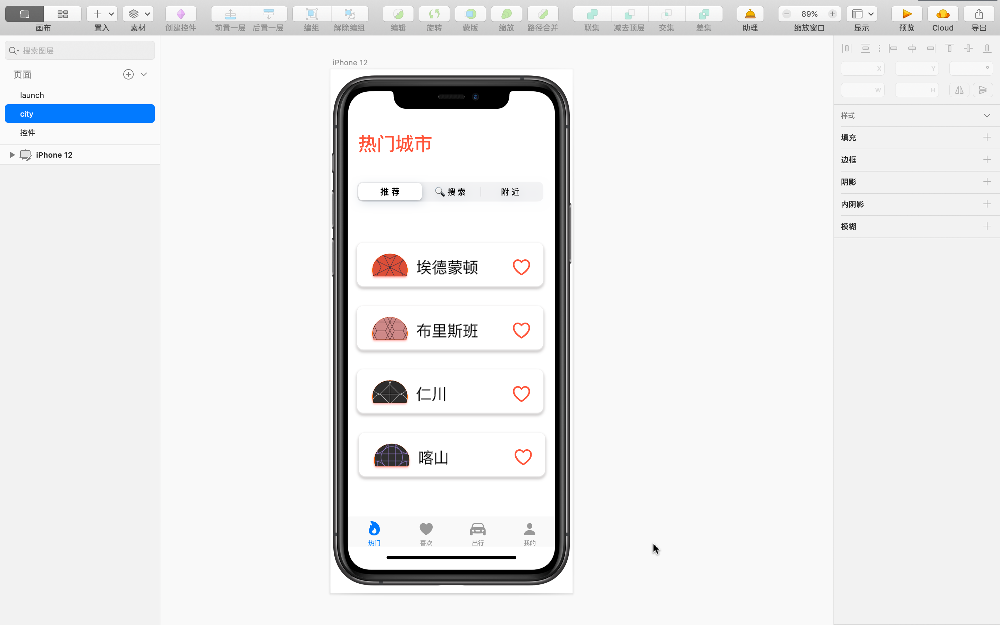
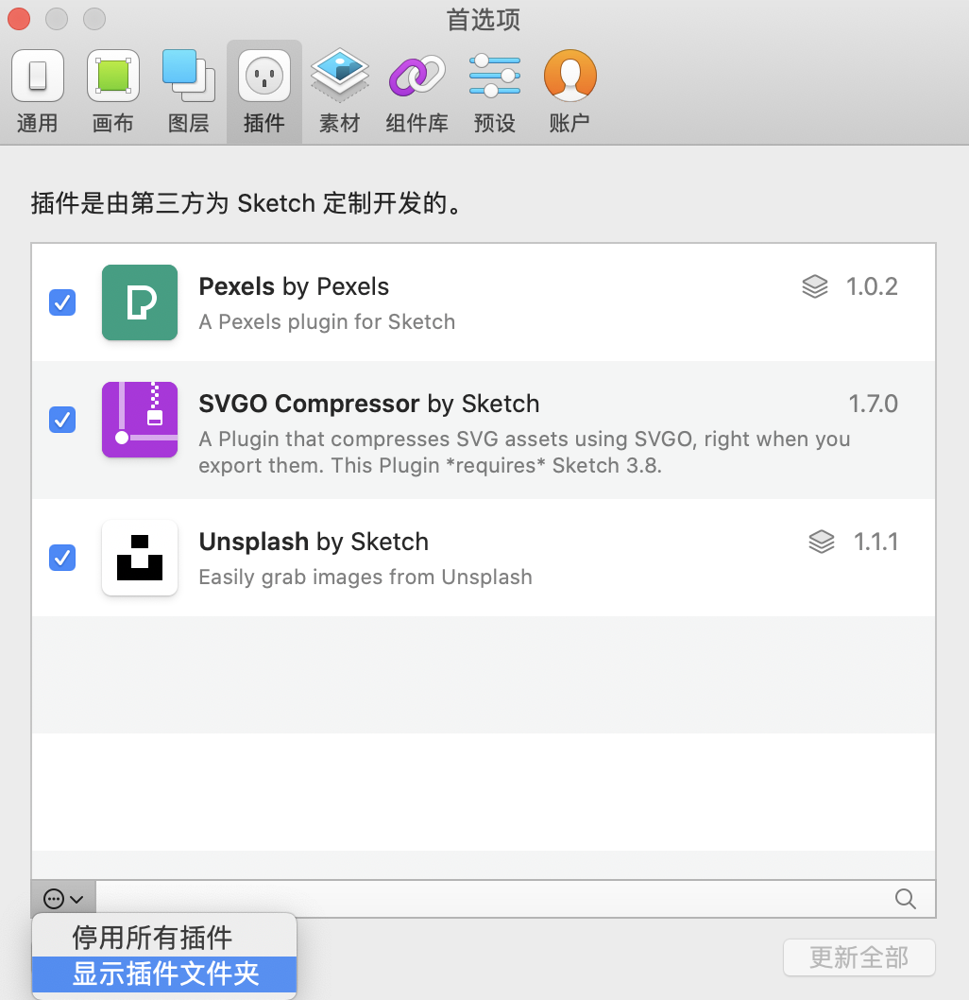
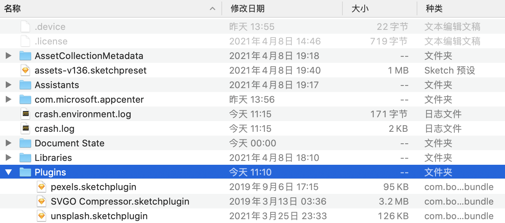
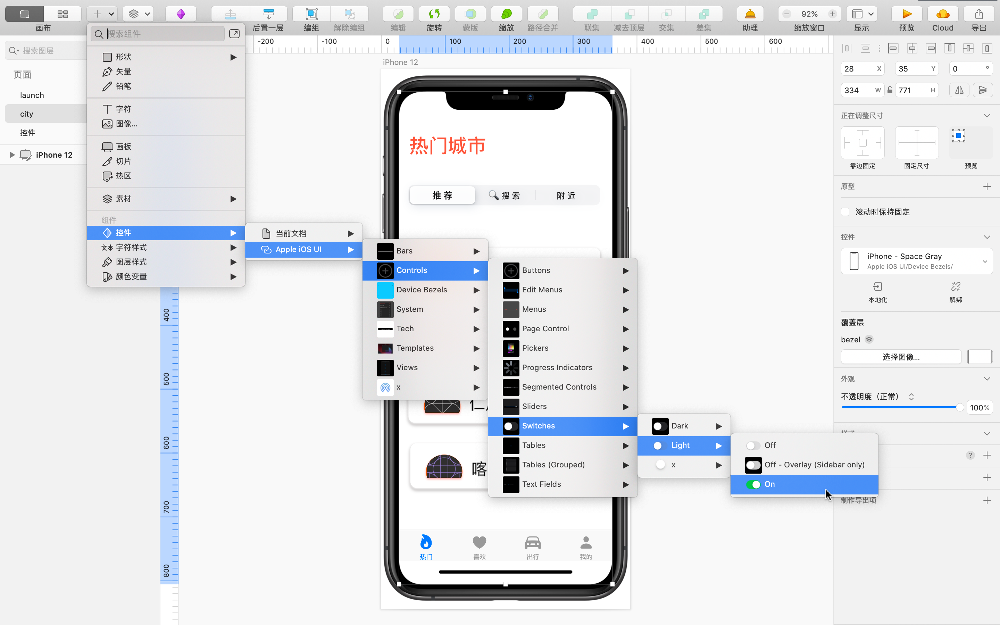

## Sketch

### 目标

学习使用矢量设计工具 Sketch 制作产品原型。

### 界面

主屏幕分为 4 个区域：顶部的**菜单栏**，中部的**画板**（创作区域），左侧的**页面**及**图层**，以及右侧的**图层选项**。使用快捷键  `⌘ + .`启用 **Presentation Mode** 可以只显示画板。 使用`⌘ ⌥ T` 可以隐藏顶部的工具栏。

关于界面更详细的介绍参见 [Sketch 官方帮助文档 - Interface](https://www.sketch.com/docs/the-interface/)。

使用`⌘` 和 `+ -`以及 `0 1 2 3`的组合可以画板缩放和导航。使用`Ctrl + R` 显示参考线，`Ctrl + G `显示网格，`Ctrl + L ` 隐藏或显示布局网格。 

**画板 （Canvas）** 是指定大小的绘图区域。**素材（ Data）** 是占位用的临时图片或文字。**控件 （Symbol）** 是可以被反复使用的界面元素。文字、图片或任何其它界面元素都属于**图层 （Layer）** 。

应用设计者最常用的是**置入 Insert** 选项。置入选项后有界面的基本形状，如矩形、直线等，还有字符、图片和画板**。**当你打开底部的控件、样式、颜色变量等组件时，还会看到一系列 Apple 开头的控件。

### 如何添加插件和组件库

打开**首选项 - 插件 - 添加插件**，然后下载需要的插件并解压，放入存放插件文件夹。添加组件库的步骤类型。

### 使用 Sketch制作产品原型

- **制作带壳（手机边框）截图**

  将手机截图拖入画板，点击「**置入 - Apple iOS UI - Device Bezels - iPhone**」添加。

- **使操作区域和真实设备等大**

  「**置入 - 画板 - 选择设备类型**」，类型可以是 iPhone / Android / 网页 / 纸张等，支持自定义，还能设置横 / 竖屏。

- **制作图形**

  「**置入 - 形状 - 矩形**」添加矩形等基本图形，使用**图层关联**制作自定义图像，比如联集、减去顶层、交集、差集。

- **自动填充占位图**

  「**素材 - Unsplash - Search Photo**」

- **用蒙版指定区域填充**

  **蒙版（Mask）**是指将两个图层结合在一起的方法。选中前后两个图层，从菜单中选择「蒙版」即可。

- **调整图层设置**

  选中图层，在右侧图层选项中点击「+」即可设置图层的「填充、边框、阴影、样式、模糊」等选项。

- **置入 Apple 官方设计元素**

  

  「**置入 - Apple iOS UI - 选择所需组件**」。

  

- **使用 SF Symbol 图标**

  你可以将SF Symbol 图标直接作为文字导入或作为图片导入。

  作为文字导入：在 SF Symbol 中选择中意的图标，使用快捷键`⌘ C` 或菜单「编辑 - 拷贝符号」然后将其粘贴进对应的位置。

  作为图片导入：直接拖拽。

  

- **将界面元素作为控件复用**

  使用`⌘ + Y` 创建的控件是一个模板，和类（Class）的概念类型，使用控件创建的界面元素叫做 Instance你可以使用一个控件创建多个 Instance。

  使用自定义的控件的方式是：点击「**置入 - 控件 - 当前文档**」后选择所需控件。

  按下 `C `可以搜索控件、字符样式、图层样式和颜色。将控件直接拖入画板也可以创建 Instance。

  控件可以随时调整设计，批量修改属于同一控件的多个 Instance，比较灵活。修改控件会导致全部控件 Instance 都被修改。

- **自动对齐**

  使用 Sketch 右侧边栏的自动对齐工具，可以实现多个元素的等距对齐。

  

***Reference***

[Sketch reference manual：https://www.sketch.com/docs/](https://www.sketch.com/docs/)

