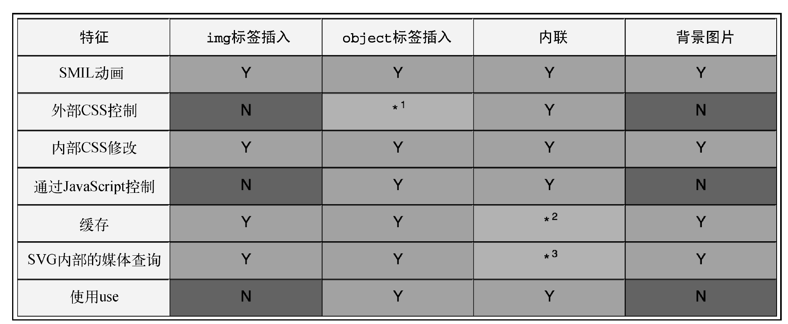
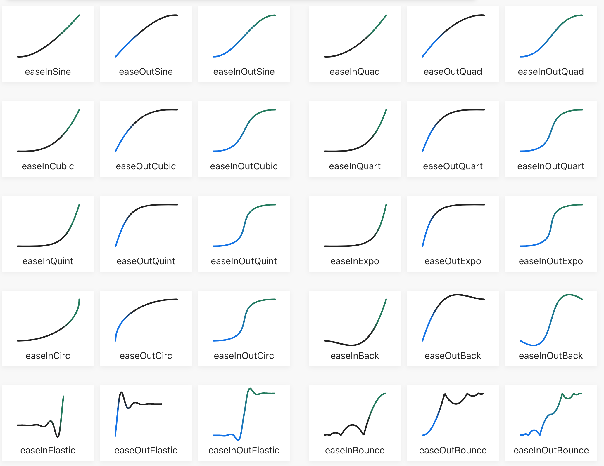

# 响应式 Web 设计

## 1. 概述

### 响应式Web设计的核心技术

- 使用媒体查询相对于视口大小应用CSS规则

- 将固定大小转换为比例大小

- SVG（Scalable Vector Graphics，可伸缩矢量图）


### 响应式Web设计

网页内容会随着访问它的视口及设备的不同而呈现不同的样式。

不需要依赖服务端或后端方案，仅使用基于HTML5和CSS3的响应式Web设计，就可以让一个网站同时适配多种设备和多个屏幕，让网站的布局和功能随用户的使用环境（屏幕大小、输入方式、设备/浏览器能力）变化。

可以参考 http://caniuse.com 来确定平台和浏览器版本对某个特性的支持程度。


使用HTML5和CSS3实现响应式Web设计涉及的基本要素：

- **媒体查询** - 根据视口（viewport）大小切换不同的样式（`@media`）

- **弹性布局** - 实现设计在让媒体查询断点间的平滑过渡（`Flexbox`，即CSS Flexible Box Layout）

- **响应式图片** - 利用`srcset`、`sizes`和`picture`，为用户提供符合需要的图片

  

#### 视口 meta 标签

浏览器中使用**视口（viewport）**指代可以呈现网页的区域，视口通常并不等于屏幕大小。视口使用`<meta>`标签作为网页和移动浏览器的接口。网页通过这个标签告诉浏览器，它希望浏览器如何渲染当前页面。此处将按照设备的宽度（device-width）来渲染网页内容。大多数情况下，可以使用如下写法：

```html
<meta name=“viewport” content="width=device-width, initial-scale=1.0" >
```

`minimum-scale=0.5`和`maximum-scale=2`结合可以实现 0.5 ~ 2 倍的缩放。允许缩放是一个重要的无障碍特性。但你也可以是使用`user-scalable=no`表示禁止缩放。（标签拥有属性，属性拥有值）


#### 让图片随窗口缩放

创建一个CSS文件：`css/styles.css`，并将它链接到HTML页面的头部。声明max-width规则，是要保证所有图片最大显示为其自身的100%（即最大只可以显示为自身那么大）。

```css
img {
	max-width: 100%;
}
```


#### 媒体查询

**最小宽度媒体查询** 是指在这个媒体查询中设置的CSS规则，只在视口符合最小定义宽度条件时才会应用到网页。实际的最小宽度可以使用不同的长度单位指定，比如百分比、em、rem和px。

`@media`指令告诉浏览器这是一个媒体查询，`screen` 告诉浏览器这里的规则只适用于屏幕类型，打印类型是 `print`，而`and (min-width:50rem)`的意思是其中的规则只适用于视口宽度在50rem以上的情况。

```css
@media screen and ( min-width: 50rem) {
   /* style */
}
```


## 2. 媒体查询

> 媒体查询包含媒体类型和零个或多个检测媒体特性的表达式。width、height和color都是可用于媒体查询的特性。使用媒体查询，可以不必修改内容本身，而让网页适配不同的设备。 - https://www.w3.org/TR/css3-mediaqueries/

在针对所有设备的媒体查询中，可以使用简写语法，即省略关键字 all 及随后的 and。如果不指定关键字，关键字就是 all。如果不是想针对特定的媒体样式，就不要写 `screen and`了。

```css
@media print {
  body { font-size: 10pt; }
}

@media screen {
  body { font-size: 13px; }
}

@media screen, print {
  body { line-height: 1.2; }
}

@media only screen
  and (min-width: 320px)
  and (max-width: 480px)
  and (resolution: 150dpi) {
    body { line-height: 1.4; }
}
```


- **媒体查询（3、4 级）**

  媒体查询具有在CSS中实现条件逻辑的能力，其中的样式只在某些条件具备时下才会被应用。

  任何 CSS 都可以放在媒体查询里，使用媒体查询可以从整体上修改一个网站的布局和外观。

  在响应式设计中，媒体查询用的最多的特性是**视口宽度（width）**，详细参靠[CSS 媒体查询完整特性](https://developer.mozilla.org/zh-CN/docs/Web/CSS/@media#%E5%AA%92%E4%BD%93%E7%89%B9%E6%80%A7)。

  4级中重点特性是「可编程、指针与悬停、亮度」。

  

- **断点**

  指某个宽度临界点，跨过这个点布局就会发生显著变化。断点应该由内容和设计本身决定。

  

- **通过媒体查询修改设计**

  「没有媒体查询本身就是媒体查询」就是设计原则。如果上方的选择符优先级并不是更高或更具体，name位于下方的 CSS 样式会覆盖位于上方的目标相同的CSS样式。

  因此，可以首先设置一套基本样式，将其应用给不同版本的设计方案。基本样式适用于任何设备，用于确保用户的基准体验。然后再通过媒体查询覆盖样式表中相关的部分，为不同视口、不同能力的设备，渐进增加不同的视觉效果和功能。

  

- **链接样式 - 在 link 标签使中用媒体查询**

  ```html
  <link rel="style sheet" type="text/css" media="screen" href="screenstyles.css" />
  <link rel="style sheet" type="text/css" media="screen and (orientation: portrait)" href="portrait-screen.css" /> 
  ```

  link标签位于 head标签中。另外，在媒体查询表达式开头添加 not，可以反转询问的条件。

  ```html
  <link rel="style sheet" type="text/css" media="not screen and (orientation: portrait)" href="portrait-screen.css" /> 
  ```

  

- **链接样式 - 使用 @import 导入中使用媒体查询**

  ```css
  @import url("phone.css") screen and (max-width:360px);
  ```

  使用 CSS 中的 @import 会增加 HTTP 请求，慎用。

  

- **在CSS文件中使用媒体查询**

  在 CSS 文件内部直接使用媒体查询是最常见的方式。

  ```css
  @media screen and (max-width: 400px) {
      h1 { color: green }
  }
  ```

  

- **组合媒体查询**

  将多个媒体查询串在一起。

  ```html
  <link rel="style sheet" type="text/css" media="screen and (orientation: portrait) and （min-width: 800px）" href="800wide-portrait-screen.css" /> 
  ```

  也可以组合多个媒体查询。

  ```html
  <link rel="style sheet" type="text/css" media="screen and (orientation: portrait) and （min-width: 800px）, projection" href="800wide-portrait-screen.css" /> 
  ```

  

- **针对高分辨率设备的媒体查询**

  ```css
  @media (min-resolution: 2dppx) {
      /* style */
  }
  ```

- **媒体查询 4 级**

  - 可编程媒体特性：通过 scripting 为启用 JavaScript的用户编写特有的 CSS 规则。

  - 交互媒体特性：指针特性 pointer 有none、coarse 和 fine 三个值，coarse 代表手指（触摸屏）。

  - 悬停媒体特性：hover, 有 none，on-demand 等值。

  - 环境媒体特性：light-level, 有normal，dim，washed 等值。

    

【组织和编写媒体查询的注意事项】

- **使用媒体查询连接不同的文件**

  浏览器需要下载并解析连接的 CSS 文件，然后再渲染页面，所以 CSS 属于「阻塞渲染」的资源。

  现代浏览器会立即分析在头部通过媒体查询连接的样式表，而不符合媒体查询指定条件的 CSS 文件可以延缓执行，到页面初始加载后再处理，以优化用户体验。

- **分隔媒体查询的利弊**

  多一个文件就多一次 HTTP 请求。在确认「所有图片已压缩，所有脚本已拼接，所有资源都使用 gzip 压缩，所有静态内容都缓存到了 CDN，所有多余的 CSS 规则都被清除」后，再考虑是否需要把媒体查询分开，并让它们分别引用不同的 CSS 文件。

- **把媒体查询写在常规的样式表中**

- **组合媒体查询还是把它们写在需要的地方（倾向后者）**

  

**Example**

```css
body {
  background-color: white;
}
@media screen and (min-width: 320px) {
  body {
    background-color: orange;
  }
}
@media screen and (min-width: 550px) {
  body {
    background-color: red;
  }
}
@media screen and (min-width: 768px) {
  body {
    background-color: yellow;
  }
}
@media screen and (min-width: 960px) {
  body {
    background-color: green;
  }
}
```


## 3. 弹性布局与响应式图片

### 3.1 将固定像素大小转换为比例大小

 **结果 = 目标 / 上下文**

将固定像素大小转换为比例大小的公式为「**结果 = 目标 / 上下文**」，即用元素所在容器的大小除元素的大小。理解了「目标除以上下文等于结果」，就可以将任何固定大小布局转换成响应式或弹性布局。比如，布局宽度为 960px（上下文），使用三栏布局（左中右），左中右分别对应 200px（目标）, 660px（目标）,100px（目标）。则转换过程如下：

- 左边栏：200 / 960 = 20.83333333%
- 中间栏：660 / 960 = 68.75%
- 右边栏：100 / 960 = 10.4166667%

一般应该从小屏幕设计向桌面设计转换。针对小屏幕，应该是「把内容显示在一根长条里」，将左边栏会作为「画外元素」存在，通常用于保存菜单导航之类的内容，只有当用户点击了某个菜单图标时才会滑入屏幕。主内容区位于页头下方，而右边栏又在主内容区下方，最后是页脚区。


### 3.2 传统 CSS 布局机制

- **行内块（inline-block）**

  **问题**

  在HTML元素间渲染空白，垂直居中内容不易，也做不到让两个相邻的元素一个宽度固定，另一个填充剩余空间。

  **解决**

  使用大小为零的 font-size 可以去掉使用行内块时产生的空白。

- **浮动（float）**

  **优点**

  浮动布局跨平台一致性很好。

  **缺点**

  给浮动元素的宽度设定百分比的话，最终计算值具有平台差异（浏览器向上/向下取整）；通常都要清除浮动，才能避免父盒子/元素折叠。浮动并非一个地道的布局机制。

- **表格与表元 - 两个CSS属性`display:table`和`display:table-cell`**

  **优点**

  跨平台绝对一致，能做到一个元素在另一个元素内垂直居中。设置为`display:table-cell`的元素在设置为`display:table`的元素中产生的间距恰到好处。它们不像浮动元素那样存在舍入差。

  **缺点**

  需要在每个项目外面包一层（要想完美地垂直居中，表元必须被包在一个表格元素中）。另外，也不可能把设置为display:table-cell的项目包到多行上。

  

### 3.3 FlexBox - 方向、对齐、次序和弹性

使用Flexbox可以实现无数种可能的布局，而且得益于其“伸缩性”，这种布局机制非常适合响应式设计。

IE9及以下版本不支持Flexbox。为了让Flexbox有效地跨浏览器显示，需要**前缀**来保证某些特性跨浏览器可用。可以使用自动加前缀的插件 Autoprefixer，Autoprefixer有针对Sublime Text 等文本编辑器的诸多版本。

Flexbox有4个关键特性：方向、对齐、次序和弹性。

- **完美垂直居中文本**

  假设定义了`<div class="CenterIt">Flexbox</div>`, 垂直居中文本的CSS规则如下：

  ````css
  .CenterIt {
      display: flex;				/* 是把当前元素设置为一个Flexbox */
      align-items: center;		/* 在Flexbox中沿交叉轴对齐项目 */
      justify-content: center;	/* 设置内容沿主轴居中 */
  }
  ````

- **偏移**

  顶部导航选项水平排列

  ```html
  <div class="MenuTop">
      <a href="#" class="ListItem">Home</a>
      <a href="#" class="ListItem">About Us</a>
      <a href="#" class="ListItem">Projects</a>
      <a href="#" class="ListItem">Policy</a>
      <a href="#" class="LastItem">Contact Us</a>
  </div>
  ```

  ```css
  .MenuTop {
  	background-color: indigo;
  	font-family: 'Oswald', sans-serif;
  	font-size: 1rem;
  	min-height: 2.75rem;
  	display: flex;
  	align-items: center;
  	padding: 0 1rem;
  }
  
  .ListItem, .LastItem {
  	color: #ebebeb;
  	text-decoration: none;
  }
  .ListItem {
  	margin-right: 1rem;
  }
  .LastItem {
  	margin-left: auto;
  }
  ```

- **反序**

  ```css
  .MenuTop {
  	...
  	display: flex;
  	flex-direction: row-reverse;	/* Add this line*/
  	align-items: center;
  	...
  }
  
  .LastItem {
  	/*margin-left: auto;*/			
  	margin-right: auto;		/* Change left to right*/
  }
  ```

- **垂直排列和垂直反序**

  垂直排列：在包含元素中使用`flex-direction:column;`，无自动外边距属性。

  垂直反序：`flex-direction: column-reverse;`，无自动外边距属性。

  ```css
  .MenuTop {
  	...
  	display: flex;
  	flex-direction: column;	/* Add this line*/
  	align-items: center;
  	...
  }
  ```

- **不同媒体查询中的不同Flexbox 布局**

  ```css
  ...
  @media (min-width: 31.25em) {
      .MenuTop {
      	flex-direction: row;
      }
  }
  ...
  @media (min-width: 31.25em) {
      .ListItem {
     		margin-right: 1rem;
      }
      .LastItem {
      	margin-left: auto;
      }
  }
  ```

  Flexbox有与inline-block和inline-table对应的inline-flex变体，即行内伸缩（inline-flex）。

  

- **Flexbox 的对齐**

  Flexbox的对齐，最重要的是理解**坐标轴（主轴和交叉轴）**。

  

  图片链接：<https://www.w3.org/TR/css-flexbox-1/#justify-content-property>

  主轴和交叉轴这两个轴代表什么取决于Flexbox排列的方向。如果将Flexbox的方向设置为row，则主轴就是横轴，而交叉轴就是纵轴。如果Flexbox的方向是column，则主轴就是纵轴，而交叉轴为横轴。

  `justify-content`可以告诉浏览器怎么处理其余空间。`space-between`会在子元素之间添加相同宽度的空白，而`space-around`则在它们两边各添加相同宽度的空白。

  | 对齐属性        | 作用                       | 值                                                       |
  | --------------- | -------------------------- | -------------------------------------------------------- |
  | justify-content | 控制沿Flexbox主轴对齐      | flex-start, flex-end, center,space-between, space-around |
  | align-items     | 在交叉轴上定位元素         | flex-start, flex-end, center, baseline, stretch          |
  | align-self      | 把某一个元素按不同方式对齐 | 同上                                                     |

- **flex 简写属性**

  flex是三个属性合体的简写：<u>flex-grow</u>、<u>flex-shrink</u> 和 <u>flex-basis</u> ，分别代表<u>伸展</u>、<u>收缩</u>、<u>基准</u>。

  可以把flex属性想象成设置比例。如果每一项都设置为1，则它们会占用相等的空间。这个简写的属性对于迅速地厘清伸缩项间的关系非常有帮助。flex属性会让内容在空间允许的情况下伸展。

  比如，在有空间的情况下可以伸展1部分，在空间不足时可以收缩1部分，而基准大小是内容的固有宽度（即不伸缩的情况下内容的大小）。

  ```css
  flex: 1 2 auto;
  ```

- **改变原始次序**

  Flexbox内置了重新排序的能力，**order **属性可以在Flexbox中简单、明确地修改元素的次序。


### 3.4 响应式图片

利用好`srcset`、`sizes`和`picture`，始终为用户提供符合他们需要的图片。

- **通过srcset 切换分辨率**

  ```html
  
  ```

  src属性的作用是，指定1倍大小的小图片，且在不支持srcset属性的浏览器中用作后备。

  对于支持srcset属性的浏览器，通过逗号分隔的图片描述，让浏览器自己决定选择哪一个。图片描述首先是图片名，然后是一个分辨率说明。

- **srcset 及sizes 联合切换**

  小屏幕中全屏显示，而在大屏幕上只显示一半宽的图片。

  在指定图片描述时，我们添加了以w为后缀的值。这个值的意思是告诉浏览器图片有多宽。这里表示图片分别是450像素宽（scones-small.jpg）和 900像素宽（scones-medium.jpg）。

  使用w后缀的值对引入sizes属性非常重要。通过后者可以把意图传达给浏览器。但这里以w为后缀的值并不是“真实”大小，它只是对浏览器的一个提示，大致等于图片的“CSS像素”大小。

  ```css
  
  ```

  sizes属性仅仅是对浏览器给出提示。如果不想让浏览器决定，可以使用picture元素让浏览器交付你让它交付的图片。

- **picture 元素**

  使用 `picture` 元素可以为不同的视口提供不同的图片，`picture`还支持提供可替换的图片格式。

  千万别省略`picture`中的`img`标签。当浏览器不支持`picture`元素，或者支持`picture`但没有合适媒体定义时，`img`标签是后备。

  ```html
  <picture>
      <source media="(min-width: 30em)" srcset="cake-table.jpg">
      <source media="(min-width: 60em)" srcset="cake-shop.jpg">
      
  </picture>
  
  <picture>
      <source type="image/webp" srcset="scones-baby-yeah.webp">
      
  </picture>
  ```


##  4. HTML5与响应式Web设计

HTML是构建网页的标记语言，是所有网站和Web应用的基础，最新版本是 HTML5。所有现代的浏览器都理解HTML5中新的语义元素（新的结构化元素、视频和音频标签）。

访问 <https://html5boilerplate.com/>可以获取 HTML5的模板。这个模板预置了HTML5“最佳实践”，包括基础的样式和可选的工具，比如Modernizr。

- **HTML5文档的开始部分**

  ```html
  <!DOCTYPE html>
  <html lang="en">
  <head>
  <meta charset=utf-8>
  ```

  - doctype - 告诉浏览器文档类型的手段，第一行是告诉浏览器如何以“标准模式”渲染网页。

  - `html`标签 - 文档的根标签，使用了lang属性指定了文档的语言，值有 en，ja等。

  - 字符编码 - charset属性的值一般都是utf-8。

  - HTML5编码规范

    在HTML5文档中，没有结束标签的反斜杠，没有引号，大小写混用，省略`<head>`标签，页面依然有效。无论HTML5对语法要求多宽松，都有必要检验自己的标记是否有效。有效的标记更容易理解。

    应该**关闭标签，属性值加引号，保持大小写一致**，这样可以使代码更清晰。你可以使用验证器（https://validator.w3.org/）检验自己的标记是否有效。

- **把多个元素放入一个`<a>`标签**

  在HTML5中，可以省去所有内部的`<a>`标签，只在外面套一个就行了。限制是不能把另一个`<a>`标签、表单和button等交互性元素放到一个`<a>`标签里。

  ```html
  <a href="index.html">
      <h2>The home page</h2>
      <p>This paragraph also links to the home page</p>
      
  </a>
  ```

- **HTML5 的新语义元素**

  | 结构化/分组    | 说明                                                         |
  | -------------- | ------------------------------------------------------------ |
  | `<main>`       | 声明主内容区（每个页面只能有一个）                           |
  | `<section>`    | 定义文档或应用中一个通用的区块                               |
  | `<nav>`        | 包装指向其他页面或同一页面中不同部分的主导航链接             |
  | `<article>`    | 包含一个独立的内容块(如博客正文和新闻报道)                   |
  | `<aside>`      | 包含与其旁边内容不相关的内容（包装侧边栏，如突出引用、广告和导航元素） |
  | `<figure>`     | 包含注解、图示、照片、代码                                   |
  | `<figcaption>` | 提供父figure元素的标题，如为图片或代码提供一个小标题         |
  | `<detail>`     | 详情（展开时要展示的内容），为details元素添加open属性可以使面板默认打开 |
  | `<summary>`    | 摘要(收起时展示的内容)                                       |
  | `<header>`     | 用在站点页头作为报头，在`<article>`元素中用作某个区块的引介区，可以在一个页面中出现多次。 |
  | `<footer>`     | 在相应区块中包含与区块相关的内容，博客页脚，版权声明，指向其他文档的链接等，可以在页面中出现多次 |
  | `<address>`    | 标记联系人信息,为最接近的`<article>`或`<body>`所用           |

  - **语义**

    语义就是赋予标记含义，访问<https://www.w3.org/TR/html5/semantics.html#semantics>可以获知HTML5的所有元素。

  - **文档的主内容**

    文档中特有的内容，导航链接、版权信息、站点标志、广告和搜索表单等多个文档中重复出现的内容不算主内容（除非网页或文档的主要内容就是搜索表单）。

  - **凭常识选择元素**

    运用常识，在合适的地方使用`<header>`和`<footer`等元素会带来无障碍方面的好处。

  - **无障碍网页**

    方便辅助技术的最简单方式就是「尽可能使用正确的元素」, 参考<https://www.a11yproject.com/>获取关于无障碍性的资源。

    WCAG - [简明指南](https://www.w3.org/WAI/WCAG20/glance/Overview.html)，[参考列表](https://www.w3.org/WAI/WCAG20/quickref/)。WAI-ARIA - 标记地标。

  - **h1 到h6**

    h1到h6元素不能用于标记副标题、字幕、广告语，除非想把它们用作新区块或子区块的标题。

  - **文本级元素**

    `<b>` - 无特殊含义

    `<em>` - 表示内容中需要强调的部分。

    `<i>` - 一段文本，用于表示另一种愿望或情绪，或者以突出不同文本形式的方式表达偏离正文的意思。

  - **作废的HTML 特性**

    HTML5宣布作废的特性可分两类：兼容和不兼容。主要包括：strike、center、font、acronym、frame和frameset。完整的作废且不兼容特性的列表 https://www.w3.org/TR/html5/obsolete.html。

- **使用HTML5 视频和音频**

  ```html
  <video src="myVideo.mp4"></video>
  
  <video src="myVideo.mp4" width="640" height="480" controls preload="auto" 
        loop poster="myVideoPoster.png">What, do you mean you don't understand HTML5?
  </video>
  ```

  - 音频对应`<audio></audio>`标签

    `<audio>`标签与`<video>`标签的属性相同（不包括width、height和poster），它们的主要区别是音频没有视频需要的播放区域。

  - MP4是跨桌面和移动平台的格式

    不同浏览器支持的媒体格式不同（MP4是跨桌面和移动平台的格式），应该列出可替代的媒体资源。

  - 属性

    要使用某个属性，只要在标签中添加它即可。

    controls 使用默认的播放控件，autoplay自动播放（不推荐），preload 预加载，loop 重复播放，poster 设置视频的首屏图像。预加载对于缓存视频延迟很有用。

  - 旧版本浏览器的后备

    如果需要，可以使用`<source>`标签在旧版本的浏览器中提供后备资源。如果用户浏览器没有任何播放条件，还可以提供一个下载视频的链接。

- **响应式HTML5 视频与内嵌框架**

  创建一个比例相同的盒子来包含视频，参见 Thierry Koble 的[方法](https://alistapart.com/article/creating-intrinsic-ratios-for-video)。

- **离线优先（offline-first)**

  保证网站和应用始终可以打开，即使不上网也能加载到内容，参见[offline](https://www.w3.org/TR/2011/WD-html5-20110525/offline.html)。

  

## 5. CSS3 新特性

关注对响应式设计有用的CSS技术、单位和选择符。

- **CSS 规则的构成**

  ```css
  .round { /* 选择符 */
  	border-radius: 10px; /* 声明: 属性和值 */
  }
  ```

- **CSS 响应式多列布局**

  每一列文本太长可能影响用户体验，因为用户需要反复上下滚动页面。关于CSS多列布局，详见[CSS3 Multi-column Layout Module](https://www.w3.org/TR/css3-multicol/)。可以固定列数，宽度可变。还可以给列间添加间距和分隔线。

  ```css
  main {
      column-count: 3;
      column-gap: 3em;
      column-rule: thin dotted #7f8fa6;
      column-width: 12em;
  }
  ```

- **断字**

  长URL完美折行。

  ```css
  word-wrap: break-word;
  ```

  **截短文本**

  假设 `<p class="truncate">Content</p>`。`white-space: nowrap`是为了确保长出来的文本不会折行显示在外部元素中。

  ```css
  .truncate {
      width: 520px;
      overflow: hidden;
      text-overflow: ellipsis;
      white-space: no-wrap;
  }
  ```

  **创建水平滚动面板**

  `white-space: nowrap`保证有空白时不折行。

  ```css
  .Scroll_Wrapper {
      width: 100%;
      white-space: nowrap;
      overflow-x: auto;
      overflow-y: hidden;
      /* 在WebKiet的触摸设备上出现 */
  	-webkit-overflow-scrolling: touch;
  	/* 在支持的IE中删除滚动条 */
  	-ms-overflow-style: none;
  }
  
  /* 防止WebKit浏览器中出现滚动条 */
  .Scroll_Wrapper::-webkit-scrollbar {
  	display: none;
  }
  
  .Item {
  	display: inline-flex;
  }
  ```

- **在CSS 中创建分支**

  在需要对CSS代码开分支的时候，可以采用渐进增强的方式，即从最简单的可用代码开始，从最基本的功能开始，从支持能力最低的设备开始，逐步增强到支持能力更强的设备。

  可使用特性查询，或借助 JavaScript库（推荐），可以在CSS中创建一个分支。如果浏览器支持某特性，就应用一段代码；如果不支持，则应用另段代码。

  **特性查询**

  特性查询是CSS 原生的分支语法。比如，如下代码在浏览器支持的情况下使用Flexbox，在不支持的情况下回退到另一种布局方案。代码起作用的前提是浏览器支持@supports，并非所有浏览器都支@supports。

  还可以使用 and 关键字和 or 关键字**组合条件**。

  ```css
  .Item {
  	display: inline-block;
  }
  
  @supports ((display: flex) and (pointer: coarse) (transform:
  translate3d(0, 0, 0)) {
  	.Item {
  		display: inline-flex;
  	}
  }
  
  @supports not (display: flex) {
  	.Item {
  		display: inline-block;
  	}
  }
  ```

  **使用Modernizr检测特性**

  ```html
  <script src="/js/libs/modernizr-2.8.3-custom.min.js"></script>
  ```

- **新CSS3 选择符**

  **属性选择符**：在方括号中给出属性，同时指定属性的值，可以进一步缩小搜索范围。CSS3新增了**子字符串匹配属性选择符(`^=, *=, $=`)**。对属性选择符而言，属性被当成一个字符串。属性选择符选择以数值开头的ID 和类。
  
  ```css
  /*以……开头*/
  img[alt^="film"] {
  	/* 样式 */
  }
  
  /*包含……*/
  [attribute*="value"] {
	/* 样式 */
  }

  /*以……结尾*/
  [attribute$="value"] {
  	/* 样式 */
  }
  ```
  
- **CSS3 结构化伪类**

  基于元素之间的位置关系选择。

  ```css
  div:first-child {/*用于匹配列表中第一项的选择符(CSS2.1)*/
  	/* 样式 */
  }
  
  div:last-child {/*可以选择最后一项的选择符(CS3)*/
  	/* 样式 */
  }
  
  .nav-Link:nth-child(odd) {/*使用nth-child来选择任意链接(选择奇数个)*/
  	/* 样式 */
  }
  
  .nav-Link:nth-child(even) {/*使用nth-child来选择任意链接(选择偶数个)*/
  	/* 样式 */
  }
  
  
  ```

  还有专门针对只有一项的选择符`:only-child`和唯一一个当前标签的选择符`:only-oftype`。

  **nth**

  CSS3提供了以下几个基于nth的规则，CSS3则从1开始计数。

  - `nth-child(n)` 

  - `nth-last-child(n)`

  - `nth-of-type(n)`

  - `nth-last-of-type(n)`

  | 结构化的伪类(伪元素)    | 说明 |
  | ----------------------- | ---- |
  | `nth`                   |      |
  | `:not`                  |      |
  | `:empty`                |      |
  | `:first-line`（伪元素） |      |

- **自定义属性和变量**

  CSS自定义属性可以存储信息，自定义属性以两个短划线开头，接着是自定义属性的名字，然后结尾与常规CSS属性一样，都是一个冒号。引用自定义属性的时候就可以用var()。

  选择页面中元素的新选择符、用于改变元素样式和大小的单位、现有（以及将来）的伪类和伪元素。

- **calc**

  ```css
  .thing {
  	width: calc(50% - 10px);
  }
  ```

  浏览器对calc()函数的支持好。

- **CSS Level 4 选择符**

  `:has` 伪类，相对视口的长度（vw，vh, vmin, vmax），

- **Web 排版**

  **通过`@font-face`引用在线字体显示文本，从而实现 Web 字体**

  响应式设计中，使用@font-face需要注意「文件大小」。

- **CSS3 的新颜色格式及透明度**

  **RGB/RGBA**

  Red Green Blue(红绿蓝):`#fe0208`或`rgb(254, 2, 8)`

  RGBA(`rgba(255, 255, 255, 0.8)`)

  **HSL/HSLA**

  Hue Saturation Lightness(色相、饱和度、亮度）：`hsl(359, 99%, 50%)`

  HSLA：`hsla(359, 99%, 50%, .5)`


## 6. CSS3高级技术

| CSS3特性     | 使用                                                       | 说明                                                         |
| ------------ | ---------------------------------------------------------- | ------------------------------------------------------------ |
| 文字阴影     | `text-shadow: 1px 1px 1px #ccc;`<br />`text-shadow: none;` | 右偏移，下偏移， blur，色值<br />使用负值可让阴影往左上方偏移<br />多文字阴影（逗号分隔） |
| 盒阴影       | `box-shadow: inset 0px 3px 5px #444;`                      | 使用 inset时为内阴影<br />多重阴影（逗号分隔）               |
| 背景渐变     | `linear-gradient`或`radial-gradient`                       | `repeating-radial-gradient`                                  |
| 多重背景图片 | `background: url('../img/1.png’), url('../img/2.png’);`    | 在一个元素上堆叠多个背景图片                                 |
| 滤镜         | `filter: drop-shadow(8px 8px 6px #333);`                   | 基于SVG滤镜，可以多个同时用                                  |

**渐变背景**

```css
background: linear-gradient(45deg, blue -50%, green);
background: radial-gradient(20rem circle at center, black,orange, red);
background: radial-gradient(closest-side circle at center, green,blue);
background: repeating-radial-gradient(black 0px, orange 5px, red 10px);
```

使用渐变背景创造图案

```css
.carbon-fibre {
        margin: 1rem;
        width: 400px;
        height: 200px;
        background:
        radial-gradient(black 15%, transparent 16%) 0 0,
        radial-gradient(black 15%, transparent 16%) 8px 8px,
        radial-gradient(rgba(255,255,255,.1) 15%, transparent 20%) 0 1px,
        radial-gradient(rgba(255,255,255,.1) 15%, transparent 20%) 8px
        9px;
        background-color:#282828;
        background-size:16px 16px;
}

@media (min-width: 45rem) {
    .carbon-fibre {
    	background: #333;
    }
}
```

可以依靠媒体查询来在不同的响应式场景中使用不同的效果。例如，一个渐变图案可能在小视口中比较好看，但是在视口较大的情况下，使用一个纯色的背景会比较好。

**多重背景**

```css
html {
    height: 100vh;
	width: 100vw;
	background:
        url('rosetta.png'),
        url('moon.png'),
        url('stars.jpg');
    background-size: 100% 50%, 300px 400px, auto;	/*auto,cover,contain*/
    background-position: top 50px right 80px, 40px 40px, top center;
	background-repeat: no-repeat;
}
```

**高分辨率背景图像**

```css
html {
	background-image: url('bg.jpg');
}
@media (min-resolution: 1.5dppx) {
	html {
		background-image: url('bg@1_5x.jpg');
	}
}
```

**CSS 滤镜**

```css
filter: drop-shadow(8px 8px 6px #333);
filter: url ('./img/filters.svg#filterRed');
filter:blur(3px);
filter:brightness(2);
filter:grayscale(.8);
filter:hue-rotate(25deg);	/*只有hue-rotate滤镜能使用负值*/
filter:invert(75%);
filter:opacity(50%);
filter:saturate(15%);
filter:sepia(.74);			/*褐色滤镜*/
```

可以使用多个滤镜，使用空格分隔它们。

````css
filter: opacity(10%) blur(2px) sepia(35%);
````

**CSS 性能**

括号外的决定了页面的架构，括号内的决定了页面的性能。不要担心CSS选择器（大括号外面的部分）的性能表现。然而，CSS中某个部分真的会让页面慢下来。那些在渲染前必须进行的计算工作，会给浏览器带来了额外的工作量。因此，慎重地使用滤镜效果


## 7. SVG与响应式Web设计

> SVG是XML[XML1.0]中用于描述二维图形的语言。SVG支持三种图形对象：矢量图形形状（例如由直线和曲线组成的路径）、图像和文本。 —SVG 1.1规范

SVG（Scalable Vector Graphics，可伸缩矢量图）允许在代码中使用矢量点来描述二维图像。这种优势使SVG被广泛应用到图标、线条图和图表的表示中。因为矢量图是使用相对点来保存数据的，所以可以缩放到任意大小而不会损失清晰度。此外，由于SVG仅仅保存矢量点，相比于同等尺寸的JPEG、GIF和PNG，其文件大小更小。浏览器广泛支持SVG。

除了最小的图片资源，如果可能的话，使用SVG替代JPEG、GIF或者PNG。这样可以产生和分辨率无关的图片，而且大小也比位图图像小得多。

### SVG 基础知识

**SVG的根元素**

SVG的根元素有width、height和viewbox属性。视框（viewbox）定义了SVG中所有形状需要遵循的坐标系。

```xml
<svg width="198px" height="188px" viewBox="0 0 198 188" version="1.1" xmlns="http://www.w3.org/2000/svg" xmlns:xlink="http://www.w3.org/1999/xlink">
	<title>Star 1</title>
	<desc>Created with Sketch.</desc>
	<defs></defs>
	<g id="Page-1" stroke="none" stroke-width="1" fill="none" fillrule="
	evenodd" sketch:type="MSPage">
	<polygon id="Star-1" stroke="#979797" stroke-width="3"
	fill="#F8E81C" sketch:type="MSShapeGroup" points="99 154 40.2214748
	184.901699 51.4471742 119.45085 3.89434837 73.0983006 69.6107374
	63.5491503 99 4 128.389263 63.5491503 194.105652 73.0983006 146.552826
	119.45085 157.778525 184.901699 "></polygon>
	</g>
</svg>
```

**命名空间**

这些命名空间只是在生成SVG的程序中使用。在Web页面上展示SVG时 xmlns 并非必需，在优化流程中，为了减小SVG的大小，会把它们去掉。

**标题和描述标签**

title和desc标签提高了SVG文档的可读性。当SVG图片被应用为背景图片的时候，去除这些标签减小文件大小。

**defs 标签**

用于储存所有可以复用的元素定义的地方，如梯度、符号、路径等。defs元素是引用元素的容器，十分重要。

**元素g**

把其他元素捆绑在一起。

**SVG 形状元素**

SVG拥有一系列可用的现成形状（path、rect、circle、ellipse、line、polyline、polygon）。

**SVG 路径**

由任意数量的连接点组成的，即允许你自由创造你想要的形状（SVG文件的价值所在）。


### 使用流行的图像编辑工具和服务创建SVG

AI、Sketch、Inkscape或在线SVG 编辑器，利用SVG 图标服务（如<https://icomoon.io/>）。


**在Web 页面中插入SVG**

- 使用img 标签

  ```html
  
  ```

- 使用object 标签

  object标签是W3C推荐的用于装载非HTML内容的容器。

  通过object标签插入到页面的SVG可以被JavaScript访问，且object可以在浏览器不支持引入的数据类型的情况下做出简单的反馈。使用CSS中的background-image是一种后备方法，只会在需要的情况下才加载。

  ```html
  <object data="img/svgfile.svg" type="image/svg+xml">
  	<span class="fallback-info">Your browser doesn't support SVG</span>
  </object>
  ```

- 把SVG 作为背景图像插入

  如果你对SVG的需求主要是静态背景图片或者是图标之类，我强烈建议通过背景图像的方式插入SVG文件。

  ```css
  .item {
  	background: url('image.png') no-repeat;
  	background: url('image.svg') left top / auto auto no-repeat;
  }
  ```

- data URI 

  用来引入外部资源的，如图像。它并不好看，但是它节省了一次网络请求。

  ```css
  .external {
  	background-image: url('Star.svg');
  }
  
  .data-uri {
  background-image: url(data:image/svg+xml,%3C%3Fxml%20
  version%3D%221.0%22%20encoding%3D%22UTF-8%22%20standalone%3D%22
  no%22%3F%3E%0A%3Csvg%20width%3D%22198px%22%20height%3D%22188px-
  %22%20viewBox%3D%220%200%20198%20188%22%20version%3D%221.1%22%20
  xmlns%3D%22http%3A%2F%2Fwww.w3.org%2F2000%2Fsvg%22%20xmlns%3Axlink
  %3D%22http%3A%2F%2Fwww.w3.org%2F1999%2Fxlink%22%20xmlns%3Asketch%3
  D%22http%3A%2F%2Fwww.bohemiancoding.com%2Fsketch%2Fns%22%3E%0A%20
  %20%20%20%3C%21--%20Generator%3A%20Sketch%203.2.2%20%289983%29%20
  -%20http%3A%2F%2Fwww.bohemiancoding.com%2Fsketch%20--%3E%0A%20
  %20%20%20%3Ctitle%3EStar%201%3C%2Ftitle%3E%0A%20%20%20%20
  %3Cdesc%3ECreated%20with%20Sketch.%3C%2Fdesc%3E%0A%20%20%20%20-
  %3Cdefs%3E%3C%2Fdefs%3E%0A%20%20%20%20%3Cg%20id%3D%22Page-1%22%20
  stroke%3D%22none%22%20stroke-width%3D%221%22%20fill%3D%22none%22%20
  fill-rule%3D%22evenodd%22%20sketch%3Atype%3D%22MSPage%22%3E%
  0A%20%20%20%20%20%20%20%20%3Cpolygon%20id%3D%22Star-1%22%20
  stroke%3D%22%23979797%22%20stroke-width%3D%223%22%20
  fill%3D%22%23F8E81C%22%20sketch%3Atype%3D%22MSShapeGroup%22%20
  points%3D%2299%20154%2040.2214748%20184.901699%2051.4471742%20
  119.45085%203.89434837%2073.0983006%2069.6107374%2063.5491503%2099%20
  4%20128.389263%2063.5491503%20194.105652%2073.0983006%20146.552826%20
  119.45085%20157.778525%20184.901699%20%22%3E%3C%2Fpolygon%3E%0A%20%20
  %20%20%3C%2Fg%3E%0A%3C%2Fsvg%3E);
  }    
  ```

  用于生成图像精灵或者data URI的工具是**Iconizr**(<https://iconizr.com/>)。

  把SVG当作背景图像插入时，如果想为它加上动画效果，或者使用JavaScript来插入数据等，那么最好的选择还是把SVG内联到HTML上。

### 内联SVG

SVG仅仅是一个XML文档，所以你可以直接将它插入到HTML中。只需要直接在HTML标记内插入SVG标记即可。另外，如果你删除掉svg元素的width和height属性，SVG就会自动缩放来填满容器。

- 利用符号（symbol）复用图形对象
- 根据上下文改变内联SVG 颜色
- 复用外部图形对象资源


### 不同插入方式下可以使用的功能

无论用什么方式插入，SVG都会使用设备最高的分辨率来渲染。在大多数情况下，**分辨率无关性**是使用SVG的理由。至于选择哪种插入方式，一般取决于你的工作流和手头上的工作。



使用[GreenSock](https://greensock.com/) 添加SVG 动画。

### 优化SVG

使用自动化工具（如[SVGO](https://github.com/svg/svgo)）来优化SVG文件，尽可能压缩资源大小。Iconizr（https://iconizr.com/）会默认用SVGO处理SVG文件，要尽量避免无意义的多次优化。

### 把SVG 作为滤镜

### SVG 中媒体查询的注意事项


## 8. CSS3过渡、变形和动画

通过CSS3的三个主要代理，即**过渡**（transition）、**变形**（transform）和**动画**（animation），就可以完成大部分动画工作。

- 当你知道动画的起始状态和终止状态，并且需要一个简单的变形方法时，使用CSS过渡。
- 当你需要在视觉上改变某个元素但又不想影响页面布局的时候，使用CSS变形。
- 当你想在一个元素上执行一系列关键帧动画时，使用CSS动画。


### 过渡

当元素的CSS状态改变时，过渡是最简单的创造视觉效果的方式。在CSS中过渡属性应用到元素的初始状态（ from状态）。可以进行过渡的元素参见[列表](https://www.w3.org/TR/css-transitions-1/)。示例中使用了相邻兄弟选择器`+`。

```css
nav {
    transition: all 1s ease 0s;
}

a + a {
	border-left: 1px solid #aaa;
}
a:hover {
	box-shadow: inset 0 -3px 0 #CC3232;
}
```

#### 过渡相关的属性（属性、持续时间、调速函数和延迟）

- `transition-property: background-color / box-shadow / text-shadow / all;` 
- `transition-duration:.3s / 2s / 1.5s;` 
- `transition-timing-function:ease / linear / ease-in / ease-out / ease-in-out / cubic-bezier;`
- `transition-delay: .3s / 2s / 2.5s; `

#### 在不同时间段内过渡不同属性

当一条规则要实现多个属性过渡时，这些属性不必步调一致。

#### 过渡调速函数

ease、linear、ease-in、ease-out、ease-in-out和cubic-bezier都是预置好的[贝塞尔曲线](https://cubic-bezier.com/)，本质上是缓动函数，是过渡在数学上的描述。下面的截图来自<https://easings.net/>。



**通配选择器`*`**

（不推荐在生产环境中这么做）。使用CSS通配选择器`*`来选择页面的所有元素，然后为所有元素都设置一个耗时1秒的过渡效果。声明中省略了过渡调速函数，浏览器默认会使用ease；声明中同样省略了延迟时间，浏览器会默认使用none，所以过渡效果不会有延迟。

```css
* {
	transition: all 1s;	
}
```


### 8.2 2D变形

过渡（transition）是从一种状态平滑转换到另一种状态，而变形（transformation）则定义了元素将会变成什么样子。变形是在文档流外发生的。一个变形的元素不会影响它附近未变形的元素的位置。可用的CSS3变形有两种：2D和3D。

#### 2D变形（结合 :hover 使用）

[2D变形模块的完整规范文档](https://www.w3.org/TR/css2-2d-transforms/)

- scale：用来缩放元素（放大和缩小）

-  translate：在屏幕上移动元素（上下左右）。translate提供了十分有用的方法来在相对定位的容器中居中绝对定位元素。

- rotate：按照一定角度旋转元素（单位为度）

- skew：沿X和Y轴对元素进行斜切

-  matrix：允许以像素精度来控制变形效果

```css
transform: scale(2);
transform: scale(0.5);

transform: translate(-20px, -20px);
transform: translate(-50%, -50%);

transform: rotate(30deg);
transform: rotate(3600deg);

transform: skew(40deg, 12deg);
transform: skew(10deg);

transform: matrix(1.678, -0.256, 1.522, 2.333, -51.533, -1.989);
transform-origin: 270px 20px;
```

矩阵变形工具[Matrix Construction Set](https://www.useragentman.com/matrix/#)

**transform-origin 属性**修改变形原点。

有一个小技巧，在某些浏览器中，绝对定位只能逐像素操作，而变形可以实现比一像素更精确的定位。


#### 3D 变形

```html
<div class="flipper">
	<span class="flipper-object flipper-vertical">
		<span class="panel front">The Front</span>
		<span class="panel back">The Back</span>
	</span>
</div>
```

```css
.flipper {
	perspective: 400px;
	position: relative;
}
.flipper-object {
	position: absolute;
	transition: transform 1s;
	transform-style: preserve-3d;
}
panel {
	top: 0;
	position: absolute;
	backface-visibility: hidden;
}

.flipper-vertical .back {
	transform: rotateX(180deg);
}
.flipper-horizontal .back {
	transform: rotateY(180deg);
}
.flipper:hover .flipper-vertical {
	transform: rotateX(180deg);
}
.flipper:hover .flipper-horizontal {
	transform: rotateY(180deg);
}
```

flipper-horizontal 水平翻转元素 flipper-vertical 垂直翻转元素

perspective属性设置透视，[transform3d](https://www.w3.org/TR/css-transforms-1/)属性在X轴（左/右）、Y轴（上/下）、Z轴（前/后）上移动元素。

```css
.flipper:hover .flipper-vertical {
	transform: rotateX(180deg) translate3d(0, 0, -120px);
	animation: pulse 1s 1s infinite alternate both;
}
.flipper:hover .flipper-horizontal {
	transform: rotateY(180deg) translate3d(0, 0, 120px);
	animation: pulse 1s 1s infinite alternate both;
}
```

**使用变形实现渐进增强**

transform3d的最大用处在于将面板移入移出屏幕，尤其是如“离屏”导航模式。

当你需要使用JavaScript和现代CSS功能（如变形）来制造交互效果的时候，尽可能考虑一下低级设备的支持性问题。在制作这种交互模式的时候，我发现最有用的办法是从最低级的功能开始，逐步增强。所以，首先为不能使用JavaScript的情况进行搭建。毕竟这种状况下，如果你的菜单展示需要依赖JavaScript，将菜单放置在屏幕外会导致用户不能使用你的菜单。于是我们将菜单标签直接放在文档流中的导航区域里。这样，在最坏的情况下，用户也可以滚动到页脚，点击他们想要切换的标签。


### 8.3 动画

CSS3[动画](https://drafts.csswg.org/css-animations-1/)由两部分组成：首先是关键帧声明，然后是在动画属性中使用该关键帧声明。相较于3D变形，CSS3动画的支持度更高。

- **创建一个关键帧规则，并使用关键帧动画**

  一般情况下，最好使用一个能代表动画效果的名字(示例中的 pulse)，因为一个关键帧声明可以在项目中多处复用。推荐使用百分比关键帧选择器。起点是这个属性所在的状态。

  ```css
  @keyframes pulse {
  	100% {
  		text-shadow: 0 0 5px #bbb;
  		box-shadow: 0 0 3px 4px #bbb;
  	}
  }
  
  .flipper:hover .flipper-horizontal {
  	transform: rotateY(180deg);
  	animation: pulse 1s 1s infinite alternate both;
  }
  ```

  animation属性可以接受全部七个[动画属性](https://www.w3.org/TR/)。

  ```css
  .animation-properties {
  	animation-name: warning;
  	animation-duration: 1.5s;
  	animation-timing-function: ease-in-out;
  	animation-iteration-count: infinite;
  	animation-play-state: running | paused;
  	animation-delay: 0s;
  	animation-fill-mode: none | forwards | backwards | both;
      animation-direction: normal | reverse | alternate | alternatereverse;
  }
  ```

  你可以在其他元素上复用已经声明的关键帧规则，并且可以使用完全不同的设置。

  ```css
  .flipper:hover .flipper-vertical {
  	transform: rotateX(180deg);
  	animation: pulse 2s 1s cubic-bezier(0.68, -0.55, 0.265, 1.55) 5 alternate both;
  }
  ```

  animation-fill-mode属性

  ```css
  .background-change {
      animation: fillBg 3s;
      animation-fill-mode: forwards;
      height: 200px;
      width: 400px;
      border: 1px solid #ccc;
  }
  @keyframes fillBg {
      0% {
     		background-color: yellow;
  }
      100% {
      	background-color: red;
      }
  }
  ```

  

## 9. 表单

### HTML5 表单中的元素

```html
<fieldset>
	<legend>About the offending film (part 1 of 3)</legend>
	<div>
        <label for="film">The film in question?</label>
        <input id="film" name="film" type="text" placeholder="e.g. KingKong" required>
	</div>
</fieldset>
```

- **placeholder属性**

  只需在input元素上加入placeholder属性，其属性值就会默认显示为占位符文本，输入框获取焦点时该文本会自动消失。当其失焦且没有文本被输入时，占位符文本会重新出现。

  你可以使用:placeholder-shown伪类选择器来为placeholder属性添加样式。

  ```css
  input:placeholder-shown {
  	color: #333;
  }
  ```

- **required属性**

  在支持HTML5的浏览器中，在input元素中添加布尔类型（意味着你可以添加该属性，也可以不添加）属性required，可表明该项为必填项。

  required属性可用于多种类型的输入元素来确保表单域中必须输入值。要注意的是，range、color、button和hidden类型的输入元素不能使用required，因为这几种输入类型几乎都有默认值。

- **autofocus属性**

  让表单在加载完成时即有一个表单域被默认选中，以方便用户输入。

  使用该属性时要小心。如果多个表单域都添加了autofocus属性，在不同的浏览器上表现是不一致的。

  有的用户习惯使用空格键来让网页进行下滚。如果网页中的表单中含有带有autofocus的表单域，则会阻止空格键的默认行为。此时，敲击空格键会在已聚焦的输入框中输入空格。

  使用autofocus属性的时候，要确保只在表单中使用一次，并且了解对那些使用空格滚动的用户的影响。

- **禁用autocomplete属性**

  禁用自动补全功能的表单项

  ```html
  <div>
  	<label for="tel">Telephone (so we can berate you if you're wrong)</label>
  	<input id="tel" name="tel" type="tel" placeholder="1-234-546758" 
             autocomplete="off" required>
  </div>
  ```

  给整个表单（不是fieldset）设置属性来禁用自动补全功能:

  ```html
  <form id="redemption" method="post" autocomplete="off">
  ```

- **list和datalist属性**

  利用list属性以及对应的datalist元素，可以在用户开始在输入框中输入值的时候，显示一组备选值。list属性中的值（awards）同时也是datalist元素的id。这样就可以让datalist与输入框关联起来。虽然并不一定需要将option包裹在select中，但是这样做有助于为老式浏览器提供降级处理。

  list和datalist属性并不会阻止用户输入自己想输入的内容，不过它们确实提供了一种便利的方式来仅利用HTML5标记添加输入提示功能，增强用户体验。

  ```html
  <div>
      <label for="awardWon">Award Won</label>
      <input id="awardWon" name="awardWon" type="text" list="awards">
      <datalist id="awards">
          <select>
              <option value="Best Picture"></option>
          	<option value="Best Director"></option>
          	<option value="Best Adapted Screenplay"></option>
          	<option value="Best Original Screenplay"></option>
          </select>
      </datalist>
  </div>
  ```


### HTML5 的新输入类型

`type=“email / number / url / tel / search / color”`, `pattern`

- **email**

  将`type="email"`与`required`和`placeholder`组合使用，许多触摸屏设备会根据输入类型改变键盘模式。

  ```html
  <div>
  	<label for="email">Your Email address</label>
  	<input id="email" name="email" type="email" 
             placeholder="dwight.schultz@gmail.com" required>
  </div>
  ```

- **number**

  支持该特性的浏览器期望输入一个数字。这些浏览器还提供了控制按钮（spinner controls），允许用户简单地点击向上和向下来改变数值。你可以使用step属性来改变输入框的控制按钮的改变步长。

  ```html
  <div>
  	<label for="yearOfCrime">Year Of Crime</label>
  	<input id="yearOfCrime" step="1" name="yearOfCrime" type="number" min="1929" max="2021" 
             required>
  </div>
  ```

- **url**

  触摸屏设备也会为URL输入框修改键盘模式。

  ```html
  <div>
  	<label for="web">Your Web address</label>
  	<input id="web" name="web" type="url" placeholder="www.mysite.com">
  </div>
  ```

- **tel**

  触摸屏设备为这种类型贴心地提供了数字键盘以便完成输入。

  ```html
  <div>
  	<label for="tel">Telephone (so we can berate you if you're wrong)</label>
  	<input id="tel" name="tel" type="tel" placeholder="1-234-546758"
             autocomplete="off" required>
  </div>
  ```

  如果你不想采用Safari中的tel输入框的默认蓝色边框，可以通过以下选择器修改。

  ```css
  a[href^=tel] { color: inherit; }
  ```

- **search**

  软件键盘（例如移动设备上的）经常会提供一个更富有针对性的键盘。

  ```html
  <div>
  	<label for="search">Search the site...</label>
  	<input id="search" name="search" type="search" placeholder= "Wyatt Earp">
  </div>
  ```

- **color**

  color输入类型会在支持的浏览器上调出颜色选择器（Chrome和Firefox）来让用户选择颜色值（十六进制值）

  ```html
  <div>
  	<label for="color">Your favorite color</label>
  	<input id="color" name="color" type="color">
  </div>
  ```

- **pattern**

  可以通过pattern属性来使用[正则表达式](https://regexr.com/)定义用户输入的数据格式。正则表达式在许多编程语言中都被用作识别字符串的一种方法。你可以构建正则表达式来匹配密码格式，或者选择特定格式的CSS类名。

  在pattern属性上输入这个正则表达式，支持该特性的浏览器会按照指定格式验证输入值。当和required属性配合使用时，一旦输入不符合格式的值，浏览器一般会给出相应的提示。

  这里也有浏览器差异性问题。

  ```html
  <div>
  	<label for="name">Your Name (first and last)</label>
  	<input id="name" name="name" pattern="([a-zA-Z]{3,30}\s*)+[a-zA- Z]{3,30}" 
             placeholder="Dwight Schultz" required>
  </div>
  ```

- **日期和时间输入类型**

  **date**

  ```html
  <input id="date" type="date" name="date">
  <input id="month" type="month" name="month">
  <input id="week" type="week" name="week">
  
  <input id="time" type="time" name="time">
  
  ```

  date和time输入类型有很多不同的变种。time输入类型允许输入一个24小时制的时间值。

- **range**

  ```html
  <input type="range" min="1" max="10" value="5">
  ```

### 9.3 如何给不支持新特性的浏览器打补丁

- 支持表单新特性的浏览器在具体实现上有所不同
- 对完全不支持新特性的浏览器如何处理


### 9.4 使用CSS 美化HTML5 表单

利用Flexbox 维持元素间的均匀间隔和其灵活性

利用变形和过渡让被聚焦的输入域放大，让被聚焦的提交按钮垂直翻转

利用盒阴影和渐变凸显表单中不同的区域

利用媒体查询在不同的视口下调整Flexbox的方向

利用CSS3的伪类选择器确保选择的正确性

- **显示必填项**

  ```css
  input:required + label:after {
      content: "*";
      font-size: 2.1em;
      position: relative;
      top: 6px;
      display: inline-flex;
      margin-left: .2ch;
      transition: color, 1s;
  }
  
  input:required:invalid + label:after {
  	color: red;
  }
  
  input:required:valid + label:after {
  color: green;
  }
  ```

- **创造一个背景填充效果**

  

## 10. 实现响应式Web设计

- **尽快让设计在浏览器和真实设备上运行起来,让设计决定断点**

  完全放弃高保真的整页实物模型。

  总是从最小的屏幕尺寸开始设计，渐渐地使视口尺寸增大，这样你就能知道在哪个地方加入断点。首先为最小的视口编写CSS，然后在媒体查询中修改其在较大视口下的表现。

```css
.rule {
	/* 小型视口样式 */
}
@media (min-width: 40em) {
    .rule {
        /* 中型视口样式 */
    }
}
@media (min-width: 70em) {
	.rule {
		/* 大型视口样式 */
	}
}
```


- **在真实设备上观察和使用设计**

  使用[BrowserSync](https://browsersync.io/)等工具来同步

  

- **使用渐进增强进行开发**

  从选择支持的浏览器中选取它们共有的子集方法来开始编写你的前端代码（HTML、CSS、JavaScript）。然后，逐步优化你的代码以适应那些比较强大的浏览器和设备。

  你应该编写能够精确描述你的内容的HTML5标记。如果你正在构建的是一个基于文本和内容的网站，你应专注于正确使用main、header、footer、article、section和aside等元素。

  如果你正在构建Web应用或者图形化UI组件（跑马灯、标签卡、手风琴等），则需要思考一下如何提炼成有效的标记。好的标记如此重要，是因为它为所有用户体验打下了良好的基础。你在HTML上的优化越多，你在CSS和JavaScript上为老式浏览器所做的优化就越少。参考：

   http://www.cssmojo.com/how-to-style-a-carousel/

   http://www.cssmojo.com/use-radio-buttons-for-single-option/

  

- **确定需要支持的浏览器**

  保证等价的功能，而不是等价的外观。新项目且没有统计数据，可以使用「**主流浏览器的前两个版本**」策略，即当前的浏览器版本和之前的两个浏览器版本。

  

- **分层的用户体验**

  基本体验：站点的最小可行版本

  增强体验：包括所有功能且最为美观的版本

  

- **将CSS的断点和JavaScript关联起来**

  `::before` 和`::after` 伪元素是作为影子DOM 元素插入到DOM 中的。`::before`作为第一个子元素插入，而`::after`则作为最后一个子元素插入。

  

- **生产中避免使用CSS框架**

  使用 CSS 框架快速制作原型可以节省时间，但是不应该把它加入到把它加入到生产项目中。添加一个框架会带来过多冗余代码，也没有个性。

  

- **开发实用的解决方案**

  使用链接代替按钮

  

- **写最简单的可行代码**

  使用最简单的方式去达到目的。

  

- **在视口中隐藏、显示、加载内容**

  如果你在小屏幕上不加载某一部分，那么在大屏幕上也不应该加载。

  在每一个视口下用户都应该能达到同样的目的（购买产品、阅读文章、完成交互）。

  要么是部分内容被加载了但不可见，要么是部分内容可见但尚未加载。

  

- **将可视化的工作交给CSS**

  JavaScript可以实现单独使用CSS无法实现的交互效果。然而，如果可能的话，在涉及视觉效果的时候，我们仍然应该将工作交给CSS来完成。这意味着，不要单独使用JavaScript实现菜单移入、移出、打开、关闭的动画效果。相反，使用JavaScript在相关的部分上做简单的类变换，然后让类去触发CSS展示相关的动
  画效果。

  

- **使用验证器和代码检测工具**

  使用[验证器](https://validator.w3.org/)，为HTML、CSS和JavaScript安装和配置检测工具，或者选择一款内置有代码检测工具的文本编辑器。

  

- **分析和测试网页性能（webpagetest.org）**

  减少你的资源数：不要加载15个JavaScript文件，而应该将它们拼成一个。
  减小你的页面大小：压缩图片。
  延迟加载非必需资源：将CSS和JavaScript的加载延迟到页面加载完成后，可以大幅缩短初始化时间。
  保证页面尽快可用：上述所有步骤的副产物

  [webpagetest](https://www.webpagetest.org/).

- 拥抱更快、更有效的技术

  [创建离线Web应用](https://www.w3.org/TR/)

- 紧跟技术发展潮流


**链接**

- <http://caniuse.com/>
- <https://html5boilerplate.com/>
- <https://validator.w3.org/>
- <https://www.a11yproject.com/>
- <https://gs.statcounter.com/>
- <https://www.colorzilla.com/gradient-editor/>
- <https://projects.verou.me/css3patterns/>
- <https://developers.google.com/web/fundamentals/performance/>
- <https://www.w3.org/TR/SVG11/intro.html>
- <https://icomoon.io/>
- <https://iconizr.com/>
- <https://greensock.com/>
- <https://github.com/svg/svgo>
- <https://cubic-bezier.com/>
- <https://easings.net/>
- <https://www.useragentman.com/matrix/#>
- <https://browsersync.io/>
- <https://validator.w3.org/>
- <https://www.webpagetest.org/>

